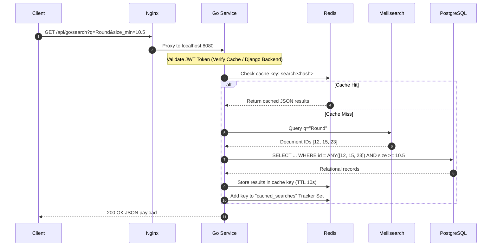
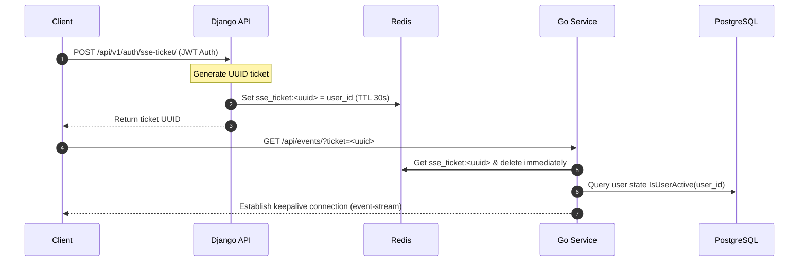

# Platform Architecture (ARCHITECTURE.md)

DMS-O2 uses a dual-service architecture split between a Python/Django monolith (system of record and mutations) and a Go microservice (search read-path).

---

## 1. Request Flow Control Blueprint

### 1.1 Read Path (Fuzzy Search & Filters)
When the React client requests search or metrics updates:
1.  Requests starting with `/api/go/` are proxied by Nginx to the Go Search API on port `8080`.
2.  Go extracts JWT tokens from the `Authorization` header or `dms_access_token` cookie.
3.  Go hashes the JWT token and checks the Redis Cache (`verify_token:<token_hash>`).
    *   *Cache Hit*: Authorizes the user immediately.
    *   *Cache Miss*: Go proxies the JWT token to Django's internal `/internal/verify-token/` endpoint with an `X-Internal-Key` header. On a `200 OK` from Django, Go caches it in Redis for 15 seconds.
4.  Go parses request query filters into the `SearchParams` struct. Go checks Redis for query results using `search:<params_hash>`.
    *   *Cache Hit*: Returns JSON results directly.
    *   *Cache Miss*:
        *   If `q != ""`, Go queries Meilisearch for matching document IDs. Then it queries Postgres using `SELECT ... WHERE d.id = ANY($1)` using `pq.Array` of Meilisearch document IDs to build the full data payload. Go ranks results in memory via `scoreDie` and caches them in Redis with a configurable TTL (default 10s).
        *   If `q == ""`, Go queries PostgreSQL directly using parameterized queries (filtering by decimals, casing, statuses, sets, machines). Results are cached in Redis.



### 1.2 Write Path (Mutations & Signals)
1.  Requests to create, update, or delete records are proxied by Nginx to Django (`127.0.0.1:8000`).
2.  Django authenticates the user, processes the serializer, and opens a transaction block.
3.  On database modifications:
    *   `pre_save`/`post_save`/`post_delete` signals execute.
    *   Signals generate audit logs (`DieHistory` or `MachineHistory`) within the transaction.
    *   Signals append `OutboxTask` actions (`SYNC_DIE` or `DELETE_DIE`) to the database outbox queue.
    *   Signals broadcast update events via PostgreSQL NOTIFY (`SELECT pg_notify('dms_events', payload)`).
4.  Once transaction commits:
    *   Celery workers run `process_outbox_task.delay()` to sync Meilisearch asynchronously.
    *   Go receives the Postgres notification on `dms_events` using `pq.NewListener`.
    *   Go invalidates the Redis `stats` cache and deletes all cached search keys tracked under the `cached_searches` Set.
    *   Go broadcasts SSE messages to listening React clients via `/api/events/?ticket=<ticket>`.

---

## 2. Process Orchestration (Supervisord Monolith)

In production, the application runs inside a single Docker container managed by Supervisord. 

```
[supervisord] -> Launches Gunicorn (8000), Celery, Go API (8080), Nginx (8080)
[nginx]       -> Proxies /api/v1 -> Gunicorn
              -> Proxies /api/go -> Go API
              -> Proxies /api/events -> Go API (SSE config: proxy_buffering off)
              -> Serves static /usr/share/nginx/html
```

---

## 3. Server-Sent Events (SSE) Broadcast Pipeline

Real-time synchronization uses an SSE ticket broker to prevent token exposure in URL parameters:


Go maintains a map of client channels and broadcasts payload notifications parsed from the Postgres `dms_events` NOTIFY channel. Go backfills missed events using the client's `Last-Event-ID` header against its in-memory event history (max capacity 500 events).
