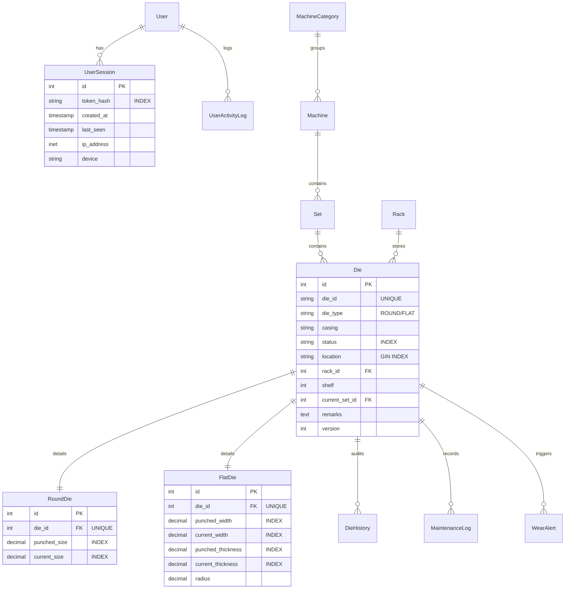

# Database Schemas & Models (DATABASE.md)

DMS-O2 utilizes PostgreSQL 18 for persistent storage, with specific schema constraints, indices, and signals.

---

## 1. Relational Schema Blueprint

---

## 2. Model Specifications

### 2.1 User Management Models
*   **User** (Inherits `AbstractUser`):
    *   `role`: CharField (`ROOT`, `ADMIN`, `OPERATOR`, `REGULAR`). Default is `REGULAR`.
    *   `is_authorized_for_tools`: BooleanField.
    *   `authorized_tools`: JSONField (list of tool string IDs).
*   **UserSession**:
    *   `user`: ForeignKey to User (CASCADE).
    *   `token_hash`: CharField (max 64, db_index=True) - SHA-256 hash of access token.
    *   `ip_address`: GenericIPAddressField.
    *   `device`: CharField (max 255).
*   **UserActivityLog**:
    *   `action`: CharField (`LOGIN`, `LOGOUT`, `FAILED_LOGIN`, `SESSION_EXPIRED`).
    *   `timestamp`: DateTimeField (db_index=True).

### 2.2 Tooling Models
*   **Die**:
    *   `die_id`: CharField (unique=True).
    *   `die_type`: CharField (`ROUND`, `FLAT`).
    *   `casing`: CharField (max 50).
    *   `status`: CharField (default `AVAILABLE`).
    *   `location`: CharField (max 200).
    *   `rack`: ForeignKey to Rack (SET_NULL, null=True).
    *   `shelf`: PositiveSmallIntegerField (null=True).
    *   `current_set`: ForeignKey to Set (SET_NULL, null=True).
*   **RoundDie**:
    *   `die`: OneToOneField to Die (CASCADE, related_name `rounddie`).
    *   `punched_size` | `current_size`: DecimalField (max_digits=7, decimal_places=3).
*   **FlatDie**:
    *   `die`: OneToOneField to Die (CASCADE, related_name `flatdie`).
    *   `punched_width` | `current_width`: DecimalField (7, 3).
    *   `punched_thickness` | `current_thickness`: DecimalField (7, 3).
    *   `radius`: DecimalField (7, 3).
*   **Rack**:
    *   `name`: CharField (unique=True).
    *   `row_count` | `column_count`: PositiveIntegerField.

### 2.3 Operations & Auditing Models
*   **DieHistory**:
    *   `die`: ForeignKey to Die (CASCADE).
    *   `field_name`: CharField (max 50).
    *   `old_value` | `new_value`: TextField.
    *   `changed_by`: ForeignKey to User (SET_NULL, null=True).
    *   `ip_address`: GenericIPAddressField.
*   **MachineHistory**:
    *   `entity_type`: CharField (`MACHINE`, `SET`, `CATEGORY`).
    *   `entity_id`: IntegerField.
    *   `action`: CharField (`CREATED`, `UPDATED`, `DELETED`).
    *   `field_name` | `old_value` | `new_value`: TextField (nullable).
*   **WearAlert**:
    *   `die`: ForeignKey to Die (CASCADE).
    *   `alert_level`: CharField (`WARNING`, `CRITICAL`).
    *   `message`: TextField.
    *   `is_resolved`: BooleanField.
*   **OutboxTask**:
    *   `task_type`: CharField (max 50, e.g. `SYNC_DIE`).
    *   `payload`: JSONField.
    *   `is_processed`: BooleanField (default False).

---

## 3. Database Indexes

*   **GIN Indexes (Trigram)**: Enforces fast fuzzy text matching on casing and location attributes within PostgreSQL:
    *   `die_location_trgm_idx` on `location` (opclasses `gin_trgm_ops`).
    *   `die_casing_trgm_idx` on `casing` (opclasses `gin_trgm_ops`).
*   **Numeric B-Tree Indexes**: Enforces fast scan bounds on decimal sizes:
    *   `current_size` on `RoundDie`.
    *   `current_width` and `current_thickness` on `FlatDie`.
*   **Audit Timestamp Indexes**: Enforces fast chronological sorting:
    *   `timestamp` and composite `(die, timestamp)` on `DieHistory`.
    *   `timestamp` on `MachineHistory` and `UserActivityLog`.
