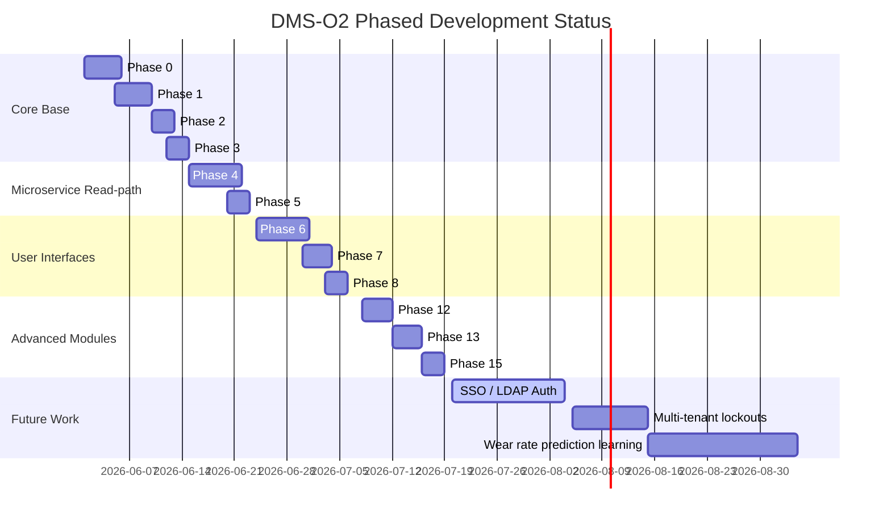

# System Development Roadmap (ROADMAP.md)

DMS-O2 development follows structured engineering phases. This document tracks the completed phases and outlines future plans.

---

## 1. Development Timeline Diagram

---

## 2. Chronological Milestones Log

### 2.1 Core Backend & Auditing (Phases 0 - 3)
*   **Deliverables**: Database migrations, model structures (Dies, Categories, Sets, Machines), and pre_save signals for automatic field auditing inside `DieHistory`.

### 2.2 Go Search API & Event Listener (Phases 4 - 5)
*   **Deliverables**: Created Go service, integration with Meilisearch, cache invalidations using `pq.NewListener` on PG NOTIFY channel `dms_events`.

### 2.3 React UI & Spreadsheet Imports (Phases 6 - 8)
*   **Deliverables**: Developed the Vite frontend, Virtualized lists, drag-and-drop allocations, CSRF cookies check, and dry-run transactional spreadsheet import parser.

### 2.4 Security & Session Eviction Hardening (v1.7.0 - v1.7.6)
*   **Deliverables**: IP brute force throttler (5/minute), startup credential verification rules, JWT cookie storage, internal keys Timing-safe HMAC, custom SVG CAD wear-highlight charts, and the engineering Elongation Calculator.

---

## 3. Future Roadmap Path

1.  **Enterprise SSO & LDAP Integration**:
    *   *Details*: Permit authentication integration with directory services.
2.  **Multi-tenant lockouts**:
    *   *Details*: Tenant namespace segregation and resource isolation.
3.  **Machine Learning Wear Rate Model**:
    *   *Details*: Replaces linear wear prediction formulas with predictive algorithms trained on historical tool degradation.
