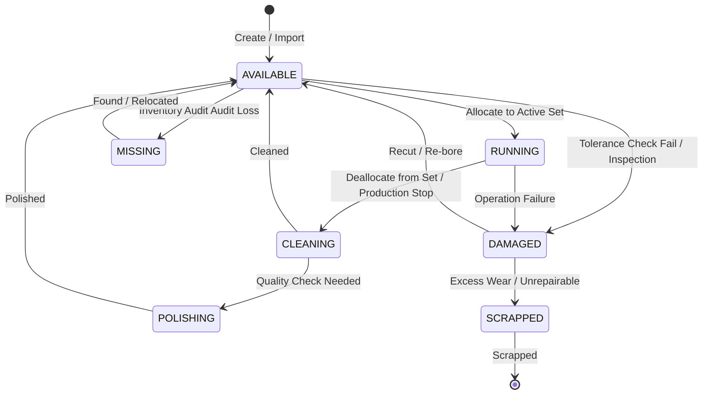
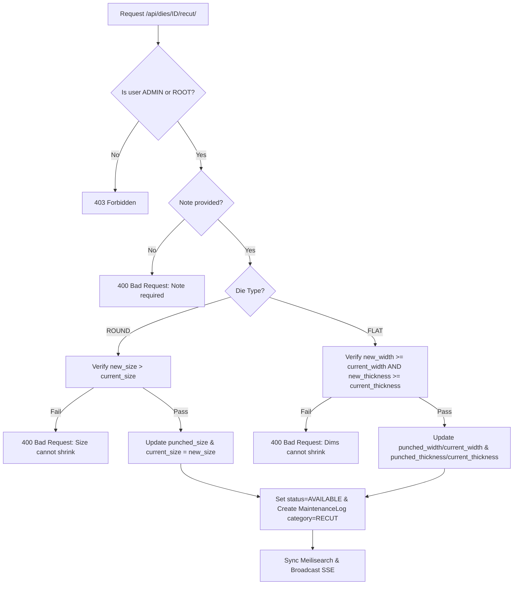
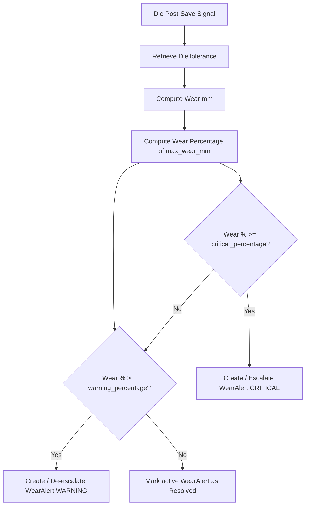
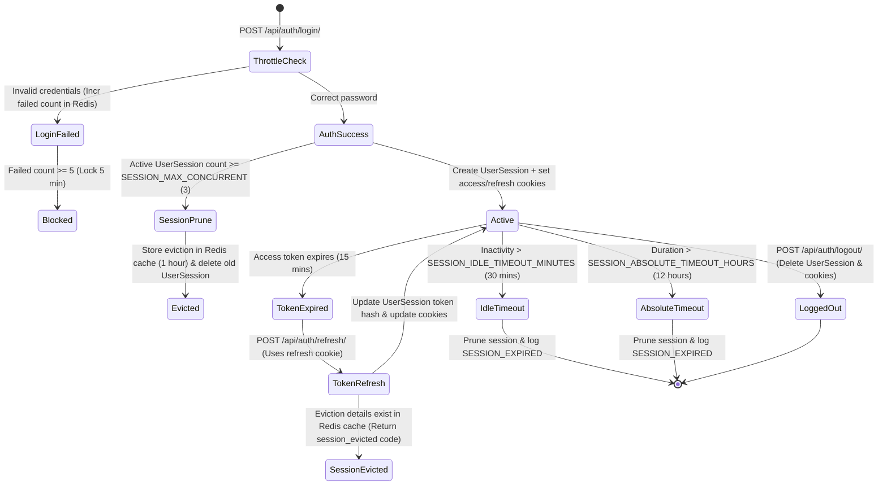

# State Flows & Lifecycles (STATE_FLOW.md)

This document diagrams state transitions and lifecycle flows within the DMS-O2 system.

---

## 1. Die Lifecycle State Machine

A Die changes state based on user updates, maintenance, or operations:

---

## 2. Recut / Re-bore Validation Flow

Recutting boring expands round inner diameters and flat casing width/thickness metrics:

---

## 3. Wear Alert Lifecycle

Calculations run automatically on post-save hooks of Die/RoundDie/FlatDie models:

---

## 4. User Session lifecycle

Saves user credentials verification, throttling counts, and token refresh details:

