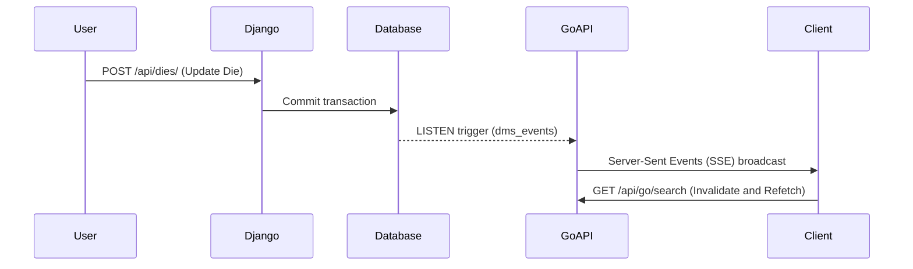

# System Architecture (architecture.md)

## Purpose & Responsibilities
DMS-O2 uses a hybrid backend split architecture to balance transactional write integrity with high-concurrency read performance:
1.  **Django (Write Service)**: Handles complex state transitions, user access limits, backups, database migrations, and imports.
2.  **Go Service (Read Service)**: Acts as a fast middleware handler proxying search requests to Meilisearch/Postgres and maintaining real-time event streams.

## Event loop (pg_notify -> Go -> SSE)

## Important Configurations
- **Nginx**: Inside the monolithic docker container, Nginx acts as a reverse proxy, listening on user-space port `8080`.
- **Gunicorn**: Listens on port `8000` locally.
- **Go API**: Listens on port `8080` internally.
- **Traefik**: Exposes ports `80` and `443` on the host, forwarding queries dynamically to the monolith.
