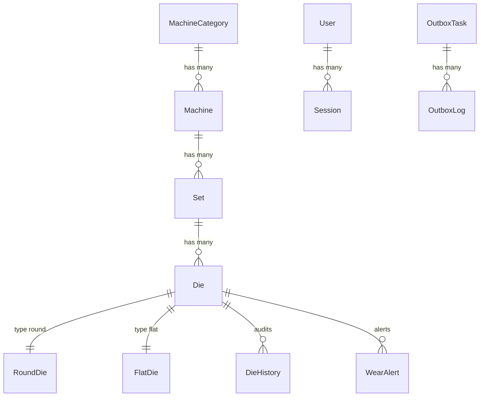

# Database Schema & Constraints

## Purpose
Complete database schema documentation for PostgreSQL 18.
**Why:** Reference for understanding data model and implementing features.
**Read by:** AI agents, engineers.
**Updated:** When schema changes.

## Entity Relationship


## Core Tables

### MachineCategory
```sql
CREATE TABLE machine_category (
    id SERIAL PRIMARY KEY,
    name VARCHAR(100) NOT NULL UNIQUE,
    description TEXT,
    created_at TIMESTAMP DEFAULT NOW(),
    updated_at TIMESTAMP DEFAULT NOW()
);
```

### Machine
```sql
CREATE TABLE machine (
    id SERIAL PRIMARY KEY,
    category_id INTEGER REFERENCES machine_category(id),
    name VARCHAR(100) NOT NULL,
    serial_number VARCHAR(50) UNIQUE,
    location VARCHAR(200),
    status VARCHAR(20) DEFAULT 'active',
    created_at TIMESTAMP DEFAULT NOW(),
    updated_at TIMESTAMP DEFAULT NOW()
);
```

### Set
```sql
CREATE TABLE set (
    id SERIAL PRIMARY KEY,
    machine_id INTEGER REFERENCES machine(id),
    name VARCHAR(100) NOT NULL,
    position INTEGER,
    created_at TIMESTAMP DEFAULT NOW(),
    updated_at TIMESTAMP DEFAULT NOW()
);
```

### Die
```sql
CREATE TABLE die (
    id SERIAL PRIMARY KEY,
    set_id INTEGER REFERENCES set(id),
    die_type VARCHAR(10) NOT NULL CHECK (die_type IN ('round', 'flat')),
    status VARCHAR(20) DEFAULT 'active',
    predicted_remaining_days INTEGER,
    created_at TIMESTAMP DEFAULT NOW(),
    updated_at TIMESTAMP DEFAULT NOW()
);
```

### RoundDie
```sql
CREATE TABLE round_die (
    id INTEGER PRIMARY KEY REFERENCES die(id),
    original_diameter DECIMAL(10,3) NOT NULL CHECK (original_diameter >= 0.001),
    current_diameter DECIMAL(10,3) NOT NULL CHECK (current_diameter >= 0.001),
    original_length DECIMAL(10,3) NOT NULL CHECK (original_length >= 0.001),
    current_length DECIMAL(10,3) NOT NULL CHECK (current_length >= 0.001)
);
```

### FlatDie
```sql
CREATE TABLE flat_die (
    id INTEGER PRIMARY KEY REFERENCES die(id),
    original_width DECIMAL(10,3) NOT NULL CHECK (original_width >= 0.001),
    current_width DECIMAL(10,3) NOT NULL CHECK (current_width >= 0.001),
    original_height DECIMAL(10,3) NOT NULL CHECK (original_height >= 0.001),
    current_height DECIMAL(10,3) NOT NULL CHECK (current_height >= 0.001)
);
```

### DieHistory
```sql
CREATE TABLE die_history (
    id SERIAL PRIMARY KEY,
    die_id INTEGER REFERENCES die(id),
    action VARCHAR(50) NOT NULL,
    old_values JSONB,
    new_values JSONB,
    timestamp TIMESTAMP DEFAULT NOW(),
    user_id INTEGER REFERENCES auth_user(id)
);
```

### WearAlert
```sql
CREATE TABLE wear_alert (
    id SERIAL PRIMARY KEY,
    die_id INTEGER REFERENCES die(id),
    alert_type VARCHAR(50) NOT NULL,
    threshold DECIMAL(10,3),
    current_value DECIMAL(10,3),
    is_resolved BOOLEAN DEFAULT FALSE,
    created_at TIMESTAMP DEFAULT NOW(),
    resolved_at TIMESTAMP
);
```

### OutboxTask
```sql
CREATE TABLE outbox_task (
    id SERIAL PRIMARY KEY,
    task_type VARCHAR(100) NOT NULL,
    payload JSONB NOT NULL,
    payload_hash VARCHAR(64) NOT NULL,
    is_processed BOOLEAN DEFAULT FALSE,
    retry_count INTEGER DEFAULT 0,
    max_retries INTEGER DEFAULT 3,
    created_at TIMESTAMP DEFAULT NOW(),
    processed_at TIMESTAMP
);
```

## Important Database Constraints & Triggers

### Outbox Signature
The `payload_hash` field stores a SHA-256 HMAC signature of the payload signed using `SECRET_KEY` during model `save()` hooks.

### Audit Logs Triggers
`DieHistory` logs are created automatically via Django `pre_save` and `post_save` database triggers, maintaining a permanent immutable ledger of tool adjustments. Complete audit logging signals are also registered on `Set`, `Machine`, and `Rack` changes.

### Decimal Constraints
`MinValueValidator(0.001)` applied to all sizing DecimalFields on `RoundDie` and `FlatDie` models to block negative values.

### Predicted Remaining Days
`Die.predicted_remaining_days` is pre-calculated remaining lifetime forecast stored on the model to optimize dashboard rendering and Meilisearch query performance.

## Indexing Policies

### Performance Indexes
```sql
-- DieHistory queries
CREATE INDEX idx_die_history_timestamp ON die_history(timestamp DESC);
CREATE INDEX idx_die_history_die_timestamp ON die_history(die_id, timestamp DESC);

-- Outbox processing
CREATE INDEX idx_outbox_task_status ON outbox_task(is_processed, created_at);

-- Search optimization
CREATE INDEX idx_die_status ON die(status);
CREATE INDEX idx_machine_status ON machine(status);
```

## Migration Strategy
- All migrations must be reversible
- Use `atomic` transactions for data migrations
- Test migrations on production-like data
- Document breaking changes in ADRs

## Backup Strategy
- Full backup: Daily at 02:00 UTC
- Incremental backup: Every 6 hours
- WAL archiving: Continuous
- Recovery point objective: 1 hour
