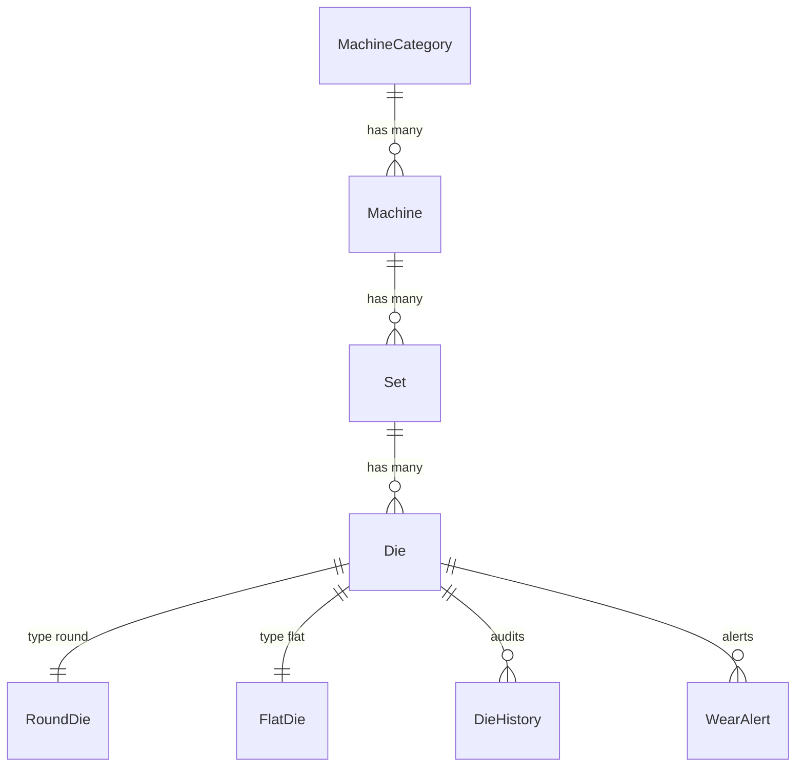

# Database Schema & Constraints (database.md)

## Entity Relationship

## Important Database Constraints & Triggers
1.  **Outbox Signature (`OutboxTask`)**:
    The `payload_hash` field stores a SHA-256 HMAC signature of the payload signed using `SECRET_KEY` during model `save()` hooks.
2.  **Audit Logs Triggers**:
    `DieHistory` logs are created automatically via Django `pre_save` and `post_save` database triggers, maintaining a permanent immutable ledger of tool adjustments. Complete audit logging signals are also registered on `Set`, `Machine`, and `Rack` changes.
3.  **Decimal constraints**:
    `MinValueValidator(0.001)` applied to all sizing DecimalFields on `RoundDie` and `FlatDie` models to block negative values.
4.  **Predicted Remaining Days (`Die.predicted_remaining_days`)**:
    Pre-calculated remaining lifetime forecast stored on the model to optimize dashboard rendering and Meilisearch query performance.
5.  **Indexing Policies**:
    - Standalone index on `DieHistory.timestamp` DESC.
    - Composite index on `(die_id, timestamp DESC)`.
    - Composite index on `OutboxTask(is_processed, created_at)` to accelerate outbox loops.
