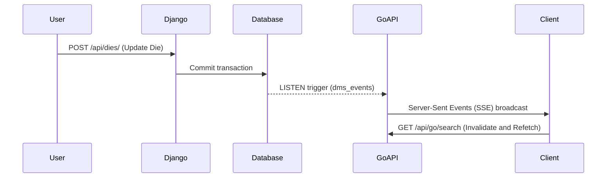

# System Architecture (architecture.md)

## Purpose & Responsibilities
DMS-O2 uses a hybrid backend split architecture to balance transactional write integrity with high-concurrency read performance:
1.  **Django (Write Service)**: Handles complex state transitions, user access limits, backups, database migrations, and imports.
2.  **Go Service (Read Service)**: Acts as a fast middleware handler proxying search requests to Meilisearch/Postgres and maintaining real-time event streams.

## Event loop (pg_notify -> Go -> SSE)

## Important Configurations
### Development Stack (docker-compose.yml)
- **Frontend (Vite/Nginx)**: Serves React SPA during development with HMR.
- **Django (Gunicorn)**: Listens on port `8000`.
- **Go API**: Listens on port `8080`.
- **Worker / Heavy-Worker**: Celery workers for default and heavy task queues.
- **Beat**: Celery beat for periodic task scheduling.
- **Traefik**: Exposes ports `80` and `443` on the host, routing to Django, Go API, and Frontend.

### Unified Monolith Stack (docker-compose.unified.yml)
- **Nginx**: Inside the monolithic container, acts as a reverse proxy, listening on port `8080`.
- **Gunicorn**: Listens on port `8000` locally.
- **Go API**: Listens on port `8080` internally.
- **Supervisord**: Orchestrates Nginx, Gunicorn, Celery workers, Celery beat, and Go API inside a single container.
- **Traefik**: Routes external traffic to the monolith.
