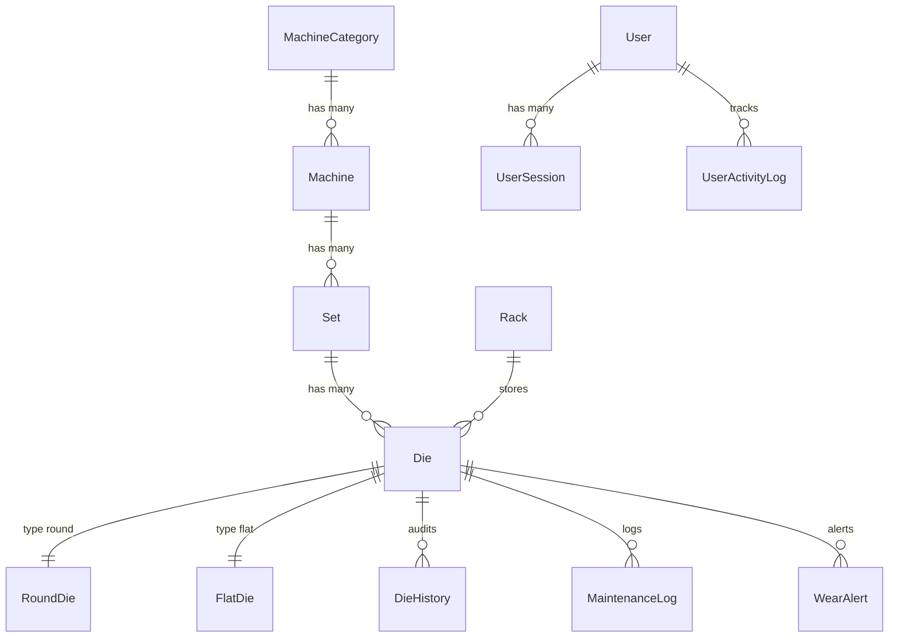

# Database Schema & Constraints

## Purpose
Complete database schema documentation for PostgreSQL 18.
**Why:** Reference for understanding data model and implementing features.
**Read by:** AI agents, engineers.
**Updated:** When schema changes.

## Entity Relationship


## Core Tables

### MachineCategory (`machines_machinecategory`)
```sql
CREATE TABLE machines_machinecategory (
    id SERIAL PRIMARY KEY,
    name VARCHAR(100) NOT NULL UNIQUE
);
```

### Machine (`machines_machine`)
```sql
CREATE TABLE machines_machine (
    id SERIAL PRIMARY KEY,
    category_id INTEGER NOT NULL REFERENCES machines_machinecategory(id),
    name VARCHAR(100) NOT NULL UNIQUE
);
```

### Set (`machines_set`)
```sql
CREATE TABLE machines_set (
    id SERIAL PRIMARY KEY,
    machine_id INTEGER NOT NULL REFERENCES machines_machine(id),
    name VARCHAR(100) NOT NULL,
    "order" INTEGER NOT NULL DEFAULT 0,
    CONSTRAINT machines_set_machine_id_name_key UNIQUE (machine_id, name)
);
```

### Rack (`machines_rack`)
```sql
CREATE TABLE machines_rack (
    id SERIAL PRIMARY KEY,
    name VARCHAR(50) NOT NULL UNIQUE,
    row_count INTEGER NOT NULL,
    column_count INTEGER NOT NULL
);
```

### Die (`dies_die`)
```sql
CREATE TABLE dies_die (
    id SERIAL PRIMARY KEY,
    die_id VARCHAR(50) NOT NULL UNIQUE,
    die_type VARCHAR(10) NOT NULL CHECK (die_type IN ('ROUND', 'FLAT')),
    casing VARCHAR(50) NOT NULL,
    status VARCHAR(20) NOT NULL DEFAULT 'AVAILABLE',
    rack_id INTEGER REFERENCES machines_rack(id) ON DELETE SET NULL,
    shelf_number SMALLINT CHECK (shelf_number >= 1),
    current_set_id INTEGER REFERENCES machines_set(id) ON DELETE SET NULL,
    remarks TEXT NOT NULL DEFAULT '',
    predicted_remaining_days INTEGER,
    created_at TIMESTAMPTZ NOT NULL DEFAULT NOW(),
    updated_at TIMESTAMPTZ NOT NULL DEFAULT NOW(),
    version INTEGER NOT NULL DEFAULT 1
);
```

### RoundDie (`dies_rounddie`)
```sql
CREATE TABLE dies_rounddie (
    id SERIAL PRIMARY KEY,
    die_id INTEGER NOT NULL UNIQUE REFERENCES dies_die(id) ON DELETE CASCADE,
    punched_size NUMERIC(7,3) NOT NULL CHECK (punched_size >= 0.001),
    current_size NUMERIC(7,3) NOT NULL CHECK (current_size >= 0.001)
);
```

### FlatDie (`dies_flatdie`)
```sql
CREATE TABLE dies_flatdie (
    id SERIAL PRIMARY KEY,
    die_id INTEGER NOT NULL UNIQUE REFERENCES dies_die(id) ON DELETE CASCADE,
    punched_width NUMERIC(7,3) NOT NULL CHECK (punched_width >= 0.001),
    current_width NUMERIC(7,3) NOT NULL CHECK (current_width >= 0.001),
    punched_thickness NUMERIC(7,3) NOT NULL CHECK (punched_thickness >= 0.001),
    current_thickness NUMERIC(7,3) NOT NULL CHECK (current_thickness >= 0.001),
    radius NUMERIC(7,3) NOT NULL CHECK (radius >= 0.001)
);
```

### DieHistory (`history_diehistory`)
```sql
CREATE TABLE history_diehistory (
    id SERIAL PRIMARY KEY,
    die_id INTEGER NOT NULL REFERENCES dies_die(id) ON DELETE CASCADE,
    changed_by_id INTEGER REFERENCES users_user(id) ON DELETE SET NULL,
    timestamp TIMESTAMPTZ NOT NULL DEFAULT NOW(),
    field_name VARCHAR(50) NOT NULL,
    old_value TEXT NOT NULL,
    new_value TEXT NOT NULL,
    ip_address INET,
    note TEXT NOT NULL DEFAULT ''
);
```

### MachineHistory (`history_machinehistory`)
```sql
CREATE TABLE history_machinehistory (
    id SERIAL PRIMARY KEY,
    entity_type VARCHAR(10) NOT NULL CHECK (entity_type IN ('MACHINE', 'SET', 'CATEGORY', 'RACK')),
    entity_id INTEGER NOT NULL,
    entity_name VARCHAR(100) NOT NULL,
    action VARCHAR(10) NOT NULL CHECK (action IN ('CREATED', 'UPDATED', 'DELETED')),
    field_name VARCHAR(50),
    old_value TEXT,
    new_value TEXT,
    changed_by_id INTEGER REFERENCES users_user(id) ON DELETE SET NULL,
    timestamp TIMESTAMPTZ NOT NULL DEFAULT NOW(),
    ip_address INET
);
```

### WearAlert (`dies_wearalert`)
```sql
CREATE TABLE dies_wearalert (
    id SERIAL PRIMARY KEY,
    die_id INTEGER NOT NULL REFERENCES dies_die(id) ON DELETE CASCADE,
    alert_level VARCHAR(15) NOT NULL CHECK (alert_level IN ('WARNING', 'CRITICAL')),
    message TEXT NOT NULL,
    is_resolved BOOLEAN NOT NULL DEFAULT FALSE,
    created_at TIMESTAMPTZ NOT NULL DEFAULT NOW(),
    resolved_at TIMESTAMPTZ
);
```

    created_at TIMESTAMP DEFAULT NOW(),
    resolved_at TIMESTAMP
);
```

### OutboxTask
```sql
CREATE TABLE outbox_task (
    id SERIAL PRIMARY KEY,
    task_type VARCHAR(100) NOT NULL,
    payload JSONB NOT NULL,
    payload_hash VARCHAR(64) NOT NULL,
    is_processed BOOLEAN DEFAULT FALSE,
    retry_count INTEGER DEFAULT 0,
    max_retries INTEGER DEFAULT 3,
    created_at TIMESTAMP DEFAULT NOW(),
    processed_at TIMESTAMP
);
```

## Important Database Constraints & Triggers

### Outbox Signature
The `payload_hash` field stores a SHA-256 HMAC signature of the payload signed using `SECRET_KEY` during model `save()` hooks.

### Audit Logs Triggers
`DieHistory` logs are created automatically via Django `pre_save` and `post_save` database triggers, maintaining a permanent immutable ledger of tool adjustments. Complete audit logging signals are also registered on `Set`, `Machine`, and `Rack` changes.

### Decimal Constraints
`MinValueValidator(0.001)` applied to all sizing DecimalFields on `RoundDie` and `FlatDie` models to block negative values.

### Predicted Remaining Days
`Die.predicted_remaining_days` is pre-calculated remaining lifetime forecast stored on the model to optimize dashboard rendering and Meilisearch query performance.

## Indexing Policies

### Performance Indexes
```sql
-- DieHistory queries
CREATE INDEX idx_die_history_timestamp ON die_history(timestamp DESC);
CREATE INDEX idx_die_history_die_timestamp ON die_history(die_id, timestamp DESC);

-- Outbox processing
CREATE INDEX idx_outbox_task_status ON outbox_task(is_processed, created_at);

-- Search optimization
CREATE INDEX idx_die_status ON die(status);
CREATE INDEX idx_machine_status ON machine(status);
```

## Migration Strategy
- All migrations must be reversible
- Use `atomic` transactions for data migrations
- Test migrations on production-like data
- Document breaking changes in ADRs

## Backup Strategy
- Full backup: Daily at 02:00 UTC
- Incremental backup: Every 6 hours
- WAL archiving: Continuous
- Recovery point objective: 1 hour
