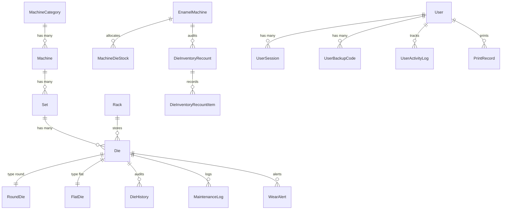

# Database Schema & Constraints

## Purpose
Complete database schema documentation for PostgreSQL 18.
**Why:** Reference for understanding data model and implementing features.
**Read by:** AI agents, engineers.
**Updated:** When schema changes.

## Entity Relationship

```mermaid
erDiagram
    MachineCategory ||--o{ Machine : "has many"
    Machine ||--o{ Set : "has many"
    Set ||--o{ Die : "has many"
    Rack ||--o{ Die : "stores"
    Die ||--|| RoundDie : "type round"
    Die ||--|| FlatDie : "type flat"
    Die ||--o{ DieHistory : "audits"
    Die ||--o{ MaintenanceLog : "logs"
    Die ||--o{ WearAlert : "alerts"
    EnamelMachine ||--o{ MachineDieStock : "allocates"
    EnamelMachine ||--o{ DieInventoryRecount : "audits"
    DieInventoryRecount ||--o{ DieInventoryRecountItem : "records"
    User ||--o{ UserSession : "has many"
    User ||--o{ UserBackupCode : "has many"
    User ||--o{ UserActivityLog : "tracks"
    User ||--o{ PrintRecord : "prints"
```

## Core Tables

### MachineCategory (`machines_machinecategory`)
```sql
CREATE TABLE machines_machinecategory (
    id SERIAL PRIMARY KEY,
    name VARCHAR(100) NOT NULL UNIQUE
);
```

### Machine (`machines_machine`)
```sql
CREATE TABLE machines_machine (
    id SERIAL PRIMARY KEY,
    category_id INTEGER NOT NULL REFERENCES machines_machinecategory(id),
    name VARCHAR(100) NOT NULL UNIQUE
);
```

### Set (`machines_set`)
```sql
CREATE TABLE machines_set (
    id SERIAL PRIMARY KEY,
    machine_id INTEGER NOT NULL REFERENCES machines_machine(id),
    name VARCHAR(100) NOT NULL,
    "order" INTEGER NOT NULL DEFAULT 0,
    CONSTRAINT machines_set_machine_id_name_key UNIQUE (machine_id, name)
);
```

### Rack (`machines_rack`)
```sql
CREATE TABLE machines_rack (
    id SERIAL PRIMARY KEY,
    name VARCHAR(50) NOT NULL UNIQUE,
    row_count INTEGER NOT NULL,
    column_count INTEGER NOT NULL
);
```

### Die (`dies_die`)
```sql
CREATE TABLE dies_die (
    id SERIAL PRIMARY KEY,
    die_id VARCHAR(50) NOT NULL UNIQUE,
    die_type VARCHAR(10) NOT NULL CHECK (die_type IN ('ROUND', 'FLAT')),
    casing VARCHAR(50) NOT NULL,
    status VARCHAR(20) NOT NULL DEFAULT 'AVAILABLE',
    rack_id INTEGER REFERENCES machines_rack(id) ON DELETE SET NULL,
    shelf_number SMALLINT CHECK (shelf_number >= 1),
    current_set_id INTEGER REFERENCES machines_set(id) ON DELETE SET NULL,
    remarks TEXT NOT NULL DEFAULT '',
    created_at TIMESTAMPTZ NOT NULL DEFAULT NOW(),
    updated_at TIMESTAMPTZ NOT NULL DEFAULT NOW(),
    version INTEGER NOT NULL DEFAULT 1
);
```

### RoundDie (`dies_rounddie`)
```sql
CREATE TABLE dies_rounddie (
    id SERIAL PRIMARY KEY,
    die_id INTEGER NOT NULL UNIQUE REFERENCES dies_die(id) ON DELETE CASCADE,
    punched_size NUMERIC(7,3) NOT NULL CHECK (punched_size >= 0.001),
    current_size NUMERIC(7,3) NOT NULL CHECK (current_size >= 0.001)
);
```

### FlatDie (`dies_flatdie`)
```sql
CREATE TABLE dies_flatdie (
    id SERIAL PRIMARY KEY,
    die_id INTEGER NOT NULL UNIQUE REFERENCES dies_die(id) ON DELETE CASCADE,
    punched_width NUMERIC(7,3) NOT NULL CHECK (punched_width >= 0.001),
    current_width NUMERIC(7,3) NOT NULL CHECK (current_width >= 0.001),
    punched_thickness NUMERIC(7,3) NOT NULL CHECK (punched_thickness >= 0.001),
    current_thickness NUMERIC(7,3) NOT NULL CHECK (current_thickness >= 0.001),
    radius NUMERIC(7,3) NOT NULL CHECK (radius >= 0.001)
);
```

### DieHistory (`history_diehistory`)
```sql
CREATE TABLE history_diehistory (
    id SERIAL PRIMARY KEY,
    die_id INTEGER NOT NULL REFERENCES dies_die(id) ON DELETE CASCADE,
    changed_by_id INTEGER REFERENCES users_user(id) ON DELETE SET NULL,
    timestamp TIMESTAMPTZ NOT NULL DEFAULT NOW(),
    field_name VARCHAR(50) NOT NULL,
    old_value TEXT NOT NULL,
    new_value TEXT NOT NULL,
    ip_address INET,
    note TEXT NOT NULL DEFAULT '',
    prev_hash VARCHAR(64) NOT NULL DEFAULT '',
    hash VARCHAR(64) NOT NULL DEFAULT ''
);

CREATE INDEX idx_diehistory_changed_by ON history_diehistory(changed_by_id);
CREATE INDEX idx_diehistory_composite ON history_diehistory(die_id, field_name, timestamp);
CREATE INDEX idx_diehistory_timestamp ON history_diehistory(timestamp DESC);
```

### MachineHistory (`history_machinehistory`)
```sql
CREATE TABLE history_machinehistory (
    id SERIAL PRIMARY KEY,
    entity_type VARCHAR(10) NOT NULL CHECK (entity_type IN ('MACHINE', 'SET', 'CATEGORY', 'RACK')),
    entity_id INTEGER NOT NULL,
    entity_name VARCHAR(100) NOT NULL,
    action VARCHAR(10) NOT NULL CHECK (action IN ('CREATED', 'UPDATED', 'DELETED')),
    field_name VARCHAR(50),
    old_value TEXT,
    new_value TEXT,
    changed_by_id INTEGER REFERENCES users_user(id) ON DELETE SET NULL,
    timestamp TIMESTAMPTZ NOT NULL DEFAULT NOW(),
    ip_address INET,
    prev_hash VARCHAR(64) NOT NULL DEFAULT '',
    hash VARCHAR(64) NOT NULL DEFAULT ''
);
```

### EnamelMachine & Live Machine Stock (`dies_enamelmachine`, `dies_machinediestock`)
```sql
CREATE TABLE dies_enamelmachine (
    id SERIAL PRIMARY KEY,
    name VARCHAR(100) NOT NULL UNIQUE,
    description TEXT NOT NULL DEFAULT ''
);

CREATE TABLE dies_machinediestock (
    id SERIAL PRIMARY KEY,
    enamel_machine_id INTEGER NOT NULL REFERENCES dies_enamelmachine(id) ON DELETE CASCADE,
    die_size NUMERIC(7,3) NOT NULL,
    quantity INTEGER NOT NULL DEFAULT 0 CHECK (quantity >= 0),
    updated_at TIMESTAMPTZ NOT NULL DEFAULT NOW(),
    CONSTRAINT dies_machinediestock_machine_size_key UNIQUE (enamel_machine_id, die_size)
);
```

### Monthly Recount Audits (`dies_dieinventoryrecount`, `dies_dieinventoryrecountitem`)
```sql
CREATE TABLE dies_dieinventoryrecount (
    id SERIAL PRIMARY KEY,
    name VARCHAR(100) NOT NULL,
    enamel_machine_id INTEGER NOT NULL REFERENCES dies_enamelmachine(id) ON DELETE CASCADE,
    recount_date DATE NOT NULL,
    created_at TIMESTAMPTZ NOT NULL DEFAULT NOW(),
    created_by_id INTEGER REFERENCES users_user(id) ON DELETE SET NULL,
    status VARCHAR(20) NOT NULL DEFAULT 'DRAFT' CHECK (status IN ('DRAFT', 'SUBMITTED'))
);

CREATE TABLE dies_dieinventoryrecountitem (
    id SERIAL PRIMARY KEY,
    recount_id INTEGER NOT NULL REFERENCES dies_dieinventoryrecount(id) ON DELETE CASCADE,
    die_size NUMERIC(7,3) NOT NULL,
    quantity INTEGER NOT NULL DEFAULT 0 CHECK (quantity >= 0),
    previous_quantity INTEGER NOT NULL DEFAULT 0 CHECK (previous_quantity >= 0)
);
```

### User & Single-Use Backup Codes (`users_user`, `users_userbackupcode`)
```sql
CREATE TABLE users_user (
    id SERIAL PRIMARY KEY,
    username VARCHAR(150) NOT NULL UNIQUE,
    email VARCHAR(254) NOT NULL,
    role VARCHAR(10) NOT NULL DEFAULT 'REGULAR' CHECK (role IN ('ROOT', 'ADMIN', 'OPERATOR', 'REGULAR')),
    is_authorized_for_tools BOOLEAN NOT NULL DEFAULT FALSE,
    authorized_tools JSONB NOT NULL DEFAULT '[]',
    is_mfa_enabled BOOLEAN NOT NULL DEFAULT FALSE,
    is_active BOOLEAN NOT NULL DEFAULT TRUE,
    date_joined TIMESTAMPTZ NOT NULL DEFAULT NOW()
);

CREATE TABLE users_userbackupcode (
    id SERIAL PRIMARY KEY,
    user_id INTEGER NOT NULL REFERENCES users_user(id) ON DELETE CASCADE,
    code_hash VARCHAR(64) NOT NULL,
    is_used BOOLEAN NOT NULL DEFAULT FALSE,
    created_at TIMESTAMPTZ NOT NULL DEFAULT NOW(),
    used_at TIMESTAMPTZ
);
```

### DieTolerance (`dies_dietolerance`)
```sql
CREATE TABLE dies_dietolerance (
    id SERIAL PRIMARY KEY,
    die_type VARCHAR(10) NOT NULL UNIQUE CHECK (die_type IN ('ROUND', 'FLAT')),
    max_wear_mm NUMERIC(5,3) NOT NULL DEFAULT 0.050,
    warning_percentage INTEGER NOT NULL DEFAULT 70,
    critical_percentage INTEGER NOT NULL DEFAULT 90
);
```

### MaintenanceLog (`dies_maintenancelog`)
```sql
CREATE TABLE dies_maintenancelog (
    id SERIAL PRIMARY KEY,
    die_id INTEGER NOT NULL REFERENCES dies_die(id) ON DELETE CASCADE,
    created_by_id INTEGER REFERENCES users_user(id) ON DELETE SET NULL,
    created_at TIMESTAMPTZ NOT NULL DEFAULT NOW(),
    note TEXT NOT NULL,
    category VARCHAR(30) NOT NULL DEFAULT '' CHECK (category IN ('INSPECTION', 'REPAIR', 'RECUT', 'CLEANING', 'POLISHING', 'MEASUREMENT', 'OTHER'))
);
```

### ImportLog (`dies_importlog`)
```sql
CREATE TABLE dies_importlog (
    id SERIAL PRIMARY KEY,
    imported_by_id INTEGER REFERENCES users_user(id) ON DELETE SET NULL,
    imported_at TIMESTAMPTZ NOT NULL DEFAULT NOW(),
    filename VARCHAR(255) NOT NULL,
    created_count INTEGER NOT NULL,
    updated_count INTEGER NOT NULL,
    skipped_count INTEGER NOT NULL,
    error_count INTEGER NOT NULL,
    errors_json JSONB
);
```

### WearAlert (`dies_wearalert`)
```sql
CREATE TABLE dies_wearalert (
    id SERIAL PRIMARY KEY,
    die_id INTEGER NOT NULL REFERENCES dies_die(id) ON DELETE CASCADE,
    alert_level VARCHAR(15) NOT NULL CHECK (alert_level IN ('WARNING', 'CRITICAL')),
    message TEXT NOT NULL,
    is_resolved BOOLEAN NOT NULL DEFAULT FALSE,
    created_at TIMESTAMPTZ NOT NULL DEFAULT NOW(),
    resolved_at TIMESTAMPTZ
);
```

### OutboxTask (`dies_outboxtask`)
```sql
CREATE TABLE dies_outboxtask (
    id SERIAL PRIMARY KEY,
    task_type VARCHAR(50) NOT NULL,
    payload JSONB NOT NULL,
    payload_hash VARCHAR(64) NOT NULL DEFAULT '',
    is_processed BOOLEAN NOT NULL DEFAULT FALSE,
    created_at TIMESTAMPTZ NOT NULL DEFAULT NOW(),
    processed_at TIMESTAMPTZ
);
```

### PrintRecord (`history_printrecord`)
```sql
CREATE TABLE history_printrecord (
    id SERIAL PRIMARY KEY,
    doc_type VARCHAR(50) NOT NULL DEFAULT 'WIRE_DRAWING_TDS',
    doc_ref VARCHAR(64) NOT NULL UNIQUE,
    work_order VARCHAR(100) NOT NULL,
    machine_name VARCHAR(100) NOT NULL DEFAULT '',
    material_profile VARCHAR(100) NOT NULL DEFAULT 'Standard Wire Drawing',
    quality_status VARCHAR(50) NOT NULL DEFAULT '',
    notes TEXT NOT NULL DEFAULT '',
    inlet_size NUMERIC(7,3),
    finish_size NUMERIC(7,3),
    total_passes SMALLINT NOT NULL DEFAULT 0,
    overall_reduction NUMERIC(5,2),
    avg_elongation NUMERIC(5,2),
    dies JSONB NOT NULL DEFAULT '[]',
    passes_data JSONB NOT NULL DEFAULT '[]',
    printed_by_id INTEGER REFERENCES users_user(id) ON DELETE SET NULL,
    username VARCHAR(150) NOT NULL,
    user_role VARCHAR(50) NOT NULL,
    ip_address INET,
    created_at TIMESTAMPTZ NOT NULL DEFAULT NOW()
);
```

## Important Database Constraints & Triggers

### Outbox Signature
The `payload_hash` field stores a SHA-256 HMAC signature of the payload signed using `SECRET_KEY` during model `save()` hooks.

### Audit Logs Triggers
`DieHistory` logs are created automatically via Django `pre_save` and `post_save` database triggers, maintaining a permanent immutable ledger of tool adjustments. Complete audit logging signals are also registered on `Set`, `Machine`, and `Rack` changes.

### Decimal Constraints
`MinValueValidator(0.001)` applied to all sizing DecimalFields on `RoundDie` and `FlatDie` models to block negative values.

## Indexing Policies

### Performance Indexes
```sql
-- DieHistory queries
CREATE INDEX idx_die_history_timestamp ON history_diehistory(timestamp DESC);
CREATE INDEX idx_die_history_die_timestamp ON history_diehistory(die_id, timestamp DESC);
CREATE INDEX idx_die_history_composite ON history_diehistory(die_id, field_name, timestamp);

-- MachineHistory queries
CREATE INDEX idx_machine_history_entity ON history_machinehistory(entity_type, entity_id);
CREATE INDEX idx_machine_history_timestamp ON history_machinehistory(timestamp DESC);

-- Outbox processing
CREATE INDEX idx_outbox_task_status ON outbox_task(is_processed, created_at);

-- Search optimization
CREATE INDEX idx_die_status ON dies_die(status);
CREATE INDEX idx_die_type ON dies_die(die_type);
CREATE INDEX idx_rounddie_current_size ON dies_rounddie(current_size);
CREATE INDEX idx_flatdie_dimensions ON dies_flatdie(current_width, current_thickness);

-- GIN trigram index for casing search
CREATE INDEX idx_die_casing_trgm ON dies_die USING gin (casing gin_trgm_ops);

-- User sessions and activity
CREATE INDEX idx_user_session_token_hash ON users_usersession(token_hash);
CREATE INDEX idx_user_activity_timestamp ON users_useractivitylog(timestamp DESC);
CREATE INDEX idx_user_activity_username ON users_useractivitylog(username);
```

## Migration Strategy
- All migrations must be reversible
- Use `atomic` transactions for data migrations
- Test migrations on production-like data
- Document breaking changes in ADRs

## Backup Strategy
- Full backup: Daily at 02:00 (Celery Beat auto-backup-daily task)
- History pruning: Daily at 03:00 (Celery Beat auto-prune-history-daily task)
- Retention: 14 days (configurable via HISTORY_RETENTION_DAYS)
- Remote: Optional S3/MinIO streaming via boto3 (configure S3_ENDPOINT_URL in .env)
- Recovery point objective: 24 hours
