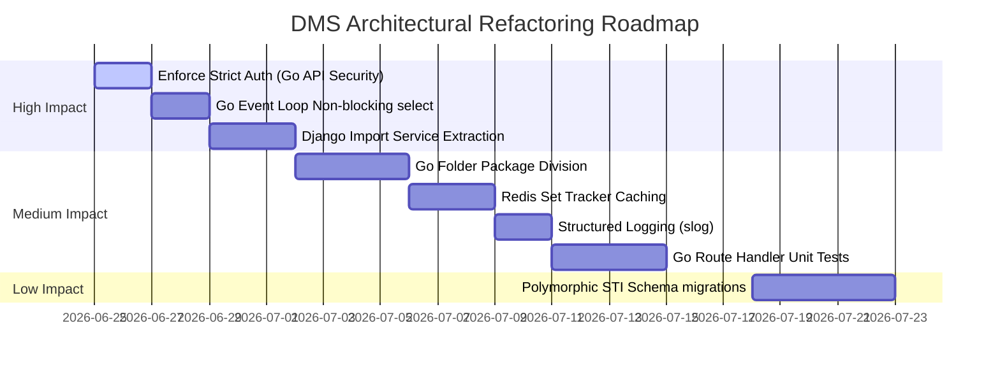

# Die Management System (DMS) — Comprehensive Architectural Review

This document provides a senior software architecture analysis of the Die Management System (DMS) codebase. It reviews folder structures, separation of concerns, code duplication, database schema, data flow, API design, security, performance bottlenecks, and testing frameworks. A step-by-step refactoring roadmap is provided at the end.

---

## 📖 Table of Contents
1. [Folder & Module Structure](#1-folder--module-structure)
2. [Separation of Concerns](#2-separation-of-concerns)
3. [Code Duplication](#3-code-duplication)
4. [Scalability Issues](#4-scalability-issues)
5. [Maintainability Problems](#5-maintainability-problems)
6. [Database Design & Data Flow](#6-database-design--data-flow)
7. [API Design](#7-api-design)
8. [Error Handling & Logging](#8-error-handling--logging)
9. [Security Weaknesses](#9-security-weaknesses)
10. [Performance Bottlenecks](#10-performance-bottlenecks)
11. [Testing Structure](#11-testing-structure)
12. [Prioritized Refactoring Roadmap](#12-prioritized-refactoring-roadmap)

---

## 1. Folder & Module Structure

### Current Problem
- **Monolithic Go API**: The Go Search API (`go-api/main.go`) is a single, massive file containing over 1,000 lines of code. It mixes database connection logic, Redis cache invalidation, Meilisearch search parameter construction, PostgreSQL `LISTEN/NOTIFY` event listening, authentication middleware, and route handlers.
- **Flat React Folders**: Frontend components (`frontend/src/components/` and `frontend/src/pages/`) are flat directories. Visual representations, API hook handlers, drag-and-drop triggers, and layout definitions are clustered in single large files (e.g. `InventoryPage.tsx` at ~1,500 lines).

### Why It Hurts As The Project Grows
- **Go Maintenance Blockers**: Parallel development on the search engine will lead to constant merge conflicts. Reading or modifying one layer (e.g. changing SQL projection fields) requires navigating routing boilerplate.
- **Frontend Code Bloat**: Flat React directories make components hard to locate. Mixing routing dependencies, React Query triggers, and custom CSS elements inside visual pages decreases modular reusability.

### Improved Architecture
- **Go Clean Architecture Package Division**:
  ```text
  go-api/
  ├── cmd/
  │   └── server/
  │       └── main.go       # Boots connections and starts HTTP server
  ├── internal/
  │   ├── auth/             # JWT middleware and validation
  │   ├── cache/            # Redis operations and scan invalidators
  │   ├── database/         # Postgres connections and sql executions
  │   ├── events/           # Listener triggers and SSE Event Manager
  │   ├── search/           # Meilisearch integrations
  │   └── handlers/         # HTTP controllers (search, stats, health, events)
  ```
- **React Domain-Driven Structure**: Group components by domain context (e.g., `features/inventory/components`, `features/dashboard/components`) and separate shared UI library components.

### Step-by-Step Refactoring Plan
1. Create package structure directories under `go-api/internal/`.
2. Extract SQL querying logic and database boot to `internal/database/`.
3. Extract Redis scan/del invalidator logic to `internal/cache/`.
4. Move handler functions to `internal/handlers/` and plug them into router multiplexers in `cmd/server/main.go`.
5. Group React components under `frontend/src/features/` folders by domain.

**Priority**: **Medium**

---

## 2. Separation of Concerns

### Current Problem
- **Fat Controllers / Mix of Concerns in Django Imports**: `backend/dies/import.py` handles raw file reading (`openpyxl`), schema check, transaction operations, caching, and Meilisearch sync triggers in a single linear sequence.
- **Inline SQL Queries in Go Service**: The Go search service builds SQL templates directly inside HTTP controller queries (`queryPostgresDirectly`), mixing HTTP parsing with SQL repository execution.

### Why It Hurts As The Project Grows
- **Unit Testing Blockers**: Testing bulk spreadsheet import requires mocking file uploads, Postgres db writes, Celery triggers, and Meilisearch configurations simultaneously.
- **ORM Schema Drift Mismatch**: Because raw SQL queries in Go match tables directly, any migrations or renames executed by Django ORM will result in runtime SQL crashes inside the Go microservice.

### Improved Architecture
- **Service Layer Pattern (Django)**: Separate business calculations from django serializers/views. Extract import business rules into a dedicated `DieImportService` class.
- **Repository Pattern (Go)**: Abstract all database queries into a `DieRepository` interface. Route handlers should interact with repository interfaces instead of directly creating SQL query logs.

### Step-by-Step Refactoring Plan
1. Define a `Repository` struct and interface in Go to abstract queries.
2. In Django, create a `services.py` file within the `dies` app to host the logic from `import.py`.
3. Separate Excel parser parsing from row validation logic in Django.

**Priority**: **High**

---

## 3. Code Duplication

### Current Problem
- **Duplicate Connection Strings**: Postgres credentials and TCP sockets configuration are duplicated in `go-api/main.go` inside `initPostgres()` and `startEventListener()`.
- **Parallel Serialization Formats**: Both Django serializers (`DieListSerializer`) and Go representation structures (`DieRepresentation`) manually define properties mapping database column values to JSON models.

### Why It Hurts As The Project Grows
- **Configuration Drift**: Changing database credentials in one connection function but forgetting the other will disable database update notifications while keeping queries operational (silent cache failure).
- **Schema Update Latency**: Adding a column (e.g. `manufacture_year`) requires manual schema changes in Django models, Django API serializers, Go structures, and SQL query selectors concurrently.

### Improved Architecture
- **Unified Configuration Loader**: Access environment settings via a central configuration helper.
- **Code Generation or Unified Model Documentation**: Share type specifications using OpenAPI specs (via `drf-spectacular` schema configuration) to keep frontend and backend models aligned.

### Step-by-Step Refactoring Plan
1. Extract connection configuration mapping in Go to a global `Config` struct.
2. Pass the configurations struct down to `initPostgres` and `startEventListener` dependencies.

**Priority**: **Medium**

---

## 4. Scalability Issues

### Current Problem
- **Celery Tasks Synchronous DB Execution**: Synchronizing Meilisearch documents happens row-by-row on Django saving signals. For bulk updates, this results in high enqueue volume in Redis, overloading the queue.
- **Postgres Notify Queue Blocking**: In `go-api/main.go`, `eventManager.broadcast <- n.Extra` is a blocking send channel. If an SSE client connection drops or processes too slowly, it blocks the main loop, delaying cache invalidation.

### Why It Hurts As The Project Grows
- **Redis Queue Starvation**: A large bulk spreadsheet import (e.g., 5,000 dies) will queue thousands of `sync_die_task` tasks. Critical tasks (like session pruning or high-priority notifications) will experience severe execution delays.
- **Service Desynchronization**: A blocked PG notification listener means caches are not invalidated, serving stale search data to active users.

### Improved Architecture
- **Batch Tasks & Queue Routing**: Separate bulk imports queue from transaction triggers. Use a designated `bulk_queue` for spreadsheet imports and keep `default` for instant updates.
- **Non-blocking Event Channel Broadcasters**: Implement non-blocking select cases or buffer channels for SSE clients.

### Step-by-Step Refactoring Plan
1. Modify `go-api` broadcaster loop to use a non-blocking select:
   ```go
   select {
   case eventManager.broadcast <- n.Extra:
   default:
       // drop event or log warning
   }
   ```
2. Configure Celery queues in `settings.py` mapping batch synchronization tasks to a slower-execution background queue.

**Priority**: **High**

---

## 5. Maintainability Problems

### Current Problem
- **Lack of Dependency Injection (Go)**: Global variables (`db`, `redisClient`, `meiliClient`) are referenced directly inside handler functions.
- **No Go Microservice Tests**: There are zero tests (unit or integration) written for the Go API.

### Why It Hurts As The Project Grows
- **Hard to Test**: Testing routes require running a live Postgres container, a live Redis node, and a live Meilisearch index. This makes local unit-testing practically impossible.
- **Regression Risk**: Code alterations in search logic are susceptible to regression bugs since there are no test pipelines protecting the service.

### Improved Architecture
- **Constructor Injection**: Pass database handlers, Redis wrappers, and logger instances as arguments to controllers/handlers.
- **Integration Test Suite**: Implement mock DB interfaces to test search rules with synthetic inputs.

### Step-by-Step Refactoring Plan
1. Introduce struct-based route handlers in Go:
   ```go
   type SearchHandler struct {
       DB    *sql.DB
       Cache *redis.Client
       Meili *meilisearch.Client
   }
   ```
2. Inject these parameters inside `main.go`.
3. Add unit tests for handlers using Go's `net/http/httptest` package and mock interfaces.

**Priority**: **High**

---

## 6. Database Design & Data Flow

### Current Problem
- **OneToOne Mapping Complexity for Type Attributes**: The base `Die` class contains casing, status, location, etc. while `RoundDie` and `FlatDie` attributes are stored in separate dependent tables via OneToOne fields.
- **Direct DB Queries by Microservice bypasses ORM**: The Go service queries Postgres tables directly, meaning it bypasses any model level validators, constraints, or signal triggers enforced by Django.

### Why It Hurts As The Project Grows
- **Query Join Overhead**: Retrieving a flat list of all dies requires executing database `LEFT JOIN` operations across 3 tables on every read.
- **Bypassing Auditing**: If the Go service performs any writing actions in the future, it will bypass Django database signals completely, generating audit trail gaps.

### Improved Architecture
- **Postgres JSONB Columns or Single Table Inheritance (STI)**: For polymorphic assets like dies, a unified schema (or storing type-specific casing envelopes in a Postgres `JSONB` column) avoids multi-table joins.
- **Read-Only Enforcements**: Maintain the Go service strictly as a read-only microservice for search routing.

### Step-by-Step Refactoring Plan
1. Enforce strict database role access settings (read-only for the Go service user).
2. Migrate type-specific attributes to JSON fields in future major model versions if casing envelopes expand.

**Priority**: **Low**

---

## 7. API Design

### Current Problem
- **Unstructured API Error Models**: Go API returns `map[string]string{"error": err.Error()}` for general errors. Django REST Framework returns standard detailed nested fields.
- **Varying JSON Schema representation**: The Django view serialization returns the primary key ID as a serialized JSON key, while the Go service strips the integer database ID via `json:"-"` and exposes only `die_id`.

### Why It Hurts As The Project Grows
- **Frontend Validation Fragility**: The frontend needs separate parser layers to process validation and connection failures depending on which endpoint it queried (DRF vs Go service).
- **Developer Friction**: Frontend devs must manually track when a die's `id` is an integer vs when it refers to `die_id` (alphanumeric string).

### Improved Architecture
- **RFC 7807 Problem Details Standard**: Standardize error payloads.
- **Consistent Serialization Payload Contracts**: Expose the primary key `id` consistently across all read endpoints.

### Step-by-Step Refactoring Plan
1. Modify `DieRepresentation` struct in `go-api/main.go` to serialize `id` as `json:"id"`.
2. Format Go API errors to match DRF detail formats: `{"detail": "error message"}`.

**Priority**: **Medium**

---

## 8. Error Handling & Logging

### Current Problem
- **Generic Stdout Printing**: The Go API prints logs via `log.Printf` directly to standard output, without severity levels (INFO, WARN, ERROR) or structure.
- **Broad Exception Swallowing**: In Django import logic and Django signals, generic `except Exception:` blocks are captured, printing generic details while failing to capture execution traces.

### Why It Hurts As The Project Grows
- **Debugging Blind Spot**: In production (where logs are piped to Traefik/Kibana), stdout lines cannot be filtered by logger or error category. Finding crashes requires parsing full text logs manually.
- **Masked Failures**: Swallowed exceptions hide critical system failures (such as Redis network connection drops or database lock timeouts).

### Improved Architecture
- **Structured Logging (Go)**: Use Go's built-in `log/slog` package or structural loggers like `zap` or `zerolog`.
- **Granular Exception Capture**: Catch specific exceptions (e.g. `ValidationError`, `ConnectionError`) and preserve stack traces.

### Step-by-Step Refactoring Plan
1. Convert `log.Printf` to `slog` logging inside `go-api/main.go`.
2. Clean up generic `except Exception` blocks in Django models/views.

**Priority**: **Medium**

---

## 9. Security Weaknesses

### Current Problem
- **Authentication Bypass Vulnerability**: Go search middleware permits guest users to perform searches if no bearer token is supplied.
  ```go
  if tokenStr == "" {
      // Allow guest access (AllowAny equivalent)
      next.ServeHTTP(w, r)
      return
  }
  ```
  If frontend requests are intercepted or routes exposed, unauthenticated users can download lists of active assets and casing dimensions.
- **Hardcoded Secret Key Fallback**: The fallback secret keys for JWT validation and Meilisearch authorization are hardcoded within the source files.

### Why It Hurts As The Project Grows
- **Security Audit Failures**: Storing secrets in Git results in security compliance failures.
- **Data Leakage Risk**: Guest users can query active locations, sets, casings, and sizes.

### Improved Architecture
- **Strict Authorization Defaults**: Restrict guest access by default; endpoints must require explicit JWT validation unless public whitelist exceptions are declared.
- **Decoupled Environment Variables**: Refuse server startup if critical secrets (like `DJANGO_SECRET_KEY`) are missing or fallback defaults are used.

### Step-by-Step Refactoring Plan
1. Modify Go API's `authMiddleware` to reject requests without authentication tokens with `401 Unauthorized` for search endpoints.
2. Throw standard fatal warnings during service bootstrap if `DJANGO_SECRET_KEY` env is set to `change_me` or empty.

**Priority**: **High**

---

## 10. Performance Bottlenecks

### Current Problem
- **Blocking Cache Invalidation (Scan Keys)**: In Go API, `invalidateCache()` executes `Scan(ctx, cursor, "search:*", 100)` to locate cached query parameters. If the inventory grows large, scanning keys blocks single-threaded Redis operations.
- **Synchronous CSV Uploads**: Django reads, validates, updates Meilisearch, and commits uploads inside a single synchronous HTTP thread.

### Why It Hurts As The Project Grows
- **Redis Performance Degradation**: As keys grow, `SCAN` delays other transactions, increasing overall dashboard query latency.
- **HTTP Timeout Errors**: Very large imports take over 30 seconds to process, causing HTTP timeout errors in gateways like Nginx or Traefik.

### Improved Architecture
- **Redis Set Tracker**: Store all cache keys under a Redis Set tracker (e.g., `active_search_keys`). When invalidating, read and delete keys directly from the Set instead of scanning the full DB.
- **Asynchronous Processing**: Upload spreadsheets to object storage (or local tmp), return a task track ID, and process validation and database commits in a Celery background queue.

### Step-by-Step Refactoring Plan
1. Modify cache storage logic to add query cache keys to a Redis set `cached_searches`.
2. Update invalidation to delete keys from the set, then clear the set.

**Priority**: **Medium**

---

## 11. Testing Structure

### Current Problem
- **No Mocking/Isolation inside E2E Tests**: Playwright E2E specs run directly against the active postgres database, creating dummy records (like `R-E2E-1`) and deleting them. If tests fail midway, test records pollute active environments.
- **No Go Test Suite**: There are no verification pipelines testing Go routing handlers.

### Why It Hurts As The Project Grows
- **Brittle Tests**: E2E tests will clash with active data casing constraints, causing false-alarm test failures in pipelines.
- **Development Slowness**: Developers must manually check microservice behavior by launching full containers.

### Improved Architecture
- **E2E Test Environment Isolation**: Use a dedicated, containerized test Postgres database instance for Playwright E2E executions.

### Step-by-Step Refactoring Plan
1. Set up an isolated test Docker compose profile for E2E testing.
2. Implement Go API unit tests.

**Priority**: **Medium**

---

## 12. Prioritized Refactoring Roadmap



| Phase | Task | Risk | Impact | Difficulty |
| :--- | :--- | :--- | :--- | :--- |
| **P1** | **Enforce Strict Auth in Go Search API** | Low | High | Easy |
| **P1** | **Change Go SSE Broadcast to Non-blocking**| Low | High | Easy |
| **P2** | **Package Refactoring of Go main.go** | Medium | Medium | Medium |
| **P2** | **Implement Redis Set Cache tracker** | Low | Medium | Easy |
| **P2** | **Implement Go Unit Testing** | Low | Medium | Medium |
| **P3** | **Polymorphic Database STI Schema** | High | Low | Hard |

---
*Created by DMS Software Architecture Team.*
