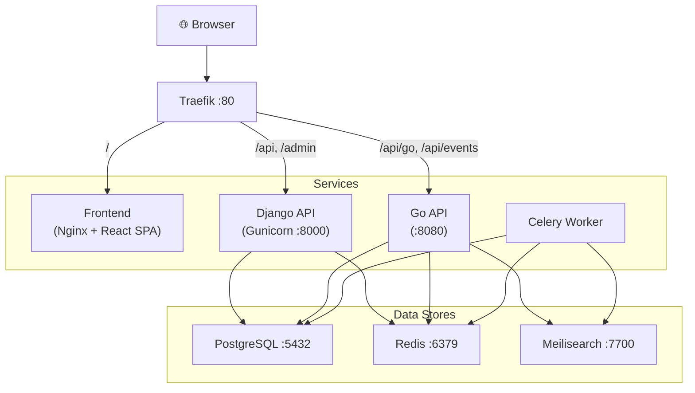

# 🐳 Docker Deployment Guide

Deploy DMS-O2 anywhere using pre-built Docker images — **no source code required**.

---

## Prerequisites

| Requirement | Minimum |
|-------------|---------|
| Docker Engine | 24+ |
| Docker Compose | V2 (included with Docker Desktop) |
| RAM | 2 GB |
| Disk | 10 GB |

---

## Quick Start

### 1. Download the compose file and environment template

Choose the commands for your operating system to set up your directory and download the configuration files:

#### Linux & macOS (Bash/Zsh)
```bash
# Create and enter the directory
mkdir dms && cd dms

# Download configuration files
curl -LO https://raw.githubusercontent.com/sauryah/dms-o2/main/docker-compose.ghcr.yml
curl -LO https://raw.githubusercontent.com/sauryah/dms-o2/main/.env.example

# Create the environment file
cp .env.example .env
```

#### Windows (PowerShell)
```powershell
# Create and enter the directory
New-Item -ItemType Directory -Path dms
Set-Location dms

# Download configuration files
Invoke-WebRequest -Uri "https://raw.githubusercontent.com/sauryah/dms-o2/main/docker-compose.ghcr.yml" -OutFile "docker-compose.ghcr.yml"
Invoke-WebRequest -Uri "https://raw.githubusercontent.com/sauryah/dms-o2/main/.env.example" -OutFile ".env.example"

# Create the environment file
Copy-Item .env.example .env
```

#### Windows (Command Prompt / cmd.exe)
```cmd
:: Create and enter the directory
mkdir dms && cd dms

:: Download configuration files
curl -LO https://raw.githubusercontent.com/sauryah/dms-o2/main/docker-compose.ghcr.yml
curl -LO https://raw.githubusercontent.com/sauryah/dms-o2/main/.env.example

:: Create the environment file
copy .env.example .env
```

---

### 2. Configure your environment

Open the generated `.env` file in your favorite text editor (e.g., VS Code, Notepad, Vim) and customize the keys.

> [!CAUTION]
> **You MUST change these values before running in production:**
> *   `POSTGRES_PASSWORD` — Use a strong, random password.
> *   `ROOT_PASSWORD` — Initial admin panel password.
> *   `DJANGO_SECRET_KEY` — Generate a secure key:
>     *   **Cross-platform (Python):** `python -c "import secrets; print(secrets.token_urlsafe(64))"`
> *   `MEILI_MASTER_KEY` — Generate a secure key:
>     *   **Linux/macOS:** `openssl rand -base64 32`
>     *   **Windows (PowerShell):** `[Convert]::ToBase64String((1..32 | ForEach-Object { Get-Random -Minimum 0 -Maximum 256 } -As Byte))`

---

### 3. Start the application

Run this command from inside your `dms` directory:

```bash
docker compose -f docker-compose.ghcr.yml up -d
```

The application will be available at **http://localhost** once all services are healthy (usually ~30 seconds).

---

## Architecture



---

## Available Images

| Component | Docker Hub | GHCR | Description |
|-----------|-----------|------|-------------|
| Backend | `sauryah/dms-backend` | `ghcr.io/sauryah/dms-o2/backend` | Django API + Celery worker |
| Frontend | `sauryah/dms-frontend` | `ghcr.io/sauryah/dms-o2/frontend` | React SPA served via Nginx |
| Go API | `sauryah/dms-go-api` | `ghcr.io/sauryah/dms-o2/go-api` | High-performance search & SSE |

All images are built for **linux/amd64** and **linux/arm64**.

---

## Configuration Reference

| Variable | Default | Description |
|----------|---------|-------------|
| `POSTGRES_DB` | `dms` | Database name |
| `POSTGRES_USER` | `dms_user` | Database username |
| `POSTGRES_PASSWORD` | *(change me)* | Database password |
| `DJANGO_SECRET_KEY` | *(change me)* | Django cryptographic signing key |
| `DJANGO_DEBUG` | `False` | Enable debug mode (never `True` in production) |
| `DJANGO_ALLOWED_HOSTS` | `localhost` | Comma-separated list of allowed hostnames |
| `MEILI_MASTER_KEY` | *(change me)* | Meilisearch authentication key |
| `MEILI_SEARCH_KEY` | *(empty)* | Optional read-only Meilisearch key |
| `ROOT_USERNAME` | `root` | Initial admin username |
| `ROOT_PASSWORD` | *(change me)* | Initial admin password |
| `SESSION_IDLE_TIMEOUT_MINUTES` | `30` | Session idle timeout |
| `SESSION_ABSOLUTE_TIMEOUT_HOURS` | `12` | Maximum session lifetime |
| `HISTORY_RETENTION_DAYS` | `365` | How long to keep audit history |
| `DMS_VERSION` | `latest` | Image version tag to use |

---

## Pinning a Version

To deploy a specific release instead of `latest`:

```bash
# Via environment variable
DMS_VERSION=1.0.0 docker compose -f docker-compose.ghcr.yml up -d

# Or add to your .env file
echo "DMS_VERSION=1.0.0" >> .env
docker compose -f docker-compose.ghcr.yml up -d
```

---

## Updating

```bash
# Pull the latest images
docker compose -f docker-compose.ghcr.yml pull

# Recreate containers with new images (zero-downtime for stateless services)
docker compose -f docker-compose.ghcr.yml up -d

# Clean up old images
docker image prune -f
```

> [!TIP]
> Migrations run automatically on every startup via the `migrate` service.

---

## Backup & Restore

### Automatic Backups

A built-in backup service runs **daily at 2:00 AM** (server time), creating compressed database dumps in a Docker volume (`dms_backups`).

- Backups are stored as `dms_YYYYMMDD_HHMMSS.sql.gz`
- Only the **last 30 backups** are retained automatically

### Manual Backup

```bash
# Trigger an immediate backup
docker compose -f docker-compose.ghcr.yml exec backup sh -c '. /env.sh; /usr/local/bin/backup.sh'

# List existing backups
docker compose -f docker-compose.ghcr.yml exec backup ls -lh /backups/
```

### Restore from Backup

```bash
# Copy backup out of the container
docker compose -f docker-compose.ghcr.yml cp backup:/backups/dms_20250101_020000.sql.gz ./

# Restore
gunzip -c dms_20250101_020000.sql.gz | docker compose -f docker-compose.ghcr.yml exec -T db psql -U dms_user dms
```

---

## Troubleshooting

### Check service health

```bash
docker compose -f docker-compose.ghcr.yml ps
docker compose -f docker-compose.ghcr.yml logs --tail=50 django
```

### Port 80 already in use

```bash
# Find what's using port 80
# Linux/Mac:
sudo lsof -i :80
# Windows:
netstat -ano | findstr :80
```

Or change the Traefik port in the compose file:
```yaml
traefik:
  ports:
    - "8080:80"  # Access at http://localhost:8080 instead
```

### Health check failures

If services keep restarting, check the logs:

```bash
# Check all logs
docker compose -f docker-compose.ghcr.yml logs

# Check specific service
docker compose -f docker-compose.ghcr.yml logs django
docker compose -f docker-compose.ghcr.yml logs go-api

# Follow logs in real-time
docker compose -f docker-compose.ghcr.yml logs -f
```

### Database connection issues

Ensure the database is fully healthy before other services start:

```bash
docker compose -f docker-compose.ghcr.yml logs db
docker compose -f docker-compose.ghcr.yml exec db pg_isready -U dms_user -d dms
```

### Reset everything

```bash
# Stop all services and remove volumes (⚠️ deletes all data)
docker compose -f docker-compose.ghcr.yml down -v

# Start fresh
docker compose -f docker-compose.ghcr.yml up -d
```

---

## Using Docker Hub Images Instead

If you prefer Docker Hub over GHCR, replace the image references in the compose file:

```yaml
# Change from:
image: ghcr.io/sauryah/dms-o2/backend:${DMS_VERSION:-latest}
# To:
image: sauryah/dms-backend:${DMS_VERSION:-latest}
```

| Service | GHCR (default) | Docker Hub |
|---------|----------------|------------|
| backend | `ghcr.io/sauryah/dms-o2/backend` | `sauryah/dms-backend` |
| frontend | `ghcr.io/sauryah/dms-o2/frontend` | `sauryah/dms-frontend` |
| go-api | `ghcr.io/sauryah/dms-o2/go-api` | `sauryah/dms-go-api` |
