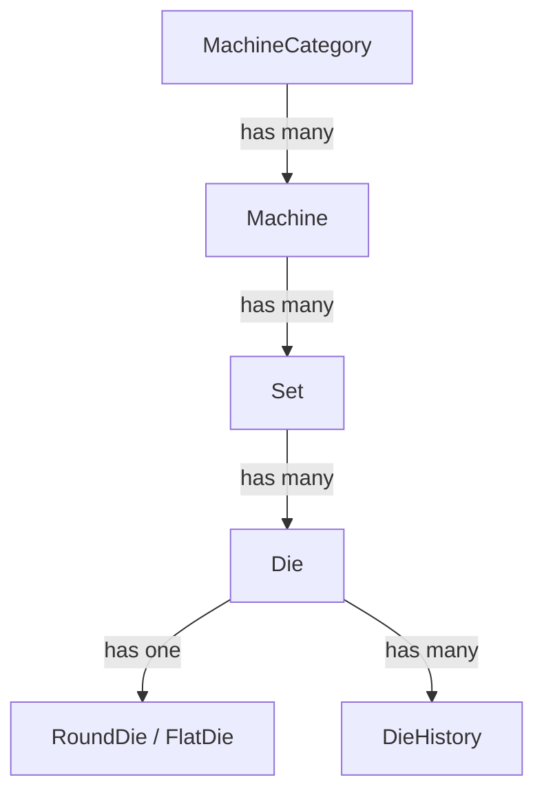
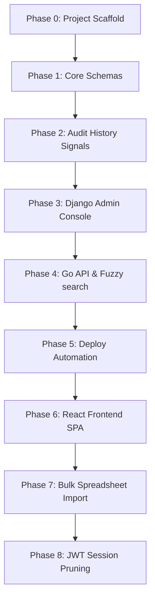

# Die Management System — Development Roadmap & Spec Ledger

This document serves as the main engineering ledger, data schema reference, deployment specifications, and chronological changelog for the Die Management System (DMS).

---

## 📖 Table of Contents
1. [Developer Onboarding & Usage Instructions](#1-developer-onboarding--usage-instructions)
2. [Platform Tech Stack](#2-platform-tech-stack)
3. [Data Models & Schema Hierarchy](#3-data-models--schema-hierarchy)
4. [Role-Based Access Control Matrix](#4-role-based-access-control-matrix)
5. [Die Specifications & Fields](#5-die-specifications--fields)
6. [Core Engineering & Business Rules](#6-core-engineering--business-rules)
7. [Phased Development Roadmap](#7-phased-development-roadmap)
8. [Chronological Changelog](#8-chronological-changelog)

---

## 1. Developer Onboarding & Usage Instructions

> [!IMPORTANT]
> **Rules for AI Coding Agents and New Developers**:
> 1. Read this entire ledger before modifying any backend files, schemas, or frontend views.
> 2. Build or refactor in strict phase order as defined in the roadmap timeline.
> 3. Execute quality assurance tests after completing each phase. All unit and E2E specs must pass before moving forward.
> 4. If a check or test fails, debug and resolve it immediately. Do not bypass errors.
> 5. After successful implementation, document the updates under the [Chronological Changelog](#8-chronological-changelog) section.

---

## 2. Platform Tech Stack

| Layer | Component | Description / Details |
| :--- | :--- | :--- |
| **Backend API** | Django 4.2 / REST Framework | Standard relational CRUD operations, permissions, admin, JWT authentication |
| **Search API** | Go (Golang) Microservice | Direct PostgreSQL indexing + Redis caching for high-speed read queries |
| **Databases** | PostgreSQL 18 | Primary relational storage, transactions, auditing |
| **Search Engine**| Meilisearch v1.7 | Fuzzy text search matching (ids, locations, casings) |
| **Frontend** | React 18 + Vite | Single Page Application served via Nginx in production |
| **Reverse Proxy**| Traefik v3 | Local network routing, auto-routing rules, and port bindings |

---

## 3. Data Models & Schema Hierarchy

DMS organizes data assets in a cascading hierarchical relationship:

---

## 4. Role-Based Access Control Matrix

| System Role | Permissions & Permitted Actions | Interface Restrictions |
| :--- | :--- | :--- |
| **Unauthenticated**| Search toolings, view metrics, browse sets. | Read-Only. Forms and action buttons are disabled. |
| **Admin** | Register new dies, edit location/status/remarks, trigger bulk spreadsheet imports. | CRUD on dies, Sets, and Machines. Locked out of user administration. |
| **Root** | Create/deactivate Admin user accounts, manage backups, restore system states. | Full administrative access. Single superuser account created via shell seeder. |

---

## 5. Die Specifications & Fields

Dies are modeled under a unified base model (`Die`) with type-specific attributes:

### Common Fields (All Dies)
*   `die_id` (String, unique, alphanumeric)
*   `casing` (String, dimensions envelope, e.g. `25x10`)
*   `status` (Enum, e.g. `AVAILABLE`, `RUNNING`, `CLEANING`, `POLISHING`, `DAMAGED`, `SCRAPPED`, `MISSING`)
*   `location` (String, free-text physical rack placement, e.g., `Rack A - Shelf 3`, nullable)
*   `current_set` (Foreign Key → Set, nullable)
*   `remarks` (Text, notes or maintenance reports)

### Round Die Attributes
*   `original_size` (Decimal, 3 decimal places, mm format)
*   `current_size` (Decimal, 3 decimal places, mm format)

### Flat Die Attributes
*   `original_width` & `current_width` (Decimal, 3 decimal places, mm format)
*   `original_thickness` & `current_thickness` (Decimal, 3 decimal places, mm format)
*   `radius` (Decimal, 3 decimal places, corner fillet mm format)

---

## 6. Core Engineering & Business Rules

1.  **Immutable History Logging**: The `DieHistory` model must **only** be written to by PostgreSQL database triggers or Django `pre_save` signals. Developers must never instantiate history logs manually.
2.  **Double-Buffered Search**:
    *   Fuzzy text queries match indices inside Meilisearch.
    *   Decimal ranges and dimensional checks query PostgreSQL directly.
3.  **Idempotent Imports**: Bulk imports update existing dies on matching `die_id`, otherwise create new entries. Rows with invalid columns or dimension formats are skipped, generating row-by-row validation error reports.
4.  **No Merged Cells in Export**: Excel exports using `openpyxl` must use a flat grid layout: single header row followed by clean data rows (no merged cells or styling lines).

---

## 7. Phased Development Roadmap

Follow this phased pipeline when setting up the platform:

---

## 8. Chronological Changelog

### 2026-06-24 · feat: implement P0 and P1 audit improvements for security, performance, and caching
- Optimized CustomJWTAuthentication to perform cache-first lookups and throttled last_seen database writes.
- Enforced password strength validation in UserSerializer using Django's validator framework.
- Modified IsRootOnly permission check to permit authenticated self-profile updates for non-ROOT users.
- Secured frontend endpoints by creating a ProtectedRoute component mapping roles to routes.
- Reduced React sidebar tree rendering complexity from O(M * S) to O(M + S) via hash map sets indexing.
- Optimized database pre_save signals to query only target auditing fields via values() instead of model instantiation.
- Implemented zero-downtime search reindexing in sync_search command via atomic index swapping.
- Accelerated bulk CSV imports through set pre-caching and database transaction savepoints.

- Fixed an issue where the global 100-item page size limit caused sets, machines, categories, and users to not render in the frontend beyond 100 entries.
- Set `pagination_class = None` on `SetViewSet`, `MachineViewSet`, `MachineCategoryViewSet`, and `UserViewSet`.

### 2026-06-22 · feat: implement bidirectional CAD-to-specification highlights, keyboard search dropdown navigation, and visual interactive rack layout grids

- Added bidirectional hover interactions between specifications tables and SVG blueprints.
- Implemented keyboard-only navigation for the search dropdown, supporting Tab/Shift+Tab and Arrow keys.
- Developed an interactive HTML5 drag-and-drop Rack Grid Layout component to visually relocate dies and manage storage slots.

### 2026-06-20 · feat: implement React Query optimistic updates and SVG dimension tooltips
- Added central optimistic state mutation triggers to speed up drag-and-drop set/die relocations.
- Equipped the CAD vector renderer with hover and click tooltips explaining safety wear tolerances.

### 2026-06-15 · feat: implement high-performance Go search API microservice with custom Postgres ANY array parsing and Vite dev server routing
### 2026-06-15 · perf: implement search request cancellation in frontend using AbortSignal to abort redundant concurrent database queries
### 2026-06-15 · feat: wrap Meilisearch syncing and SSE broadcasts in transaction.on_commit database hooks to ensure transaction safety
### 2026-06-15 · perf: enable dynamic Gzip/Brotli compression in Traefik middleware for both API and frontend static assets
### 2026-06-15 · perf: implement fast dict-based collection serialization in backend to bypass DRF overhead (10-15x speedup)
### 2026-06-15 · perf: memoize hierarchical tree grouping in App.jsx to optimize sidebar rendering and input response
### 2026-06-15 · sec: implement automated session eviction on user password change or account deactivation
### 2026-06-14 · feat: implement drag-and-drop allocations to drag dies into sets or sets onto machines directly in the sidebar tree view
### 2026-06-14 · fix: allow dms.local and LAN hostnames in vite.config.js server.allowedHosts
### 2026-06-14 · feat: configure HTTP-only routing in Traefik to allow seamless local network access without SSL warning popups
### 2026-06-14 · feat: implement live real-time status synchronization using PostgreSQL LISTEN/NOTIFY and Server-Sent Events (SSE)
### 2026-06-14 · feat: implement local HTTPS encryption using mkcert and Traefik on port 443 with automated HTTP-to-HTTPS redirect
### 2026-06-14 · feat: implement dynamic chevrons for desktop sidebar toggle and style tree connecting lines with indigo color and hover highlights
### 2026-06-14 · feat: create unified setup.sh environment bootstrap script and add size/header integrity checks in backup_db.sh
### 2026-06-14 · feat: add search input, parent category/machine filters, and scroll wrappers for Categories, Machines, and Tool Sets views
### 2026-06-14 · feat: implement backup file local download, dump file upload, and active session eviction before system restores
### 2026-06-14 · feat: implement root-only Backup & Restore UI tab in User Administration page with double-confirmation restore modal
### 2026-06-14 · feat: implement automated nightly backups container and dms-backup.sh host utility script
### 2026-06-14 · security: require current password to change password or email for self-profile updates
### 2026-06-14 · feat: implement client-side session idle warning modal and keep-alive backend endpoint
### 2026-06-14 · feat: implement search optimizations (query debouncing, test environment index isolation, backend direct db query fallback, and auto-sync on deploy)
### 2026-06-14 · fix: create sync_search management command to sync database with Meilisearch and fix frontend search filter parameter initialization from URL query parameters
### 2026-06-14 · fix: shift deployment conditional checks to step-level env checks and add Meilisearch container healthcheck in workflow
### 2026-06-14 · fix: skip deployment step when server secrets are unconfigured, map ports, and fix migration checks in workflow
### 2026-06-14 · feat: support bulk status update via multi-select checkbox table controls
### 2026-06-14 · feat: complete UI/UX facelift with status distribution donut chart, dynamic SVG CAD blueprints, connecting tree lines, and custom fonts
### 2026-06-14 · fix: resolve flat die radius serialization in backend list serializer and render in frontend tables/cards
### 2026-06-14 · feat: redesign inventory page with Tree View + Master Detail, enable batch machine/set creation, and implement production upgrade/deployment workflow
### 2026-06-14 · feat: allow ROOT users to edit their own profile (password and email) in User Administration page
### 2026-06-14 · feat: implement range query filtering for Meilisearch search results, add Dashboard search filters UI with strict range trigger logic, and add unit and E2E smoke tests
### 2026-06-13 · feat: secure ROOT user session, prevent self-demotion, update create_root_user command
### 2026-06-13 · docs: update PROJECT.md changelog with user admin commit
### 2026-06-13 · feat: implement User Administration page for ROOT users and add E2E tests
### 2026-06-12 · docs: update PROJECT.md changelog with serializer fix commit
### 2026-06-12 · fix: include current_set field in DieListSerializer to enable correct tree grouping in frontend
### 2026-06-12 · docs: update PROJECT.md changelog with bulk import set name resolution commit
### 2026-06-12 · feat: support resolving and assigning sets by name with machine_name conflict resolution during bulk import, and update CSV template
### 2026-06-12 · docs: update PROJECT.md changelog with consistency signals commit
### 2026-06-12 · feat: add Django signals in machines app to resync Meilisearch and maintain history log consistency upon Set/Machine changes and Set deletion
### 2026-06-12 · docs: update PROJECT.md changelog with tree layout commit
### 2026-06-12 · feat: redesign Die Inventory page to display expandable drill-down tree (Machine -> Sets -> Dies)
### 2026-06-12 · docs: update PROJECT.md changelog with docker-compose port commit
### 2026-06-12 · infra: expose PostgreSQL port 5432 to host in docker-compose.yml
### 2026-06-12 · docs: update PROJECT.md changelog with bulk import template commit
### 2026-06-12 · feat: add client-side CSV template download on Bulk Import page
### 2026-06-12 · docs: update PROJECT.md changelog after readme update
### 2026-06-12 · docs: update API documentation in README.md with Machine Sets CRUD endpoints
### 2026-06-12 · docs: update PROJECT.md changelog
### 2026-06-12 · feat: implement machine category, machine, and set CRUD views with frontend pages, separate dashboard and inventory pages, and fix E2E smoke tests
### 2026-06-12 · docs: add default login credentials to README.md
### 2026-06-12 · docs: finalize project md changelog with the docker setup documentation commit
### 2026-06-12 · docs: update README.md and PROJECT.md to document unified docker setup
### 2026-06-12 · infra: containerize React frontend service in docker-compose with Traefik ingress
### 2026-06-12 · docs: finalize PROJECT.md changelog with readme commit
### 2026-06-12 · docs: generate complete README.md based on codebase analysis
### 2026-06-12 · docs: finalize changelog in PROJECT.md
### 2026-06-12 · docs: update changelog for Phase 6-8 complete
### 2026-06-12 · Phase 6-8: React frontend pages, bulk import, and JWT auth and session prune logic and tests implemented
### 2026-06-12 · Phase 5: Deploy workflow implemented
### 2026-06-12 · Phase 4: REST API + Search implemented and passing all tests
### 2026-06-12 · Phase 3: Django admin configured and all models registered, all tests pass
### 2026-06-12 · Phase 2: DieHistory pre_save signals implemented, all tests pass
### 2026-06-12 · Phase 1: Core models and migrations implemented, all tests pass
### 2026-06-12 · Phase 0: Project scaffold complete and all tests pass
### 2026-06-12 · docs: update changelog for phase 0 scaffold
### 2026-06-12 · Phase 0: Project Scaffold
egistered, all tests pass
### 2026-06-12 · Phase 2: DieHistory pre_save signals implemented, all tests pass
### 2026-06-12 · Phase 1: Core models and migrations implemented, all tests pass
### 2026-06-12 · Phase 0: Project scaffold complete and all tests pass
### 2026-06-12 · docs: update changelog for phase 0 scaffold
### 2026-06-12 · Phase 0: Project Scaffold
