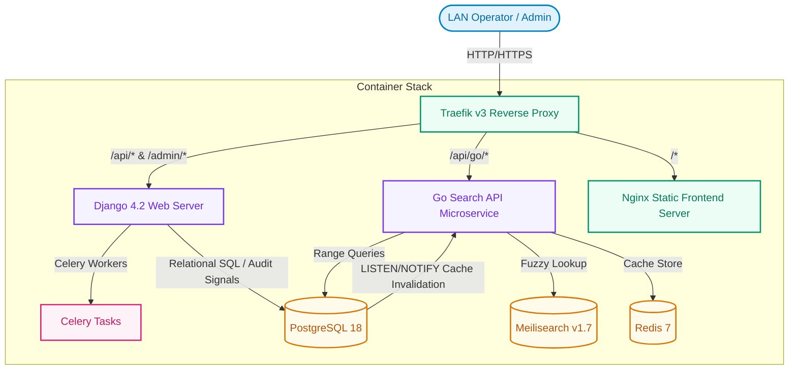

# 🛠️ DMS-O2

<p align="center">
  <strong>Industrial-Grade Die Management System (DMS)</strong><br />
  <em>Optimized for low-latency shop floor operations, offline resilience, and secure LAN asset tracking.</em>
</p>

<p align="center">
  <a href="https://github.com/sauryah/dms-o2/releases"></a>
  <a href="LICENSE"></a>
  <a href="https://hub.docker.com/r/sauryah/dms-backend"></a>
  <a href="https://github.com/sauryah/dms-o2/actions"></a>
  <a href="backend"></a>
  <a href="go-api"></a>
  <a href="frontend"></a>
  <a href="https://github.com/sauryah/dms-o2/stargazers"></a>
  <a href="https://github.com/sauryah/dms-o2/network/members"></a>
</p>

---

**DMS-O2** is an industrial-grade, high-performance Local Area Network (LAN) platform for tracking, inventory management, and auditing of manufacturing dies. Designed for low latency, high concurrency shop floor operations, and offline resilience, it replaces unstructured spreadsheets with a structured, reliable source of truth.

## 🖥️ Screen Preview


---

## 📖 Table of Contents

- [Overview \& Architecture](#overview--architecture)
- [Key Features](#key-features)
- [Technology Stack](#technology-stack)
- [Quick Start](#quick-start)
  - [Prerequisites](#prerequisites)
  - [Installing `mkcert`](#installing-mkcert)
  - [Automated Setup](#automated-setup)
  - [Manual Setup (Alternative)](#manual-setup-alternative)
  - [Access Interfaces](#access-interfaces)
- [Deploy with Docker (No Source Code)](#deploy-with-docker-no-source-code)
- [Configuration](#configuration)
- [Project Structure](#project-structure)
- [Usage Guide](#usage-guide)
  - [Using Make (Recommended)](#using-make-recommended)
  - [Common Container Tasks](#common-container-tasks)
  - [Keyboard Navigation](#keyboard-navigation)
- [Deployment \& Upgrades](#deployment--upgrades)
- [Backup \& Recovery](#backup--recovery)
  - [Command Utility (`dms-backup.sh`)](#command-utility-dms-backupsh)
- [Security](#security)
  - [TLS Certificates](#tls-certificates)
- [LAN HTTPS Access from Other Computers](#lan-https-access-from-other-computers)
  - [Step 1: Copy the Root CA](#step-1-copy-the-root-ca)
  - [Step 2: Install the Certificate](#step-2-install-the-certificate)
  - [Step 3: Verify](#step-3-verify)
  - [Regenerating Certificates](#regenerating-certificates)
- [Roadmap](#roadmap)
- [FAQ](#faq)
- [Troubleshooting](#troubleshooting)
  - [Full Docker Reset (Nuclear Option)](#full-docker-reset-nuclear-option)
- [Licensing \& Compliance](#licensing--compliance)
- [Contributing](#contributing)
- [Support](#support)
- [Credits](#credits)

---

## 🧠 Overview & Architecture

DMS-O2 is built as a microservice-oriented application optimized to deliver sub-millisecond read latency over local area networks (LAN). It uses a hybrid query execution design: fuzzy text searches are routed to Meilisearch, while numeric range queries run directly on PostgreSQL.



*For deep architectural design specifications, refer to [docs/ARCHITECTURE.md](docs/ARCHITECTURE.md).*

---

## ✨ Key Features

* **Precision Die Modeling**: Custom tracking templates optimized for:
  * **Round dies** (casing, current size, original size).
  * **Flat dies** (width, thickness, corner radius).
* **Interactive CAD Highlighting**: Bidirectional vector highlight syncing. Hovering over dimensions in tables glows the corresponding blueprint SVG node, and vice versa.
* **Visual Storage Rack Map**: Drag-and-drop grid interface representing physical warehouse racks for rapid inventory relocation.
* **Fuzzy & Parametric Search**: Blazing-fast lookup leveraging the Go search microservice with Redis caching, PostgreSQL range queries, and Meilisearch.
* **Granular Role-Based Access Control (RBAC)**:
  * *Unauthenticated / Operator*: Read-only search, view metrics, and browse inventory.
  * *Admin*: Full CRUD on dies, machines, and sets, plus bulk spreadsheet imports.
  * *Root*: User administration, database backup/restore operations, and system configuration.
* **Immutable Auditing**: Database triggers and Django pre-save signals capture all modifications to die status, location, and dimensions.
* **Session Management**: Concurrent session control with immediate eviction of previous logins upon new sign-ins.
* **Sheet-to-Database Import**: Validation-backed, idempotent CSV/Excel import system.
* **Engineering Tools Suite**: Integrated die calculators, including the **Sizing & Elongation Calculator** and the high-fidelity **Wire Drawing Elongation Calculator** featuring interactive results tables, Suggesters, and PDF/Excel/CSV exports.

---

## 🛠️ Technology Stack

| Layer | Component | Version | Role / Purpose |
| :--- | :--- | :--- | :--- |
| **Frontend UI** | React, Vite, Vanilla CSS | `React 18`, `Vite` | Single Page Application (SPA) dashboard |
| **Backend API** | Django & Django REST Framework | `Python 3.11`, `Django 4.2` | Core business logic, RBAC policies, mutating transactions |
| **Search Gateway** | Go (Golang) | `Go 1.22` | Ultra-fast read-only query processing & cache management |
| **Relational DB** | PostgreSQL | `PostgreSQL 18` | Primary relational store & immutable auditing |
| **Fuzzy Index** | Meilisearch | `v1.7` | Typo-tolerant text index for rapid search |
| **Memory Cache** | Redis | `v7` (Alpine) | Query caching & Celery broker |
| **Ingress Router** | Traefik | `v3` | Automated HTTPS TLS termination & reverse proxy |
| **Testing** | Vitest, Playwright, PyTest | — | Front-to-back unit, integration, and E2E coverage |

---

## 🚀 Quick Start

### Prerequisites

Ensure you have the following installed on your host machine:

* **Docker & Docker Compose (V2+)**: On Linux, configure your user to access the Docker daemon without `sudo`:
  ```bash
  sudo usermod -aG docker $USER
  # Log out and log back in for changes to take effect
  ```
* **mkcert**: Required for local TLS certificate generation.
* **Node.js (v18+) & npm**: Only required if running the frontend locally outside Docker.
* **Python 3.11**: Only required if running Django commands locally outside Docker.

---

### Installing `mkcert`

Choose the command matching your host operating system:

| Operating System | Install Command |
| :--- | :--- |
| **Linux (Fedora/RHEL)** | `sudo dnf install mkcert` |
| **Linux (Debian/Ubuntu)** | `sudo apt install mkcert` |
| **macOS (Homebrew)** | `brew install mkcert` |
| **Windows (Chocolatey)** | `choco install mkcert` |

*Alternatively, download binaries directly from the [official releases](https://github.com/FiloSottile/mkcert/releases).*

---

### Automated Setup

The system includes automated installers that copy configuration files, build containers, initialize databases, and generate certificates.

#### Linux & macOS
```bash
chmod +x setup.sh
./setup.sh
```

#### Windows (PowerShell)
```powershell
Set-ExecutionPolicy -Scope Process -ExecutionPolicy Bypass
./setup.ps1
```

> [!TIP]
> **Using Make**
> A `Makefile` is provided for developer convenience. Run `make help` to see all available targets (setup, certs, start, stop, logs, backup, etc.).

> [!TIP]
> **LAN Network Access**
> On completion, the setup scripts output your server's LAN IP address (e.g., `https://192.168.1.15`). Any device on the same local network can access the dashboard. To remove SSL browser warnings on client machines, see [LAN HTTPS Access from Other Computers](#lan-https-access-from-other-computers).

---

### Manual Setup (Alternative)

If you prefer to configure the steps manually:

1. **Environment Settings**:
   ```bash
   cp .env.example .env
   ```
2. **Start Services**:
   ```bash
   docker compose up -d --build
   ```
3. **Run Database Migrations & Seeds**:
   ```bash
   docker compose exec django python manage.py migrate
   docker compose exec django python manage.py create_root_user
   ```
4. **Sync Search Indexes**:
   ```bash
   docker compose exec django python manage.py sync_search
   ```

---

### Access Interfaces

* **Frontend SPA**: [https://localhost](https://localhost)
* **Django Admin Console**: [https://localhost/admin/](https://localhost/admin/)
* **REST API Root**: [https://localhost/api/](https://localhost/api/)
* **Default Credentials**: Automatically generated by `setup.sh` (saved in your `.env` file).

> [!NOTE]
> DMS-O2 forces HTTPS by default. The setup scripts automatically generate TLS certificates for your LAN IP using [mkcert](https://github.com/FiloSottile/mkcert). All plain HTTP requests are automatically redirected to HTTPS.

---

## 🐳 Deploy with Docker (No Source Code)

To deploy DMS-O2 instantly using pre-built images without cloning this repository, execute:

```bash
mkdir dms && cd dms
curl -LO https://raw.githubusercontent.com/sauryah/dms-o2/main/docker-compose.ghcr.yml
curl -LO https://raw.githubusercontent.com/sauryah/dms-o2/main/.env.example
cp .env.example .env   # ← Edit passwords and secret keys here!
docker compose -f docker-compose.ghcr.yml up -d
```

*For detailed production deployment instructions, including Windows PowerShell/Command Prompt scripts, automated backups, and version pinning, review the [Docker Deployment Guide](DOCKER.md).*

---

## ⚙️ Configuration

System variables are managed in the `.env` file in the project root.

> [!WARNING]
> Ensure all secret keys and passwords are changed in production environments. Never commit `.env` files to git repositories.

| Key | Default Value | Description |
| :--- | :--- | :--- |
| `POSTGRES_DB` | `dms` | Target PostgreSQL database name. |
| `POSTGRES_USER` | `dms_user` | Database user account. |
| `POSTGRES_PASSWORD` | `your_db_password` | Database access password. |
| `POSTGRES_HOST` | `db` | Database service host inside the Docker network. |
| `POSTGRES_PORT` | `5432` | PostgreSQL network port. |
| `REDIS_PASSWORD` | `change_me_redis_password` | Redis auth password (must match broker/backend URL). |
| `DJANGO_SECRET_KEY` | `your-secret-key` | Django secret key for session signing and CSRF protection. |
| `INTERNAL_API_SECRET` | `your-internal-secret` | Shared secret for Django ↔ Go API communication. |
| `CELERY_BROKER_URL` | `redis://:change_me_redis_password@redis:6379/0` | Redis connection URL for Celery message broker. |
| `CELERY_RESULT_BACKEND` | `redis://:change_me_redis_password@redis:6379/0` | Redis connection URL for Celery task results. |
| `MEILI_HOST` | `http://meilisearch:7700` | Search service connection endpoint. |
| `MEILI_MASTER_KEY` | *auto-generated* | Meilisearch authorization key. |
| `ROOT_USERNAME` | `root` | Superuser username. |
| `ROOT_PASSWORD` | *(generated by setup.sh)* | Default administrator password. |
| `SESSION_IDLE_TIMEOUT_MINUTES` | `30` | Minutes before idle session expires. |
| `SESSION_ABSOLUTE_TIMEOUT_HOURS` | `12` | Absolute hours before user is forced to log in again. |

---

## 📂 Project Structure

```text
dms-o2/
├── .github/workflows/         # CI/CD Deployment configurations
├── .githooks/                 # Git hooks (pre-commit linting & secret detection)
├── backend/                   # Django Backend Service
│   ├── dies/                  # Die models, database signals, and viewsets
│   ├── history/               # Audit logging logic and model hooks
│   ├── machines/              # Assets (Categories, Machines, Tool Sets)
│   └── users/                 # RBAC and session timeout tracking
├── certs/                     # TLS certificates (generated, gitignored)
│   ├── cert.pem               # Server certificate for current LAN IP
│   ├── key.pem                # Private key
│   └── rootCA.pem             # Root CA (install on client machines)
├── go-api/                    # Go Search & Stats Microservice
│   ├── cmd/server/main.go     # API routes and Redis invalidation cache logic
│   └── Dockerfile             # Multi-stage container file
├── frontend/                  # React Frontend Single Page Application
│   ├── src/                   # UI components, layout grids, hooks
│   └── Dockerfile.prod        # Production static Nginx configuration
├── scripts/                   # Utility scripts
│   ├── generate-certs.sh      # Auto-generate TLS certs (Linux/macOS)
│   ├── generate-certs.bat     # Auto-generate TLS certs (Windows)
│   ├── install-cert.bat       # Install rootCA on Windows clients
│   ├── backup_db.sh           # Database backup script
│   └── prune_history.sh       # Audit history retention cleanup
├── docs/                      # Documentation folder
│   └── ARCHITECTURE.md        # Deep architectural design specs
├── design-system/             # CSS tokens and design specs
│   └── die-management-system/
│       └── MASTER.md          # Global design components and tokens
├── Makefile                   # Common dev commands (make help)
├── traefik.yml                # Traefik static config (entrypoints, providers)
├── dynamic.yml                # Traefik dynamic config (TLS store, certificates)
├── docker-compose.yml         # Local development compose stack
├── docker-compose.prod.yml    # Production compose stack
├── docker-compose.ghcr.yml    # Pre-built image compose stack
├── setup.sh                   # Automated setup (Linux/macOS)
├── setup.ps1                  # Automated setup (Windows)
├── deploy.sh                  # Production upgrade script
└── dms-backup.sh              # Database backup and restore script
```

* **Architecture Specs**: Detailed layout rules can be found in [docs/ARCHITECTURE.md](docs/ARCHITECTURE.md).
* **Design Guidelines**: Visual UI styling guidelines are located in [design-system/die-management-system/MASTER.md](design-system/die-management-system/MASTER.md).

---

## 📖 Usage Guide

### Using Make (Recommended)

Run `make help` to view all CLI tasks:

| Command | Description |
| :--- | :--- |
| `make setup` | Full automated setup (Docker + DB + certs) |
| `make certs` | Regenerate TLS certificates for current LAN IP |
| `make start` | Start all containers |
| `make stop` | Stop all containers |
| `make logs` | Tail all container logs |
| `make migrate` | Run database migrations |
| `make backup` | Run manual database backup |
| `make build` | Rebuild and restart all containers |

---

### Common Container Tasks

* **Start the container stack**:
  ```bash
  docker compose up -d
  ```
* **Stop the stack (without deleting data)**:
  ```bash
  docker compose stop
  ```
* **Bring the stack down (cleans containers and networks)**:
  ```bash
  docker compose down
  ```
* **View container logs**:
  ```bash
  docker compose logs -f
  ```
* **Database Interactive CLI**:
  ```bash
  docker compose exec db psql -U dms_user -d dms
  ```

---

### ⌨️ Keyboard Navigation

To optimize for shop-floor speed, the search interface supports rapid keyboard shortcuts:

* <kbd>▲ ArrowUp</kbd> / <kbd>▼ ArrowDown</kbd> — Navigate up and down through list results.
* <kbd>Tab</kbd> / <kbd>Shift</kbd> + <kbd>Tab</kbd> — Shift focus between input fields.
* <kbd>Enter</kbd> — Select and view the highlighted inventory record.

---

## 📈 Deployment & Upgrades

Production-optimized assets use a high-concurrency setup:
1. **Nginx**: Serves compiled React assets with Gzip compression.
2. **Gunicorn**: Serves the Django backend WSGI server.
3. **Go Endpoint**: Bypasses Django entirely for high-speed read operations on `/api/go/*`.

### Production Deployment Script

To deploy upgrades without downtime, use the integrated deployment automation script:
```bash
./deploy.sh
```
This script pulls updates, verifies configuration files, builds changed containers, runs SQL migrations, and clears legacy docker caches.

---

## 💾 Backup & Recovery

A scheduled database container performs compressed dumps nightly at **2:00 AM** and persists them to the host folder `./backups/` with a **14-day retention cycle**.

### Command Utility (`dms-backup.sh`)

* **Create a manual backup**:
  ```bash
  ./dms-backup.sh backup
  ```
* **List all local backups**:
  ```bash
  ./dms-backup.sh list
  ```
* **Restore the database**:
  ```bash
  ./dms-backup.sh restore <backup_filename.dump>
  ```

> [!WARNING]
> Restoring a database will overwrite current records and trigger an automatic rebuild of Meilisearch search indexes.

---

## 🛡️ Security

DMS-O2 is built with security-first practices to protect industrial assets and maintain server integrity on local shop floor networks.

### Core Security Controls

* **Container Privilege Isolation**: All container processes run under a non-root system user (`USER dmsuser`) to prevent privilege escalation.
* **Mutating API Protection**: All mutating cookie-based API calls require an `X-Requested-With: XMLHttpRequest` header to prevent CSRF attacks.
* **HMAC Message Signing**: Celery outbox task payloads are signed using HMAC-SHA256 signatures and validated before execution.
* **Insecure Credential Startup Invalidation**: System validation checks prevent running in production mode (`DJANGO_DEBUG=False`) with default insecure credentials.
* **HTTPS Everywhere**: Traefik automatically enforces SSL/TLS for all inbound requests and redirects all plain HTTP traffic.
* **Session Integrity**: Single active session enforcement: logging in from a new device immediately revokes older active sessions.
* **Timing-Attack Countermeasures**: Shared microservice secrets (e.g., `INTERNAL_API_SECRET` for Django ↔ Go communication) are validated using timing-safe comparisons (`hmac.compare_digest`).
* **Microservice Authentication**: Active Redis authentication (`--requirepass`) enforced across Go, Django, and Celery connections.
* **Hardened Security Headers**: Complete Nginx static-serving headers including `X-Frame-Options`, `X-Content-Type-Options`, `Content-Security-Policy`, and `Permissions-Policy`.
* **Input Validation**: Strict input validation in all shell scripts and fully parameterized SQL queries to prevent SQL injections.
* **Celery Task Safety**: Backup restore tasks pass token hashes instead of raw JWTs through the message broker.

---

### TLS Certificates

DMS generates TLS certificates automatically during setup using [mkcert](https://github.com/FiloSottile/mkcert). Certificates are:
* **Auto-generated** for your machine's LAN IP address during `setup.sh` / `setup.ps1`.
* **Stored locally** in `certs/` (excluded from git via `.gitignore`).
* **Valid for 2 years** from the date of generation.
* **Regenerable** by running `scripts/generate-certs.sh` (Linux/macOS) or `scripts/generate-certs.bat` (Windows).

*If you identify a security issue, please review our [Security Policy](SECURITY.md) for details on responsible vulnerability reporting.*

---

## 🌐 LAN HTTPS Access from Other Computers

To access the DMS dashboard from another computer on the same local network **without certificate warnings**, you need to install the server's root CA certificate (`rootCA.cer`) on each client device.

### 📋 Setup Workflow

```mermaid
graph LR
    Server[DMS Server certs/] -->|1. Copy rootCA.cer| Client[Client Computer]
    Client -->|2. Install Certificate| TrustStore[OS Trusted Root Store]
    TrustStore -->|3. Browse HTTPS| SecureConn[Secure HTTPS Connection]
    
    style Server fill:#e0f2fe,stroke:#0284c7,stroke-width:2px,color:#0369a1;
    style Client fill:#f5f3ff,stroke:#7c3aed,stroke-width:2px,color:#6d28d9;
    style TrustStore fill:#ecfdf5,stroke:#059669,stroke-width:2px,color:#047857;
    style SecureConn fill:#fffbeb,stroke:#d97706,stroke-width:2px,color:#b45309;
```



#### Step 1: Copy the Root CA
On the DMS server, copy this file from the `certs/` folder to the client computer:
* `certs/rootCA.cer` *(DER format, optimized for Windows)*

Copy via USB, network share, email, etc.

---

#### Step 2: Install the Certificate on the Client

Choose the method matching the client machine's environment:

##### Option A: Windows (PowerShell - Recommended)
Run **PowerShell as Administrator** and execute:
```powershell
certutil -addstore -f "Root" rootCA.cer
```

##### Option B: Windows (Graphical User Interface)
1. Double-click `rootCA.cer`.
2. Click **Install Certificate...**
3. Select **Local Machine** and click **Next**.
4. Choose **Place all certificates in the following store** and click **Browse**.
5. Select **Trusted Root Certification Authorities** and click **OK**.
6. Click **Next** and click **Finish**.

##### Option C: Mozilla Firefox (All Platforms)
Firefox maintains an isolated certificate store:
1. Open Firefox and navigate to `about:preferences#privacy`.
2. Scroll to the **Certificates** section and click **View Certificates...**
3. Select the **Authorities** tab and click **Import...**
4. Select `rootCA.cer` and check **Trust this CA to identify websites**.
5. Click **OK** and restart Firefox.

##### Option D: Google Chrome / Microsoft Edge (Alternative)
If Chrome does not inherit the Windows system store automatically:
1. Go to `chrome://settings/certificates`.
2. Navigate to **Authorities** and click **Import**.
3. Select and import the `rootCA.cer` certificate.

---

#### Step 3: Verify the Connection
Open the browser on the client machine and navigate to:
```text
https://<DMS_SERVER_IP>
```
The connection should now display a secure padlock icon with no warnings.

---

### Regenerating Certificates

If the server's IP address changes, you must regenerate the certificates:

```bash
# Linux/macOS
./scripts/generate-certs.sh

# Windows
scripts\generate-certs.bat
```

Or run `mkcert` directly, replacing `YOUR_LAN_IP` with your actual IP (e.g., `192.168.10.71`):
```bash
mkcert -install
mkcert -cert-file certs/cert.pem -key-file certs/key.pem localhost 127.0.0.1 YOUR_LAN_IP ::1
```

After generating, restart Traefik:
```bash
docker compose up -d --force-recreate traefik
```
Then redistribute the new `rootCA.cer` to all client machines.

---

## 📈 Roadmap

The current priorities and roadmap items for DMS-O2 include:

* **CAD Engine Extensions**: Direct import support for DWG/DXF dimensional schematics.
* **Expanded Analytics**: Graphical historical wear trends and predictive cycle life tracking.
* **Multi-Warehouse Syncing**: Inter-facility inventory transfers with audit chain validation.
* **ScyllaDB Migration**: Evaluation of high-throughput timeseries storage for die history logs.

---

## ❓ FAQ

#### How is concurrent session eviction handled?
DMS enforces a single active session policy. When a user signs in from a different terminal or browser session, the previous session is immediately invalidated (returning `401 Unauthorized` on old requests).

#### How do I re-sync search indexes manually?
If database records and Meilisearch indexes are out of sync, trigger a full re-index run:
```bash
docker compose exec django python manage.py sync_search
```

#### Can unauthenticated users move dies?
No. Moving dies, adding new records, or editing states requires **Admin** or **Root** permissions. Unauthenticated users are strictly limited to search and view actions.

---

## 🔧 Troubleshooting

Below are solutions to common setup, network, and database issues. Click on a category to expand the troubleshooting steps.

<details>
<summary><b>🐳 Docker, Container & Port Issues</b></summary>

| Symptom | Primary Cause | Resolution |
| :--- | :--- | :--- |
| **Port conflict on 80/443** | Another server (e.g., Apache or host Nginx) is active | Stop the host service: `sudo systemctl stop nginx` (or `apache2`), or change port bindings in `docker-compose.yml`. Both 80 and 443 must be available on the host. |
| **Write/Compile permission denied** | Root-owned files left in mounting volume | Clean the build artifact directory: run `docker compose exec frontend rm -rf dist` and restart. |
| **Docker "permission denied" on Linux** | User is not part of the `docker` group | Add your user: `sudo usermod -aG docker $USER`, then **log out and log back in** to refresh permissions. |
| **`.env` secrets still show `auto:run_setup_to_generate`** | The `.env` file already existed before running the setup script | Remove the incomplete env: `rm .env` (or `del .env` on Windows) and run `./setup.sh` (or `.\setup.ps1`) again. |

</details>

<details>
<summary><b>🔒 SSL, HTTPS & LAN Network Issues</b></summary>

| Symptom | Primary Cause | Resolution |
| :--- | :--- | :--- |
| **Cannot connect/access from phone or external device** | Server IP changed, host is not allowed in Django, or Windows network category is set to Public | DMS auto-detects the server IP during setup. If it fails, add the IP manually to `DJANGO_ALLOWED_HOSTS` in `.env` (e.g. `DJANGO_ALLOWED_HOSTS=...,192.168.1.15`) and restart: `docker compose restart django`. On Windows, run PowerShell as Administrator and execute `Set-NetConnectionProfile -InterfaceAlias Wi-Fi -NetworkCategory Private` to allow local routing. |
| **Browser shows "Not Secure" or certificate warning** | Root CA certificate not installed on client machine | Follow the [LAN HTTPS Access Guide](#lan-https-access-from-other-computers) to install `rootCA.cer`. For Firefox, import the certificate manually via `about:preferences#privacy`. |
| **`ERR_CERT_AUTHORITY_INVALID` in Chrome** | Chrome is ignoring the OS certificate store | Import the root CA directly via `chrome://settings/certificates` -> **Authorities** -> **Import**. |
| **Certificate does not match IP (DNS/IP SAN error)** | Server IP address changed after cert generation | Regenerate certificates using `./scripts/generate-certs.sh` (Linux/macOS) or `scripts\generate-certs.bat` (Windows), then reinstall the new root CA on client machines. |

</details>

<details>
<summary><b>🗄️ Database, Cache & Search Index Issues</b></summary>

| Symptom | Primary Cause | Resolution |
| :--- | :--- | :--- |
| **Meilisearch connection error** | Mismatched host mapping | Inside Docker, ensure `MEILI_HOST=http://meilisearch:7700`. For direct local runs, set `MEILI_HOST=http://localhost:7700`. |
| **Migrate fails with `MeilisearchCommunicationError`** | Migration ran before Meilisearch fully initialized | Ensure `meilisearch` has a healthcheck in `docker-compose.yml` and the migrate service has `condition: service_healthy` in its `depends_on`. Run `docker compose up -d --build` to retry. |
| **`password authentication failed for user "dms_user"`** | DB volume retains old password, but `.env` has a new one | Clean out old volumes: `docker compose down -v`, then recreate stack: `docker compose up -d --build`. *Note: This wipes database data; re-run migrations and seeds afterwards.* |
| **Dies missing from sidebar tree / showing 0 count** | Database pagination limit exceeded | Increase the `pageSize` state variable in `frontend/src/features/inventory/hooks/useInventoryState.ts` and rebuild: `docker compose up -d --build frontend`. |

</details>

<details>
<summary><b>🔑 Authentication, Sessions & Administration</b></summary>

| Symptom | Primary Cause | Resolution |
| :--- | :--- | :--- |
| **401 Unauthorized loops after login** | Go API cannot check tokens because `DJANGO_ALLOWED_HOSTS` is missing the `django` service name | Add `django` to `DJANGO_ALLOWED_HOSTS` in `.env` (e.g. `DJANGO_ALLOWED_HOSTS=localhost,127.0.0.1,django`) and restart: `docker compose restart`. |
| **401 Unauthorized loops (other)** | Database was reset or session became invalid | Clear local storage / cookies in your browser's developer tools and log back in. |
| **Locked out / forgot root password** | Administrator credentials lost | Reset the password inside the container: `docker compose exec django python manage.py changepassword root`. |

</details>

---

### ☢️ Full Docker Reset (Nuclear Option)

If your Docker environment gets corrupted or you need to start from a completely clean slate, you can wipe all containers, images, networks, volumes, and build cache.

> [!WARNING]
> This command will delete **ALL** Docker data on your system, not just DMS-O2 resources. Ensure you have backed up any unrelated Docker work.

**Linux / macOS:**
```bash
sudo bash -c 'systemctl start docker && docker ps -aq | xargs -r docker rm -f && docker images -aq | xargs -r docker rmi -f && docker volume ls -q | xargs -r docker volume rm -f && docker network ls --filter type=custom -q | xargs -r docker network rm && docker builder prune -af && docker system prune -af --volumes'
```

**Windows (PowerShell as Administrator):**
```powershell
docker rm -f $(docker ps -aq) 2>$null; docker rmi -f $(docker images -aq) 2>$null; docker volume rm -f $(docker volume ls -q) 2>$null; docker network rm $(docker network ls --filter type=custom -q) 2>$null; docker builder prune -af; docker system prune -af --volumes
```

---

## ⚖️ Licensing & Compliance

DMS-O2 is a dual-licensed project designed to offer flexibility for both open-source development and proprietary commercial use:

1. **Open Source (GNU AGPL-3.0)**: Free to run, copy, modify, and distribute. However, if you modify the software and host it over a network, you **must make your modifications publicly available** under the AGPL-3.0. Review the full terms in the [LICENSE](LICENSE) file.
2. **Commercial License**: If your organization has policies against AGPL software, or you wish to make proprietary modifications without disclosing your source code, you must obtain a commercial license. Review details in [LICENSE-COMMERCIAL.md](LICENSE-COMMERCIAL.md) or contact the maintainers.

For detailed intellectual property and branding rules, see:
* **Copyright Details**: [COPYRIGHT.md](COPYRIGHT.md)
* **Trademark Guidelines**: [TRADEMARK.md](TRADEMARK.md)

---

## 🤝 Contributing

Contributions are welcome! Please read [CONTRIBUTING.md](CONTRIBUTING.md) for local development setup instructions, testing workflows, and details on our Contributor License Agreement (CLA) which allows the dual-licensing of contributions.

### Pre-commit Hooks

A pre-commit hook configuration is included in `.githooks/pre-commit` to verify Python syntax, check for `console.log` statements in frontend code, validate Dockerfiles, and detect secret leaks. To enable it:

```bash
git config core.hooksPath .githooks
```

---

## 📞 Support

For deployment support, bug reports, and customization assistance, check our [Support Guide](SUPPORT.md) to choose the best community or commercial support channel.

---

## 🏆 Credits

Developed for industrial manufacturing shop floors by Sahil Pradhan.
