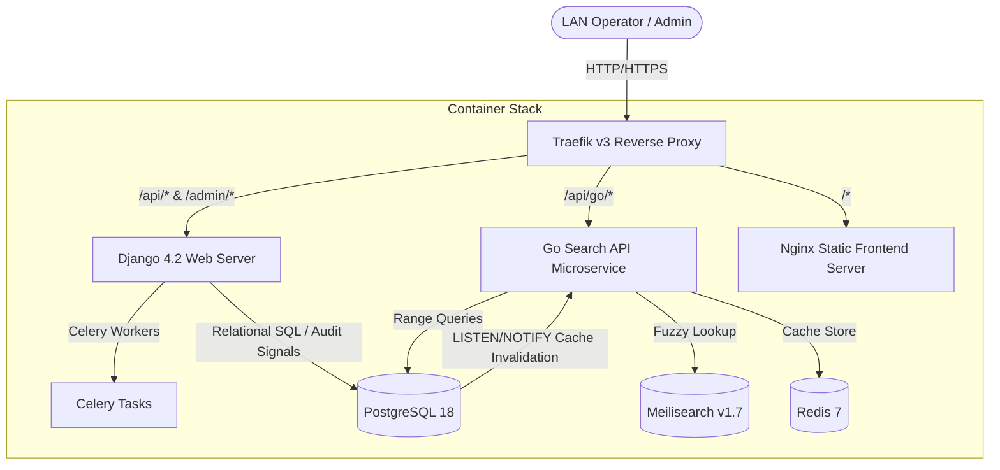

# DMS-O2

[](https://github.com/sauryah/dms-o2/releases)
[](LICENSE)
[](https://hub.docker.com/r/sauryah/dms-backend)
[](https://github.com/sauryah/dms-o2/actions)
[](backend)
[](go-api)
[](frontend)
[](https://github.com/sauryah/dms-o2/stargazers)
[](https://github.com/sauryah/dms-o2/network/members)

An industrial-grade, high-performance Local Area Network (LAN) platform for tracking, inventory management, and auditing of manufacturing dies. Designed for low latency, high concurrency shop floor operations, and offline resilience.

## Screenshot


---

## Table of Contents

* [Screenshot](#screenshot)

* [Overview & Architecture](#overview--architecture)
* [Key Features](#key-features)
* [Tech Stack](#tech-stack)
* [Quick Start](#quick-start)
* [Deploy with Docker (No Source Code)](#deploy-with-docker-no-source-code)
* [Configuration](#configuration)
* [Project Structure](#project-structure)
* [Usage Guide](#usage-guide)
* [Deployment & Upgrades](#deployment--upgrades)
* [Backup & Recovery](#backup--recovery)
* [Security](#security)
* [Roadmap](#roadmap)
* [FAQ](#faq)
* [Troubleshooting](#troubleshooting)
* [Licensing & Compliance](#licensing--compliance)
* [Contributing](#contributing)
* [Support](#support)
* [Credits](#credits)

---

## Overview & Architecture

DMS-O2 is built as a microservice-oriented application optimized to deliver sub-millisecond read latency over local area networks (LAN). It uses a hybrid query execution design: fuzzy text searches are routed to Meilisearch, and numeric range queries run directly on PostgreSQL.



---

## Key Features

* **Precision Die Modeling**: Custom tracking for **Round dies** (casing, current size, original size) and **Flat dies** (width, thickness, corner radius).
* **Interactive CAD Highlighting**: Bidirectional vector highlight syncing. Hovering over dimensions in tables glows the corresponding blueprint SVG node, and vice versa.
* **Visual Storage Rack Map**: Drag-and-drop grid interface representing physical warehouse racks for quick inventory relocation.
* **Fuzzy & Parametric Search**: Blazing-fast lookup leveraging the Go search microservice with Redis caching, PostgreSQL range queries, and Meilisearch.
* **Granular Role-Based Access Control (RBAC)**:
  * *Unauthenticated/Operator*: Read-only search, view metrics, and browse inventory.
  * *Admin*: Full CRUD on dies/machines/sets, and bulk spreadsheet imports.
  * *Root*: User administration, database backup/restore operations, and system configuration.
* **Immutable Auditing**: Database triggers and Django pre-save signals capture all modifications to die status, location, and dimensions.
* **Session Management**: Concurrent session control with immediate eviction of previous logins upon new sign-ins.
* **Sheet-to-Database Import**: Validation-backed, idempotent CSV/Excel import system.
* **Engineering Tools Suite**: Integrated die calculators, including the **Sizing & Elongation Calculator** and the high-fidelity **Wire Drawing Elongation Calculator** featuring interactive results tables, Suggesters, and PDF/Excel/CSV exports.

---

## Tech Stack

| Layer | Technology | Version | Purpose |
| :--- | :--- | :--- | :--- |
| **Frontend** | React, Vite, Vanilla CSS | React 18, Vite | Single Page Application |
| **Backend API** | Python, Django, DRF | Python 3.11, Django 4.2 | Relational API, RBAC, Core logic |
| **Search API** | Go (Golang) | 1.22 | High-performance read-only queries |
| **Databases** | PostgreSQL, Meilisearch | Postgres 18, Meili v1.7 | Relational storage & Fuzzy text index |
| **Caching** | Redis | 7 (Alpine) | Search query result cache |
| **Ingress/Proxy** | Traefik | v3 | Ingress, Routing, and TLS termination |
| **Testing** | Vitest, Playwright, PyTest | - | Unit, Integration, and E2E Testing |

---

## Quick Start

### Prerequisites

* **Docker** & **Docker Compose** (V2+)
* **Node.js** (v18+) & **npm** (only required for local developer running)
* **Python 3.11** (only required for local Django execution)

### Automated Setup

The system provides an automated installer that copies settings, builds containers, seeds database structures, and runs search index updates.

#### Linux & macOS

```bash
chmod +x setup.sh
./setup.sh
```

#### Windows (PowerShell)

```powershell
Set-ExecutionPolicy -Scope Process -ExecutionPolicy Bypass
./setup.ps1
```

> [!TIP]
> **LAN Network Access**
> On completion, the setup scripts output your LAN IP address (e.g., `http://192.168.1.15`). Any device on the same local network can access the frontend dashboard directly.

### Manual Setup (Alternative)

1. **Environment Settings**:

   ```bash
   cp .env.example .env
   ```

2. **Start Services**:

   ```bash
   docker compose up -d --build
   ```

3. **Run Database Migrations & Seeds**:

   ```bash
   docker compose exec django python manage.py migrate
   docker compose exec django python manage.py create_root_user
   ```

4. **Sync Search Indexes**:
   Execute the index synchronization CLI tool:

   ```bash
   docker compose exec django python manage.py sync_search
   ```

### Access Interfaces

* **Frontend SPA**: [http://localhost](http://localhost)
* **Django Admin Console**: [http://localhost/admin/](http://localhost/admin/)
* **REST API Root**: [http://localhost/api/](http://localhost/api/)
* **Default Root Credentials**: Username: `root` | Password: `root123` (Configured in `.env`)

---

## Deploy with Docker (No Source Code)

You can deploy DMS-O2 instantly using **pre-built Docker images** without cloning this repository:

```bash
mkdir dms && cd dms
curl -LO https://raw.githubusercontent.com/sauryah/dms-o2/main/docker-compose.ghcr.yml
curl -LO https://raw.githubusercontent.com/sauryah/dms-o2/main/.env.example
cp .env.example .env   # ← edit passwords & keys!
docker compose -f docker-compose.ghcr.yml up -d
```

For detailed deployment instructions, including Windows PowerShell/Command Prompt scripts, automated backups, and version pinning, see the [Docker Deployment Guide](DOCKER.md).

---

## Configuration

System variables are managed inside the `.env` file located in the project root.

> [!WARNING]
> Ensure all secret keys and passwords are changed in production environments. Never commit `.env` to git repositories.

| Key | Default Value | Description |
| :--- | :--- | :--- |
| `POSTGRES_DB` | `dms` | Target PostgreSQL database name |
| `POSTGRES_USER` | `dms_user` | Database user account |
| `POSTGRES_PASSWORD` | `your_db_password` | Database access password |
| `POSTGRES_HOST` | `db` | Database service host inside Docker network |
| `POSTGRES_PORT` | `5432` | PostgreSQL network port |
| `MEILI_HOST` | `http://meilisearch:7700` | Search service connection endpoint |
| `MEILI_MASTER_KEY` | *auto-generated* | Meilisearch authorization key |
| `ROOT_USERNAME` | `root` | Superuser username |
| `ROOT_PASSWORD` | `root123` | Default administrator password |
| `SESSION_IDLE_TIMEOUT_MINUTES` | `30` | Minutes before idle session expires |
| `SESSION_ABSOLUTE_TIMEOUT_HOURS` | `12` | Absolute hours before user is forced to log in again |

---

## Project Structure

```text
dms-o2/
├── .github/workflows/         # CI/CD Deployment configurations
├── backend/                   # Django Backend Service
│   ├── dies/                  # Die models, database signals, and viewsets
│   ├── history/               # Audit logging logic and model hooks
│   ├── machines/              # Assets (Categories, Machines, Tool Sets)
│   └── users/                 # RBAC and session timeout tracking
├── go-api/                    # Go Search & Stats Microservice
│   ├── main.go                # API routes and Redis invalidation cache logic
│   └── Dockerfile             # Multi-stage container file
├── frontend/                  # React Frontend Single Page Application
│   ├── src/               # UI components, layout grids, hooks
│   └── Dockerfile.prod        # Production static Nginx configuration
├── docs/                      # Documentation folder
│   └── ARCHITECTURE.md        # Deep architectural design specs
├── design-system/             # CSS tokens and design specs
│   └── die-management-system/
│       └── MASTER.md          # Global design components and tokens
├── deploy.sh                  # Production upgrade script
└── dms-backup.sh              # Database backup and restore script
```

* Detailed Architecture specs can be found in [docs/ARCHITECTURE.md](docs/ARCHITECTURE.md).
* Visual UI styling guidelines are located in [design-system/die-management-system/MASTER.md](design-system/die-management-system/MASTER.md).

---

## Usage Guide

### Common Container Tasks

* **Start the container stack**:

  ```bash
  docker compose up -d
  ```

* **Stop the stack (without deleting data)**:

  ```bash
  docker compose stop
  ```

* **Bring the stack down (cleans containers and networks)**:

  ```bash
  docker compose down
  ```

* **View container logs**:

  ```bash
  docker compose logs -f
  ```

* **Database Interactive CLI**:

  ```bash
  docker compose exec db psql -U dms_user -d dms
  ```

### Keyboard Navigation

Within the main navigation search bar, the UI supports:

* `ArrowDown` / `ArrowUp` to traverse list results.
* `Tab` / `Shift+Tab` to focus fields.
* `Enter` to select highlighted inventory records.

---

## Deployment & Upgrades

Production-optimized assets use a high-concurrency setup:

1. **Nginx**: Serves compiled React assets with Gzip compression.
2. **Gunicorn**: Serves the Django backend WSGI server.
3. **Go Endpoint**: Bypasses Django entirely for high-speed read operations on `/api/go/*`.

### Production Deployment Script

To deploy upgrades without downtime, use the integrated deployment automation script:

```bash
./deploy.sh
```

This script pulls updates, verifies configuration files, builds changed containers, runs SQL migrations, and clears legacy docker caches.

---

## Backup & Recovery

A scheduled database container performs compressed dumps nightly at **2:00 AM** and persists them to the host folder `./backups/` with a **14-day retention cycle**.

### Command Utility (`dms-backup.sh`)

* **Create a manual backup**:

  ```bash
  ./dms-backup.sh backup
  ```

* **List all local backups**:

  ```bash
  ./dms-backup.sh list
  ```

* **Restore the database**:

  ```bash
  ./dms-backup.sh restore <backup_filename.dump>
  ```

  *Note: Restoring a database will overwrite current records and trigger an automatic rebuild of Meilisearch search indexes.*

---

## Security

DMS-O2 is maintained with security as a priority. If you identify a security issue, please review our [Security Policy](SECURITY.md) for details on responsible vulnerability reporting and private communication channels.

---

## Roadmap

The current priorities and roadmap items for DMS-O2 include:

* **CAD Engine Extensions:** Direct import support for DWG/DXF dimensional schematics.
* **Expanded Analytics:** Graphical historical wear trends and predictive cycle life tracking.
* **Multi-Warehouse Syncing:** Inter-facility inventory transfers with audit chain validation.
* **ScyllaDB Migration:** Evaluation of high-throughput timeseries storage for die history logs.

---

## FAQ

### How is concurrent session eviction handled?

DMS enforces a single active session policy. When a user signs in from a different terminal or browser session, the previous session is immediately invalidated (returning `401 Unauthorized` on old requests).

### How do I re-sync search indexes manually?

If database records and Meilisearch indexes are out of sync, trigger a full re-index run:

```bash
docker compose exec django python manage.py sync_search
```

### Can unauthenticated users move dies?

No. Moving dies, adding new records, or editing states requires **Admin** or **Root** permissions. Unauthenticated users are strictly limited to search and view actions.

---

## Troubleshooting

| Symptoms | Cause | Solution |
| :--- | :--- | :--- |
| **Meilisearch connection error** | Dev config host mapping mismatch | Inside Docker networks, configure `MEILI_HOST=http://meilisearch:7700`. For direct local runs, set `MEILI_HOST=http://localhost:7700`. |
| **Port conflict on 80/443** | Another server (Nginx/Apache) is running on the host | Disable host server: `sudo systemctl stop nginx`, or change port bindings in `docker-compose.yml`. |
| **Write/Compile permission denied** | Root-owned files left in mounting volume | Run cleanup command: `docker compose exec frontend rm -rf dist` and restart. |
| **401 Unauthorized loops** | Database state was reset or session invalidated | Clear local storage in browser devtools and log in again. |
| **Dies missing from sidebar tree / showing 0 count** | Database has scaled beyond the default pagination limit | Increase the default `pageSize` state variable in `frontend/src/features/inventory/hooks/useInventoryState.ts` and rebuild the frontend: `docker compose up -d --build frontend`. |
| **Cannot connect/access from phone or external device** | Host IP not allowed in Django, Windows Network Category is Public, or Firewall blocking Docker Backend. | Add the laptop's network IP address or `*` to `DJANGO_ALLOWED_HOSTS` in your `.env` file, then restart containers. On Windows, set your network profile to **Private** in admin PowerShell: `Set-NetConnectionProfile -InterfaceAlias Wi-Fi -NetworkCategory Private`. Update Docker's inbound rules to apply to all profiles. |

---

## Licensing & Compliance

DMS-O2 is a dual-licensed project designed to offer flexibility for both open-source development and proprietary commercial use:

1. **Open Source (GNU AGPL-3.0)**: Free to run, copy, modify, and distribute. However, if you modify the software and host it over a network, you **must make your modifications publicly available** under the AGPL-3.0. Review the full terms in the [LICENSE](LICENSE) file.
2. **Commercial License**: If your organization has policies against AGPL software, or you wish to make proprietary modifications without disclosing your source code, you must obtain a commercial license. Review details in [LICENSE-COMMERCIAL.md](LICENSE-COMMERCIAL.md) or contact the maintainers.

For detailed intellectual property and branding rules, see:

* **Copyright Details:** [COPYRIGHT.md](COPYRIGHT.md)
* **Trademark Guidelines:** [TRADEMARK.md](TRADEMARK.md)

---

## Contributing

Contributions are welcome! Please read [CONTRIBUTING.md](CONTRIBUTING.md) for local development setup instructions, testing workflows, and information on our Contributor License Agreement (CLA) that permits dual-licensing of your changes.

---

## Support

For deployment support, bug reports, and customization help, check our [Support Guide](SUPPORT.md) to choose the best community or commercial support channel.

---

## Credits

Developed for industrial manufacturing shop floors by Sahil Pradhan.
