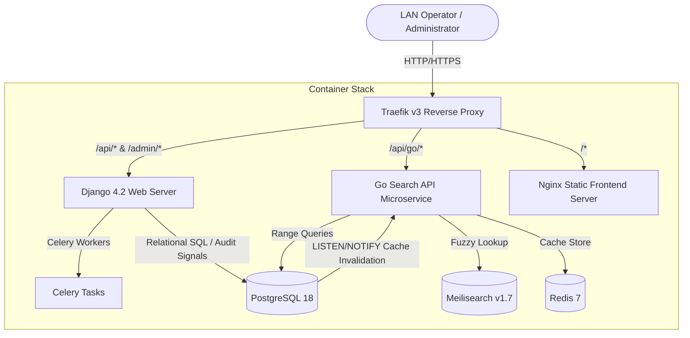

# DMS — Die Management System

<div align="center">
  <p><strong>Industrial Local Area Network (LAN) Die Tracking & Inventory Platform</strong></p>
  <p>High-performance search, real-time sync, signal-driven auditing, and nightly backups for shop floor operations.</p>
</div>

---

## 📖 Table of Contents
- [DMS — Die Management System](#dms--die-management-system)
  - [📖 Table of Contents](#-table-of-contents)
  - [💡 System Architecture](#-system-architecture)
  - [🚀 Features](#-features)
  - [💻 Tech Stack](#-tech-stack)
  - [🏁 Quick Start Guide](#-quick-start-guide)
    - [Prerequisites](#prerequisites)
    - [Automated Setup](#automated-setup)
    - [Manual Installation (Alternative)](#manual-installation-alternative)
  - [⚙️ Environment Configuration](#️-environment-configuration)
  - [🛠️ Container Management Reference](#️-container-management-reference)
    - [Start container stack](#start-container-stack)
    - [Stop containers (temporary)](#stop-containers-temporary)
    - [Shut down container stack (clean)](#shut-down-container-stack-clean)
    - [View real-time logs](#view-real-time-logs)
    - [Interactive PostgreSQL console](#interactive-postgresql-console)
    - [Execute Django management command](#execute-django-management-command)
  - [💾 Nightly Database Backups](#-nightly-database-backups)
  - [🧑‍💻 Local Development Setup](#-local-development-setup)
    - [Backend Local Setup](#backend-local-setup)
    - [Frontend Local Setup](#frontend-local-setup)
  - [🧪 Quality Assurance & Scripts](#-quality-assurance--scripts)
  - [📋 Project Directory Overview](#-project-directory-overview)
  - [🔌 API Endpoint Reference](#-api-endpoint-reference)
  - [🚀 Production Deployment & Upgrades](#-production-deployment--upgrades)
  - [❓ FAQ & Common Scenarios](#-faq--common-scenarios)
  - [⚠️ Troubleshooting Guide](#️-troubleshooting-guide)
  - [🤝 Contributing Guidelines](#-contributing-guidelines)
  - [📄 License](#-license)

---

## 💡 System Architecture

DMS is built as a microservice-oriented application designed to serve high-concurrency requests over local area networks with low latency:



---

## 🚀 Features

*   **Precision Die Tracking**: Explicit modeling for **Round dies** (casing, current size, original size) and **Flat dies** (width, thickness, corner radius).
*   **Bidirectional CAD Highlights**: Hovering over specifications dynamically highlights CAD blueprint elements (and vice-versa) with smooth vector glows.
*   **Visual Storage Rack Map**: Dynamic grid visualization of racks and shelves with drag-and-drop die storage relocation.
*   **Enhanced Keyboard Navigation**: Fast search indexing search dropdown traversal using Tab/Shift+Tab and Arrow keys.
*   **Immutable Audit Logging**: Signal-driven system capturing all changes to status, location, tool sets, and dimensions.
*   **Fuzzy & Parametric Search**: Combined lookup using Go, Meilisearch (fuzzy string matching) and PostgreSQL (decimal range queries).
*   **Granular RBAC Matrix**:
    *   **Unauthenticated**: Search and view only.
    *   **Admin**: Status and location edits, die CRUD operations, and bulk import.
    *   **Root**: User administration, database backup/restore, and global parameters.
*   **Concurrent Session Control**: Single active session enforcement. New sign-ins instantly evict previous logins.
*   **Sheet-to-Database Import**: Idempotent upload for CSV and Excel (.xlsx) spreadsheets with validation reports.
*   **High Availability Docker Stack**: Zero-downtime proxy configuration using Traefik v3.

---

## 💻 Tech Stack

*   **Backend Framework**: Python 3.11, Django 4.2, Django REST Framework, Django Simple JWT, OpenPyXL
*   **Search Microservice**: Go (Golang) 1.21
*   **Databases & Caches**: PostgreSQL 18, Meilisearch v1.7, Redis 7 (alpine-based)
*   **Frontend SPA**: React 18, Vite, Vanilla CSS, TanStack React Query v5, React Router DOM v6
*   **Ingress & Infras**: Traefik v3, Docker, Docker Compose
*   **Testing Engines**: Playwright (E2E Integration), Vitest & JSDOM (Frontend unit), PyTest / Django Test Suite (Backend)

---

## 🏁 Quick Start Guide

### Prerequisites
*   **Docker** and **Docker Compose** (V2+) installed.
*   **Node.js** (v18+) and **npm** (only required for local developer execution).
*   **Python 3.11** (only required for local django execution).

### Automated Setup

We provide unified installation scripts that duplicate configuration variables, bootstrap all Docker services, apply migrations, seed the default root account, and synchronize Meilisearch indices.

#### Linux & macOS
```bash
chmod +x setup.sh
./setup.sh
```

#### Windows (PowerShell)
```powershell
# Run Bypass if PowerShell blocks execution policy
Set-ExecutionPolicy -Scope Process -ExecutionPolicy Bypass
./setup.ps1
```

> [!TIP]
> **LAN Access Made Simple**
> At the end of the installation process, the setup script automatically outputs your local host IP address (e.g., `http://192.168.1.15`). Any computer or tablet connected to the same Wi-Fi/LAN network can access the application immediately using this link.

---

### Manual Installation (Alternative)

For developers who prefer executing individual bootstrap steps:

1.  **Duplicate Environment File**:
    ```bash
    cp .env.example .env
    ```
2.  **Start the Docker Container Stack**:
    ```bash
    docker compose up -d --build
    ```

    > [!TIP]
    > **TLS Handshake Timeout?**
    > If you encounter a `net/http: TLS handshake timeout` error while pulling images on a slower or congested connection, it is because Docker is downloading multiple images concurrently. You can resolve this by pre-pulling the required base/service images one-by-one:
    > ```bash
    > docker pull postgres:18-alpine
    > docker pull getmeili/meilisearch:v1.7
    > docker pull redis:7-alpine
    > docker pull traefik:v3
    > docker pull python:3.11-slim
    > docker pull golang:1.22-alpine
    > docker pull node:18-alpine
    > docker pull alpine:latest
    > ```
    > Alternatively, simply run the automated `./setup.sh` (or `./setup.ps1` on Windows) which handles this sequential pre-pulling process automatically.
3.  **Execute Database Setup & Search Synchronization**:
    ```bash
    docker compose exec django python manage.py migrate
    docker compose exec django python manage.py create_root_user
    docker compose exec django python manage.py sync_search
    ```
4.  **Application Access Interfaces**:
    *   **Frontend Portal**: [http://localhost](http://localhost)
    *   **Django Administrator Dashboard**: [http://localhost/admin/](http://localhost/admin/)
    *   **Django REST API Root**: [http://localhost/api/](http://localhost/api/)
    *   **Default Root Credentials**: Username: `root` | Password: `root123` (Set in your `.env`)

---

## ⚙️ Environment Configuration

DMS uses a centralized `.env` configuration file in the project root. Maintain secure values in production environments.

> [!WARNING]
> Do not expose database passwords or Meilisearch master keys in version control. Keep `.env` added to your `.gitignore`.

| Variable | Default Value | Purpose |
| :--- | :--- | :--- |
| `POSTGRES_DB` | `dms` | Target PostgreSQL database name |
| `POSTGRES_USER` | `dms_user` | Database user account |
| `POSTGRES_PASSWORD` | `your_db_password` | Database access password |
| `POSTGRES_HOST` | `db` | Database service host inside Docker network |
| `POSTGRES_PORT` | `5432` | PostgreSQL network port |
| `DJANGO_SECRET_KEY` | *auto-generated* | Django cryptography hash key |
| `DJANGO_DEBUG` | `False` | Enables/disables debug mode (always `False` in prod) |
| `DJANGO_ALLOWED_HOSTS` | `localhost,127.0.0.1` | Authorized host domain names / IP range |
| `MEILI_HOST` | `http://meilisearch:7700` | Search service connection endpoint |
| `MEILI_MASTER_KEY` | *auto-generated* | Meilisearch authorization key |
| `ROOT_USERNAME` | `root` | Superuser username |
| `ROOT_PASSWORD` | `root123` | Default administrator password |
| `SESSION_IDLE_TIMEOUT_MINUTES` | `30` | Minutes before idle session expires |
| `SESSION_ABSOLUTE_TIMEOUT_HOURS`| `12` | Absolute hours before user is forced to log in again |

---

## 🛠️ Container Management Reference

Here is a checklist of common administrative docker commands:

### Start container stack
```bash
docker compose up -d
```
*Add `--build` to compile dependency changes (e.g. `package.json` updates).*

### Stop containers (temporary)
```bash
docker compose stop
```
*Restarts containers using `docker compose start`.*

### Shut down container stack (clean)
```bash
docker compose down
```

> [!IMPORTANT]
> **Data Preservation Rule**
> Using `docker compose down` will **never** delete your database records or search indices because they are saved on persistent external volumes. **DO NOT** execute `docker compose down -v` unless you intend to completely erase all data records.

### View real-time logs
```bash
docker compose logs -f
# Or target a single container
docker compose logs -f django
```

### Interactive PostgreSQL console
```bash
docker compose exec db psql -U dms_user -d dms
```

### Execute Django management command
```bash
docker compose exec django python manage.py <command>
```

---

## 💾 Nightly Database Backups

The system includes an automated postgres backup container that:
1.  Triggers a compressed custom binary database snapshot (`.dump` files) nightly at **2:00 AM**.
2.  Persists the snapshots on the host disk at `./backups/`.
3.  Enforces a **14-day retention cycle**, automatically pruning older archives.

### Manual Backup Commands

A host-level database management utility is provided via `./dms-backup.sh`:

*   **Generate an Instant Backup**:
    ```bash
    ./dms-backup.sh backup
    ```
*   **List Available Backups**:
    ```bash
    ./dms-backup.sh list
    ```
*   **Restore the Database from an Archive**:
    ```bash
    ./dms-backup.sh restore <backup_filename.dump>
    ```
    *Note: Restoring a backup completely overwrites current database tables and triggers automated search index rebuilding.*

---

## 🧑‍💻 Local Development Setup

For faster frontend/backend iterations without waiting for Docker compilation steps:

### Backend Local Setup

1.  Navigate to the backend directory, initialize and activate a virtual environment:
    ```bash
    cd backend
    python -m venv venv
    source venv/bin/activate  # macOS/Linux
    # venv\Scripts\activate   # Windows PowerShell
    ```
2.  Install python package dependencies:
    ```bash
    pip install -r requirements.txt
    ```
3.  Apply SQL migrations and start the Django development server:
    ```bash
    python manage.py migrate
    python manage.py runserver 8000
    ```

### Frontend Local Setup

1.  Navigate to the frontend directory and install dependencies:
    ```bash
    cd frontend
    npm install
    ```
2.  Start the Vite hot-reloading development server:
    ```bash
    npm run dev
    ```
    *All API queries are automatically proxied to port 8000.*

---

## 🧪 Quality Assurance & Scripts

### Backend Actions
*   `python manage.py test`: Execute Django API, signal auditing, and model unit tests.
*   `python manage.py create_root_user`: Seed the root administrator profile.
*   `python manage.py expire_sessions`: System cron job to prune idle user sessions.

### Frontend Actions
*   `npm run dev`: Start development hot reloading.
*   `npm run build`: Compile static production bundles into `dist/`.
*   `npm run test`: Run frontend unit and mock tests using Vitest.
*   `npm run test:e2e`: Execute end-to-end user flows using Playwright.

---

## 📋 Project Directory Overview

```
DMS/
├── .github/workflows/deploy.yml   # CI/CD Deployment configurations
├── backend/                       # Python Django Backend
│   ├── dies/                      # Die models, database signals, and views
│   ├── machines/                  # Machine assets, categories, and tool sets
│   ├── history/                   # Signal-based audit logging
│   ├── users/                     # RBAC management & user session monitoring
│   └── dms/                       # Configuration, URL mapping, and WSGI setup
├── go-api/                        # Go Search & Stats Microservice
│   ├── Dockerfile                 # Optimized multi-stage build configuration
│   └── main.go                    # Microservice entrypoint and Redis connection
├── frontend/                      # React Frontend Single Page App
│   ├── src/                       # Components, pages, hooks, styling
│   ├── tests/e2e/                 # Playwright E2E system smoke tests
│   └── Dockerfile.prod            # Production multi-stage Nginx configuration
├── scripts/                       # Local Git hooks and utility tools
├── docker-compose.yml             # Local developer container stack
├── docker-compose.prod.yml        # Production optimized configuration
├── deploy.sh                      # Zero-downtime system upgrade script
├── traefik.yml                    # Traefik routing rules
└── PROJECT.md                     # Roadmap and checklist logs
```

---

## 🔌 API Endpoint Reference

All endpoints are configured with JWT Bearer Token validation. Add `Authorization: Bearer <token>` in the HTTP headers.

| Endpoint | Method | Role Required | Request Body | Description |
| :--- | :--- | :--- | :--- | :--- |
| `/api/auth/login/` | `POST` | Public | `{username, password}` | Generates JWT credentials |
| `/api/auth/keep-alive/`| `POST` | Regular/Admin/Root | None | Extends session validity |
| `/api/dies/` | `GET` | Public | None | Lists dies with range filters |
| `/api/dies/` | `POST` | Admin/Root | Die attributes | Creates a new die |
| `/api/dies/{id}/` | `GET` | Public | None | Returns detail & historical logs |
| `/api/dies/{id}/` | `PATCH`| Admin/Root | Partial attributes | Edits status, location, remarks |
| `/api/dies/{id}/` | `DELETE`| Admin/Root | None | Removes die from inventory |
| `/api/go/search` | `GET` | Public | None | High-performance fuzzy lookups |
| `/api/import/` | `POST` | Admin/Root | Multipart File | Idempotent bulk import |
| `/api/users/` | `GET/POST`| Root | User attributes | Manages administrator accounts |
| `/api/backups/` | `GET/POST`| Root | None | Lists or generates DB dumps |

---

## 🚀 Production Deployment & Upgrades

The application uses an optimized configuration for production deployment:
*   **Nginx Serving Static Assets**: React is compiled and served from lightweight Nginx alpine images.
*   **Gunicorn serving Django**: High concurrency WSGI serving for database writes.
*   **High Performance Go Endpoint**: All requests matching `/api/go/*` bypass Django entirely, queried directly by Go and cached in Redis.

### Semi-Automated Upgrades (`deploy.sh`)

When pushing new code changes to the server, execute the automated upgrade script:
```bash
./deploy.sh
```
This script pulls from origin, validates environment configuration keys, compiles container changes, runs migrations, and prunes unused images to keep host disk usage low.

---

## ❓ FAQ & Common Scenarios

#### How are session evictions handled?
If a user log in from a new computer, the system invalidates any previously active session immediately (returning `401 Unauthorized` to the old client). If the user remains idle for 30 minutes, they are automatically logged out.

#### What happens if Meilisearch indexes fall out of sync?
If you suspect discrepancy between database records and Meilisearch, execute:
```bash
docker compose exec django python manage.py sync_search
```
This pulls postgres tables and updates Meilisearch keys cleanly.

#### Can normal Operators update the location of a die?
Regular/unauthenticated users can search and view items. Updating status or location requires an **Admin** or **Root** account.

---

## ⚠️ Troubleshooting Guide

| Issue | Root Cause | Solution |
| :--- | :--- | :--- |
| **Meilisearch Connection Fails** | Incorrect host variable in local developer context | If running inside Docker, set `MEILI_HOST=http://meilisearch:7700`. If running locally outside Docker, use `MEILI_HOST=http://localhost:7700`. |
| **Port 80/443 Conflicts** | Another web server (e.g. Apache, Nginx) is running on the host | Run `sudo systemctl stop nginx` or change the port mapping in `docker-compose.yml` to a free port. |
| **EACCES Permission Denied on build** | Root-owned files generated inside mounting volume | Execute `docker compose exec frontend rm -rf dist` (or run `docker compose down` and restart). |
| **401 Session Expired immediately** | Database reset or user logged in elsewhere | Clear browser local storage and request a new login token. |

---

## 🤝 Contributing Guidelines

1.  **Fork** the repository and create a feature branch (e.g. `feature/add-wear-charts`).
2.  Include Vitest test specs for frontend features, or Django unit tests for backend changes.
3.  Format and check code quality:
    *   Backend: `docker compose exec django python manage.py test`
    *   Frontend: `npm run test`
4.  Open a Pull Request with details about design decisions and target impacts.

---

## 📄 License

**Proprietary / Internal Business Use Only**

This software and source code are proprietary. See the [LICENSE](file:///home/tr/Desktop/Projects/dms-o2/LICENSE) file for terms and conditions.


