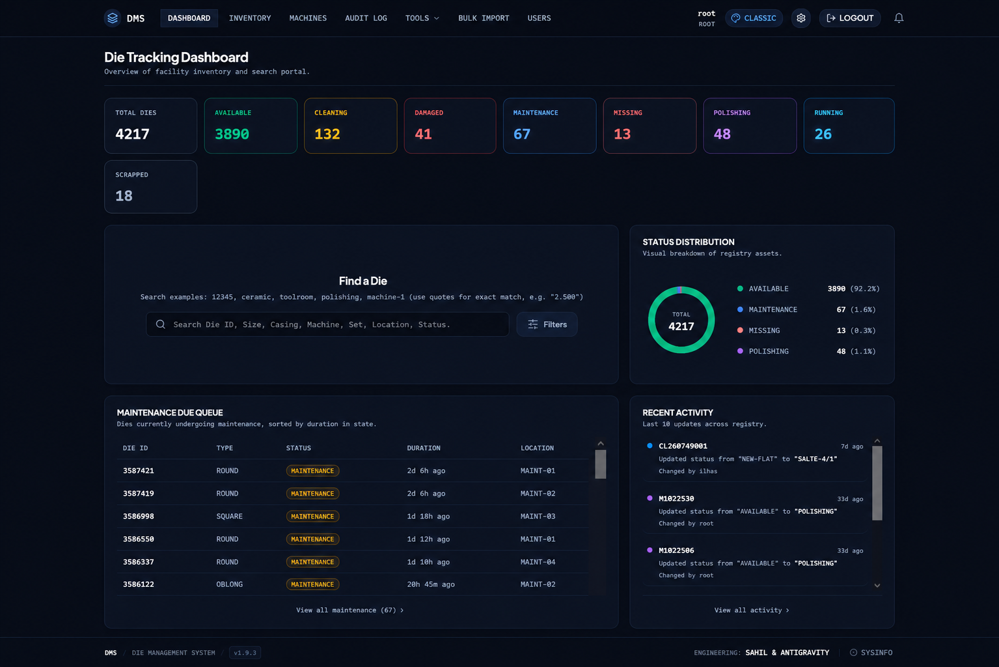
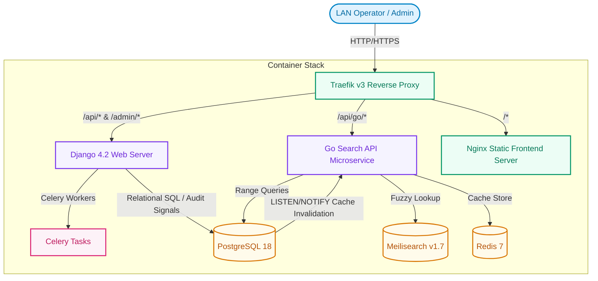
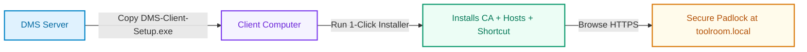

# DMS-O2

<p align="center">
  <strong>Die Management System</strong>
</p>

<p align="center">
  <em>Local Area Network (LAN) platform for die tracking, inventory management, and audit histories.</em>
</p>

<p align="center">
  <a href="https://github.com/sauryah/dms-o2/releases"></a>
  <a href="LICENSE"></a>
  <a href="https://hub.docker.com/r/sauryah/dms-backend"></a>
  <a href="https://github.com/sauryah/dms-o2/actions"></a>
  <a href="https://github.com/sauryah/dms-o2/stargazers"></a>
</p>

<p align="center">
  
  
  
  
  
  
  
  
</p>

---

<p align="center">
  
</p>

<p align="center">
  <strong>DMS-O2</strong> tracks precision drawing dies, machine allocations, and monthly inventory counts across manufacturing shop floors.
</p>

## Table of Contents

- [Overview & Architecture](#overview--architecture)
- [Core Workspaces](#core-workspaces)
- [Key Features](#key-features)
- [Technology Stack](#technology-stack)
- [Quick Start](#quick-start)
  - [Prerequisites](#prerequisites)
  - [Installing mkcert](#installing-mkcert)
  - [Automated Setup](#automated-setup)
  - [Manual Setup (Alternative)](#manual-setup-alternative)
  - [Access Interfaces](#access-interfaces)
- [Deploy with Docker (No Source Code)](#deploy-with-docker-no-source-code)
- [Configuration](#configuration)
- [Project Structure](#project-structure)
- [Usage Guide](#usage-guide)
  - [Using Make (Recommended)](#using-make-recommended)
  - [Common Container Tasks](#common-container-tasks)
  - [Keyboard Navigation](#keyboard-navigation)
- [Deployment & Upgrades](#deployment--upgrades)
- [Backup & Recovery](#backup--recovery)
  - [Command Utility (dms-backup.sh)](#command-utility-dms-backupsh)
- [Security](#security)
  - [TLS Certificates & Root CA](#tls-certificates--root-ca)
- [Client & User Access Installation Guide](#client--user-access-installation-guide)
  - [Method 1: Standalone Client Installer (DMS-Client-Setup.exe - Recommended)](#method-1-standalone-client-installer-dms-client-setupexe---recommended)
  - [Method 2: Windows Automated Script (install-cert.bat)](#method-2-windows-automated-script-install-certbat)
  - [Method 3: PowerShell / Command Line](#method-3-powershell--command-line)
  - [Method 4: Mozilla Firefox (Manual Import)](#method-4-mozilla-firefox-manual-import)
  - [Regenerating Certificates](#regenerating-certificates)
- [Operational Tools & Automation](#operational-tools--automation)
  - [Network Doctor (network-doctor.ps1)](#network-doctor-network-doctorps1)
  - [Automatic Windows Startup (install-autostart.ps1)](#automatic-windows-startup-install-autostartps1)
  - [Rebuilding the Client Installer (build-client-exe.ps1)](#rebuilding-the-client-installer-build-client-exeps1)
- [Roadmap](#roadmap)
- [FAQ](#faq)
- [Troubleshooting](#troubleshooting)
  - [Full Docker Reset (Nuclear Option)](#full-docker-reset-nuclear-option)
- [Licensing & Compliance](#licensing--compliance)
- [Contributing](#contributing)
- [Support](#support)
- [Credits](#credits)

---

## Overview & Architecture

DMS-O2 uses a hybrid query execution design: fuzzy text searches route to Meilisearch, while numeric range queries run directly on PostgreSQL. The architecture delivers sub-millisecond read latency over LAN.


```mermaid
graph TD
    User([LAN Operator / Admin]):::client -->|HTTP/HTTPS| Traefik[Traefik v3 Reverse Proxy]:::proxy
    
    subgraph Container Stack [Container Stack]
        Traefik -->|/api/go/*| GoAPI[Go Search API Microservice]:::backend
        Traefik -->|/api/* & /admin/*| Django[Django 4.2 Web Server]:::backend
        Traefik -->|/*| Nginx[Nginx Static Frontend Server]:::proxy
        
        Django -->|Celery Workers| Celery[Celery Tasks]:::celery
        Django -->|Relational SQL / Audit Signals| Postgres[(PostgreSQL 18)]:::db
        
        GoAPI -->|Fuzzy Lookup| Meili[(Meilisearch v1.7)]:::db
        GoAPI -->|Cache Store| Redis[(Redis 7)]:::db
        GoAPI -->|Range Queries| Postgres
        
        Postgres -->|LISTEN/NOTIFY Cache Invalidation| GoAPI
    end

    classDef client fill:#e0f2fe,stroke:#0284c7,stroke-width:2px,color:#0369a1;
    classDef proxy fill:#ecfdf5,stroke:#059669,stroke-width:2px,color:#047857;
    classDef backend fill:#f5f3ff,stroke:#7c3aed,stroke-width:2px,color:#6d28d9;
    classDef db fill:#fffbeb,stroke:#d97706,stroke-width:2px,color:#b45309;
    classDef celery fill:#fdf2f8,stroke:#db2777,stroke-width:2px,color:#be185d;
```

*See [docs/ARCHITECTURE.md](docs/ARCHITECTURE.md) for architectural specifications.*

---

## Core Workspaces

| Workspace | Primary Purpose | Key Capabilities |
| :--- | :--- | :--- |
| **Die Tracking Dashboard** | Real-time plant telemetry & status cards | KPI stats with glow borders, search bar with autocomplete, status donut breakdown, maintenance queue |
| **Die Inventory** | Master registry for round & flat dies | Filter by status/casing/machine, CAD vector blueprint sync, 2D/3D visual inspection |
| **Machine Sets** | Machine allocations & rack placement | Drag-and-drop storage rack map, set configuration, operational active/inactive ratio |
| **Die Set Planner** | Engineering capacity & procurement | Preset series calculators, bottleneck deficit analysis, recount sheets, Excel/CSV audit import |
| **Engineering Suite** | Wire drawing & sizing physics engine | Siebel's force formula, elongation analysis, 3D von Mises stress heatmap, PDF/Excel export |
| **Audit History** | Immutable field-level change ledger | Trigger-backed change history, timestamps, operator identity, exportable audit trail |
| **Settings & Security** | System administration & access control | System theme switcher, 2FA setup, wear tolerance alert limits, database backup/restore |

---

## Key Features

* **Triple System Themes**: Real-time instant switching between **Classic Slate** (vibrant industrial midnight UI with glowing KPI status cards), **Dark Terminal** (high-density Bloomberg monospace), and **Precision Light** (clean high-contrast daylight mode).
* **Precision Die Modeling**: Custom tracking templates for round dies (casing, current size, original size) and flat dies (width, thickness, corner radius). Supports statuses: `AVAILABLE`, `RUNNING`, `CLEANING`, `POLISHING`, `DAMAGED`, `SCRAPPED`, `MISSING`, `MAINTENANCE`.
* **Modular Die Set Planner & Capacity Engine**: Multi-source stock ingestion (DMS database, live enamel machines, monthly audit recount sheets), bottleneck deficit analytics, series capacity planning, and target set procurement forecasting with 5-decimal precision.
* **Enamel Machine Tracking & Monthly Recount Audit Sheets**: Machine die allocation ledger and spreadsheet-grade monthly physical inventory audit sheets with Excel/CSV drag-and-drop import and discrepancy reports.
* **Single-Use Backup Codes Authentication**: Cryptographically hashed (SHA-256) one-time recovery codes for secondary sign-in security without requiring mobile authenticator apps.
* **Real-Time Live SSE Event Distribution**: Redis Pub/Sub multiplexing PostgreSQL `LISTEN/NOTIFY` events across multi-container instances with automatic local fallback.
* **Interactive CAD Highlighting**: Bidirectional vector sync between table dimensions and blueprint SVG nodes.
* **Visual Storage Rack Map**: Drag-and-drop grid interface for physical warehouse rack management.
* **Fuzzy & Parametric Search**: Sub-millisecond lookups via Go microservice with Redis caching, PostgreSQL range queries, and Meilisearch.
* **Granular Role-Based Access Control (RBAC)**:
  * *Unauthenticated / Operator*: Read-only search, metrics, and inventory browsing.
  * *Admin*: Full CRUD on dies, machines, and sets, plus bulk spreadsheet imports.
  * *Root*: User administration, database backup/restore, and system configuration.
* **Immutable Auditing**: Database triggers and Django signals capture all modifications to die status, location, and dimensions.
* **Session Management**: Single active session enforcement with immediate revocation on new sign-in.
* **Sheet-to-Database Import**: Validation-backed, idempotent CSV/Excel import system.
* **3D Stress Analysis**: WebGL von Mises stress heatmaps with angle/bearing sliders, cutaway planes, crack defect overlays, and snapshot export.
* **Engineering Workbench**: CAD geometry inspector, deformation simulator, Siebel's force calculations, and trade-off comparison matrices.
* **Granular Tool Permissions**: Per-user feature toggles with real-time background auth sync.
* **Frontend Resilience**: Automatic chunk load error recovery and update fallback handling.
* **Engineering Calculators**: Sizing & elongation calculator, wire drawing calculator with interactive results, and PDF/Excel/CSV exports.

---

## Technology Stack

| Layer | Component | Version | Role / Purpose |
| :--- | :--- | :--- | :--- |
| **Frontend UI** | React, Vite, Vanilla CSS | `React 18`, `Vite` | Single Page Application (SPA) dashboard |
| **Backend API** | Django & Django REST Framework | `Python 3.11`, `Django 4.2` | Core business logic, RBAC policies, mutating transactions |
| **Search Gateway** | Go (Golang) | `Go 1.22` | Ultra-fast read-only query processing & cache management |
| **Relational DB** | PostgreSQL | `PostgreSQL 18` | Primary relational store & immutable auditing |
| **Fuzzy Index** | Meilisearch | `v1.7` | Typo-tolerant text index for rapid search |
| **Memory Cache** | Redis | `v7` (Alpine) | Query caching & Celery broker |
| **Ingress Router** | Traefik | `v3` | Automated HTTPS TLS termination & reverse proxy |
| **Testing** | Vitest, Playwright, PyTest | — | Front-to-back unit, integration, and E2E coverage |

---

## Quick Start

### Prerequisites

Ensure you have the following installed on your host machine:

* **Docker & Docker Compose (V2+)**: On Linux, configure your user to access the Docker daemon without `sudo`:
  ```bash
  sudo usermod -aG docker $USER
  # Log out and log back in for changes to take effect
  ```
* **mkcert / OpenSSL**: Required for local TLS certificate generation. If `mkcert` is missing or blocked by Windows Application Control policies (AppLocker/WDAC), the setup script automatically falls back to Git OpenSSL.
* **Node.js (v18+) & npm**: Only required if running the frontend locally outside Docker.
* **Python 3.11**: Only required if running Django commands locally outside Docker.

---

### Installing `mkcert`

Choose the command matching your host operating system:

| Operating System | Install Command |
| :--- | :--- |
| **Linux (Fedora/RHEL)** | `sudo dnf install mkcert` |
| **Linux (Debian/Ubuntu)** | `sudo apt install mkcert` |
| **macOS (Homebrew)** | `brew install mkcert` |
| **Windows (Chocolatey)** | `choco install mkcert` |

*Alternatively, download binaries directly from the [official releases](https://github.com/FiloSottile/mkcert/releases).*

---

### Automated Setup

The setup scripts automate container builds, database initialization, and certificate generation.

#### Linux & macOS
```bash
chmod +x setup.sh
./setup.sh
```

#### Windows (1-Click / Terminal)
You can double-click **`setup.bat`** or run:
```cmd
setup.bat
```
Or run directly in PowerShell (execution policy is automatically bypassed for the session):
```powershell
.\setup.ps1
```

> [!TIP]
> **Using Make**
> A `Makefile` is provided for developer convenience. Run `make help` to see all available targets (setup, certs, start, stop, logs, backup, etc.).

> [!TIP]
> **LAN Network Access**
> On completion, the setup scripts output your server's LAN IP address (e.g., `https://192.168.1.15`). Any device on the same local network can access the dashboard. To remove SSL browser warnings on client machines, see [Client & User Access Installation Guide](#-client--user-access-installation-guide).

---

### Manual Setup (Alternative)

If you prefer to configure the steps manually:

1. **Environment Settings**:
   ```bash
   cp .env.example .env
   ```
2. **Generate TLS Certificates**:
   ```bash
   # Windows
   scripts\generate-certs.bat

   # Linux/macOS
   chmod +x scripts/generate-certs.sh
   ./scripts/generate-certs.sh
   ```
   *Or generate directly with `mkcert` (replace `YOUR_LAN_IP`):*
   ```bash
   mkcert -install
   mkcert -cert-file certs/cert.pem -key-file certs/key.pem localhost 127.0.0.1 YOUR_LAN_IP ::1
   ```
3. **Start Services**:
   ```bash
   docker compose up -d --build
   ```
4. **Run Database Migrations & Seeds**:
   ```bash
   docker compose exec django python manage.py migrate
   docker compose exec django python manage.py create_root_user
   ```
5. **Sync Search Indexes**:
   ```bash
   docker compose exec django python manage.py sync_search
   ```

---

### Access Interfaces

* **Friendly Hostname (mDNS)**: [https://toolroom.local](https://toolroom.local) *(or [https://dms.local](https://dms.local))*
* **Local Machine**: [https://localhost](https://localhost)
* **LAN IP**: `https://<YOUR_SERVER_IP>` (e.g., `https://192.168.10.240`)
* **Django Admin Console**: [https://toolroom.local/admin/](https://toolroom.local/admin/)
* **REST API Root**: [https://toolroom.local/api/](https://toolroom.local/api/)
* **Default Credentials**: Automatically generated during initial setup (saved in your `.env` file).

> [!NOTE]
> DMS-O2 forces HTTPS by default. Plain HTTP requests on port 80 are permanently redirected (HTTP 308) to HTTPS on port 443. Windows 10/11 machines natively broadcast `toolroom.local` across your local subnet via mDNS on port 5353 UDP.

---

## Deploy with Docker (No Source Code)

Deploy DMS-O2 using pre-built images without cloning the repository:

```bash
mkdir dms && cd dms
curl -LO https://raw.githubusercontent.com/sauryah/dms-o2/main/docker-compose.ghcr.yml
curl -LO https://raw.githubusercontent.com/sauryah/dms-o2/main/.env.example
cp .env.example .env   # ← Edit passwords and secret keys here!
docker compose -f docker-compose.ghcr.yml up -d
```

*For detailed production deployment instructions, including Windows PowerShell/Command Prompt scripts, automated backups, and version pinning, review the [Docker Deployment Guide](DOCKER.md).*

---

## Configuration

System variables managed in the `.env` file at the project root.

> [!WARNING]
> Ensure all secret keys and passwords are changed in production environments. Never commit `.env` files to git repositories.

| Key | Default Value | Description |
| :--- | :--- | :--- |
| `POSTGRES_DB` | `dms` | Target PostgreSQL database name. |
| `POSTGRES_USER` | `dms_user` | Database user account. |
| `POSTGRES_PASSWORD` | `your_db_password` | Database access password. |
| `POSTGRES_HOST` | `db` | Database service host inside the Docker network. |
| `POSTGRES_PORT` | `5432` | PostgreSQL network port. |
| `REDIS_PASSWORD` | `change_me_redis_password` | Redis auth password (must match broker/backend URL). |
| `DJANGO_SECRET_KEY` | `your-secret-key` | Django secret key for session signing and CSRF protection. |
| `INTERNAL_API_SECRET` | `your-internal-secret` | Shared secret for Django ↔ Go API communication. |
| `CELERY_BROKER_URL` | `redis://:change_me_redis_password@redis:6379/0` | Redis connection URL for Celery message broker. |
| `CELERY_RESULT_BACKEND` | `redis://:change_me_redis_password@redis:6379/0` | Redis connection URL for Celery task results. |
| `MEILI_HOST` | `http://meilisearch:7700` | Search service connection endpoint. |
| `MEILI_MASTER_KEY` | *auto-generated* | Meilisearch authorization key. |
| `ROOT_USERNAME` | `root` | Superuser username. |
| `ROOT_PASSWORD` | *(generated by setup.sh)* | Default administrator password. |
| `SESSION_IDLE_TIMEOUT_MINUTES` | `30` | Minutes before idle session expires. |
| `SESSION_ABSOLUTE_TIMEOUT_HOURS` | `12` | Absolute hours before user is forced to log in again. |

---

## Project Structure

```text
dms-o2/
├── .github/workflows/         # CI/CD Deployment configurations
├── .githooks/                 # Git hooks (pre-commit linting & secret detection)
├── backend/                   # Django Backend Service
│   ├── dms/                   # Core settings, URLs, Celery config
│   ├── dies/                  # Die models, signals, viewsets, services (recut, wear, import, search, validation)
│   ├── history/               # Audit logging (DieHistory, MachineHistory) and views
│   ├── machines/              # Assets (Categories, Machines, Sets, Racks)
│   ├── search/                # Celery Meilisearch indexing tasks and outbox processor
│   └── users/                 # RBAC, auth views, permissions, session management
├── certs/                     # TLS certificates (generated, gitignored)
│   ├── cert.pem               # Server certificate for current LAN IP
│   ├── key.pem                # Private key
│   └── rootCA.pem             # Root CA (install on client machines)
├── go-api/                    # Go Search & Stats Microservice
│   ├── cmd/server/main.go     # API routes and Redis invalidation cache logic
│   └── Dockerfile             # Multi-stage container file
├── frontend/                  # React Frontend Single Page Application
│   ├── src/                   # UI components, layout grids, hooks, contexts
│   ├── features/              # Feature-specific components (inventory, dashboard, wire-drawing-calculator)
│   └── Dockerfile.prod        # Production static Nginx configuration
├── scripts/                   # Utility scripts
│   ├── generate-certs.sh      # Auto-generate TLS certs (Linux/macOS)
│   ├── generate-certs.bat     # Auto-generate TLS certs (Windows)
│   ├── uninstall-certs.sh     # Uninstall Root CA and delete certs (Linux/macOS)
│   ├── uninstall-certs.bat    # Uninstall Root CA and delete certs (Windows)
│   ├── client-install-template.bat # Windows installer script template
│   ├── client-install-template.sh # macOS/Linux installer script template
│   ├── client-instructions-template.txt # Client cert installation instructions template
│   ├── install-cert.bat       # Install rootCA on Windows clients
│   ├── backup_db.sh           # Database backup script
│   └── prune_history.sh       # Audit history retention cleanup
├── docs/                      # Documentation folder
│   └── ARCHITECTURE.md        # Deep architectural design specs
├── design-system/             # CSS tokens and design specs
│   └── die-management-system/
│       └── MASTER.md          # Global design components and tokens
├── Makefile                   # Common dev commands (make help)
├── traefik.yml                # Traefik static config (entrypoints, providers)
├── dynamic.yml                # Traefik dynamic config (TLS store, certificates)
├── docker-compose.yml         # Local development compose stack
├── docker-compose.prod.yml    # Production compose stack
├── docker-compose.ghcr.yml    # Pre-built image compose stack
├── setup.sh                   # Automated setup (Linux/macOS)
├── setup.ps1                  # Automated setup (Windows)
├── deploy.sh                  # Production upgrade script
└── dms-backup.sh              # Database backup and restore script
```

* **Architecture Specs**: Detailed layout rules can be found in [docs/ARCHITECTURE.md](docs/ARCHITECTURE.md).
* **Design Guidelines**: Visual UI styling guidelines are located in [design-system/die-management-system/MASTER.md](design-system/die-management-system/MASTER.md).

---

## Usage Guide

### Using Make (Recommended)

Run `make help` to view available CLI tasks:

| Command | Description |
| :--- | :--- |
| `make setup` | Full automated setup (Docker + DB + certs) |
| `make certs` | Regenerate TLS certificates for current LAN IP |
| `make uninstall-certs` | Remove all certificates and uninstall Root CA from system trust store |
| `make start` | Start all containers |
| `make stop` | Stop all containers |
| `make logs` | Tail all container logs |
| `make migrate` | Run database migrations |
| `make backup` | Run manual database backup |
| `make build` | Rebuild and restart all containers |

---

### Common Container Tasks

* **Start the stack**:
  ```bash
  docker compose up -d
  ```
* **Stop without deleting data**:
  ```bash
  docker compose stop
  ```
* **Bring down (removes containers and networks)**:
  ```bash
  docker compose down
  ```
* **View logs**:
  ```bash
  docker compose logs -f
  ```
* **Database CLI**:
  ```bash
  docker compose exec db psql -U dms_user -d dms
  ```
* **Emergency Password Reset**:
  ```bash
  docker compose exec django python manage.py changepassword root
  ```
* **Emergency Backup Codes / 2FA Reset**:
  ```bash
  docker compose exec django python manage.py reset_mfa root
  ```

---

### Keyboard Navigation

Optimized for shop-floor speed with keyboard shortcuts:

* <kbd>▲ ArrowUp</kbd> / <kbd>▼ ArrowDown</kbd> — Navigate up and down through list results.
* <kbd>Tab</kbd> / <kbd>Shift</kbd> + <kbd>Tab</kbd> — Shift focus between input fields.
* <kbd>Enter</kbd> — Select and view the highlighted inventory record.

---

## Deployment & Upgrades

Production deployment uses high-concurrency configuration:

1. **Nginx**: Serves compiled React assets with Gzip compression.
2. **Gunicorn**: WSGI server for Django backend.
3. **Go Endpoint**: Bypasses Django for high-speed reads on `/api/go/*`.

### Production Deployment Script

Deploy upgrades without downtime using the integrated deployment script:
```bash
./deploy.sh
```
This script pulls updates, verifies configuration, builds changed containers, runs migrations, and clears legacy caches.

---

## Backup & Recovery

Automated nightly compressed database dumps at **2:00 AM** with **14-day retention**. Backups persist to `./backups/`.

### Command Utility (`dms-backup.sh`)

* **Create a manual backup**:
  ```bash
  ./dms-backup.sh backup
  ```
* **List all local backups**:
  ```bash
  ./dms-backup.sh list
  ```
* **Restore the database**:
  ```bash
  ./dms-backup.sh restore <backup_filename.dump>
  ```

> [!WARNING]
> Restoring a database will overwrite current records and trigger an automatic rebuild of Meilisearch search indexes.

---

## Security

DMS-O2 is built with security-first practices to protect industrial assets and maintain server integrity on local shop floor networks.

### Core Security Controls

* **Container Isolation**: All processes run under a non-root user (`USER dmsuser`).
* **CSRF Protection**: Mutating cookie-based API calls require `X-Requested-With: XMLHttpRequest`.
* **HMAC Signing**: Celery outbox task payloads validated via HMAC-SHA256.
* **Credential Validation**: Startup checks prevent production mode with default credentials.
* **HTTPS Enforcement**: Traefik auto-enforces TLS and redirects all HTTP traffic.
* **Session Integrity**: Single active session policy with immediate revocation.
* **Timing-Safe Comparisons**: Microservice secrets validated using `hmac.compare_digest`.
* **Redis Authentication**: `--requirepass` enforced across all service connections.
* **Security Headers**: Nginx serves `X-Frame-Options`, `X-Content-Type-Options`, `Content-Security-Policy`, and `Permissions-Policy`.
* **Input Validation**: Parameterized SQL queries and strict shell script validation.
* **Task Safety**: Backup restore tasks pass token hashes instead of raw JWTs.

---

### TLS Certificates & Root CA

DMS-O2 secures network connections via HTTPS/TLS. Client devices must trust the server's Root CA to access the dashboard without certificate warnings.

* **Server Certificates**: Auto-generated for your LAN IP during setup using [mkcert](https://github.com/FiloSottile/mkcert). Stored in `certs/` (gitignored), valid for 2 years. Regenerate with `scripts/generate-certs.sh` or `scripts/generate-certs.bat`.

*For security issues, see [Security Policy](SECURITY.md) for responsible vulnerability reporting guidelines.*

---

## Client & User Access Installation Guide

To access DMS from another computer on the same LAN without security warnings, configure the client device using one of the methods below.


```mermaid
graph LR
    Server[DMS Server] -->|Copy DMS-Client-Setup.exe| Client[Client Computer]
    Client -->|Run 1-Click Installer| Config[Installs CA + Hosts + Shortcut]
    Config -->|Browse HTTPS| SecureConn[Secure Padlock at toolroom.local]
    
    style Server fill:#e0f2fe,stroke:#0284c7,stroke-width:2px,color:#0369a1;
    style Client fill:#f5f3ff,stroke:#7c3aed,stroke-width:2px,color:#6d28d9;
    style Config fill:#ecfdf5,stroke:#059669,stroke-width:2px,color:#047857;
    style SecureConn fill:#fffbeb,stroke:#d97706,stroke-width:2px,color:#b45309;
```

---

### Method 1: Standalone Client Installer (`DMS-Client-Setup.exe` - Recommended)

The simplest way to connect another Windows computer:

1. Copy the single standalone file **`DMS-Client-Setup.exe`** (12.5 KB) from your server (located at `D:\dms-o2\DMS-Client-Setup.exe` or on the server desktop) to a USB drive or shared folder.
2. Run `DMS-Client-Setup.exe` on the other computer.
3. Click **Setup Workstation**:
   * Extracts and installs the embedded Root CA into the Windows Trusted Root store.
   * Enables Enterprise Root trust for Mozilla Firefox, Google Chrome, and Microsoft Edge.
   * Maps `toolroom.local`, `dms.local`, and `toolroom` to the server IP in `C:\Windows\System32\drivers\etc\hosts`.
   * Creates a **DMS-O2 Toolroom** shortcut on the client desktop.
4. Click **Open DMS-O2** &rarr; your browser opens directly to `https://toolroom.local` with a trusted green padlock.

---

### Method 2: Windows Automated Script (`install-cert.bat`)

1. Copy `certs/rootCA.cer` and `scripts/install-cert.bat` to the same folder on the client machine.
2. Right-click `install-cert.bat` and select **Run as Administrator**.
3. Restart all browser windows completely.

---

### Method 3: PowerShell / Command Line

Install for **Current User** (requires no administrator rights):
```cmd
certutil -user -addstore "Root" rootCA.cer
```

Or install **System-wide** (Run as Administrator):
```cmd
certutil -addstore -f "Root" rootCA.cer
```

---

### Method 4: Mozilla Firefox (Manual Import)

If not using the standalone installer:
1. In Firefox, navigate to `about:preferences#privacy`.
2. Scroll to the bottom and click **View Certificates...**
3. Select the **Authorities** tab and click **Import...**
4. Select `rootCA.cer` and check **Trust this CA to identify websites**.
5. Click **OK** and restart Firefox.

---

### Regenerating Certificates

If the server's IP address changes, regenerate certificates with the updated SAN extensions:

```powershell
powershell -ExecutionPolicy Bypass -File scripts\generate_openssl_certs.ps1
```

After regeneration, restart Traefik to load the new certificate and rebuild the client installer:
```powershell
docker compose restart traefik
powershell -ExecutionPolicy Bypass -File scripts\build-client-exe.ps1
```

---

## Operational Tools & Automation

DMS-O2 includes operational scripts for health diagnosis, autostart, and client distribution:

### Network Doctor (`network-doctor.ps1`)
Runs an end-to-end 5-point audit of local network interfaces, Windows firewall rules, mDNS resolution, container health across all 10 services, and endpoint response latencies:
```powershell
powershell -ExecutionPolicy Bypass -File scripts\network-doctor.ps1
```
Includes an interactive 1-key repair menu to restart containers, reset WSL2 runtime, or rebuild certificates.

### Automatic Windows Startup (`install-autostart.ps1`)
Registers a silent background VBScript launcher in the Windows Startup folder (`shell:startup`) so Docker Desktop and the complete DMS-O2 container stack boot automatically on system login without console popups:
```powershell
powershell -ExecutionPolicy Bypass -File scripts\install-autostart.ps1
```
Runtime health logs are recorded to `logs/autostart.log`. To remove autostart, run `scripts\uninstall-autostart.ps1`.

### Rebuilding the Client Installer (`build-client-exe.ps1`)
Compiles the standalone native `DMS-Client-Setup.exe` with the latest certificate and server IP embedded inside using Windows' built-in C# compiler:
```powershell
powershell -ExecutionPolicy Bypass -File scripts\build-client-exe.ps1
```
```

---

## Roadmap

The current priorities and roadmap items for DMS-O2 include:

* **CAD Engine Extensions**: DWG/DXF dimensional schematic import.
* **Expanded Analytics**: Historical wear trends and predictive cycle life tracking.
* **Multi-Warehouse Syncing**: Inter-facility inventory transfers with audit chain validation.
* **ScyllaDB Migration**: High-throughput timeseries storage for die history logs.

---

## FAQ

#### How is concurrent session eviction handled?
DMS enforces a single active session policy. Signing in from a new device immediately revokes the previous session (returning `401 Unauthorized`).

#### How do I re-sync search indexes manually?
```bash
docker compose exec django python manage.py sync_search
```

#### Can unauthenticated users move dies?
No. Moving dies, adding records, or editing states requires **Admin** or **Root** permissions. Unauthenticated users are limited to search and view actions.

---

## Troubleshooting

Below are solutions to common setup, network, and database issues. Click on a category to expand the troubleshooting steps.

<details>
<summary><b>Docker, Container & Port Issues</b></summary>

| Symptom | Primary Cause | Resolution |
| :--- | :--- | :--- |
| **Port conflict on 80/443** | Another server (e.g., Apache or host Nginx) is active | Stop the host service: `sudo systemctl stop nginx` (or `apache2`), or change port bindings in `docker-compose.yml`. Both 80 and 443 must be available on the host. |
| **`procReady not received` / OCI runtime failure** | WSL2 process handle exhaustion or containerd shim deadlock | Clean restart WSL2 runtime: `docker compose down; wsl --shutdown; docker compose up -d`. Healthcheck intervals in `docker-compose.yml` have been relaxed (15s/30s/60s) to prevent process thrashing. |
| **Write/Compile permission denied** | Root-owned files left in mounting volume | Clean the build artifact directory: run `docker compose exec frontend rm -rf dist` and restart. |
| **Docker "permission denied" on Linux** | User is not part of the `docker` group | Add your user: `sudo usermod -aG docker $USER`, then **log out and log back in** to refresh permissions. |
| **`.env` secrets still show `auto:run_setup_to_generate`** | The `.env` file already existed before running the setup script | Remove the incomplete env: `rm .env` (or `del .env` on Windows) and run `./setup.sh` (or `.\setup.ps1`) again. |

</details>

<details>
<summary><b>SSL, HTTPS & LAN Network Issues</b></summary>

| Symptom | Primary Cause | Resolution |
| :--- | :--- | :--- |
| **Cannot connect/access from phone or external device** | Server IP changed, host is not allowed in Django, or Windows network category is set to Public | DMS dynamically matches RFC 1918 private subnets. For firewall, run PowerShell as Administrator on Windows and execute `Set-NetConnectionProfile -InterfaceAlias Wi-Fi -NetworkCategory Private` to allow incoming LAN traffic on ports 80 and 443. Run `.\scripts\network-doctor.ps1` to audit. |
| **Browser shows "Not Secure" or certificate warning** | Root CA certificate not installed on client machine | Run `DMS-Client-Setup.exe` on the client computer to install the embedded certificate and desktop shortcut automatically. |
| **`SEC_ERROR_BAD_SIGNATURE` in Firefox** | Firefox cached a previously imported root CA with a mismatched cryptographic key | In Firefox, go to `about:preferences#privacy` &rarr; **View Certificates...** &rarr; **Authorities** tab &rarr; find **DMS Local Root CA** &rarr; click **Delete or Distrust...**. Then import the current `rootCA.cer` or run `DMS-Client-Setup.exe`. |
| **Can access via IP, but `toolroom.local` fails** | Wi-Fi router blocks multicast mDNS (UDP 5353) or Firefox has DNS-over-HTTPS (DoH) enabled | Run `DMS-Client-Setup.exe` on the client computer (it automatically maps `toolroom.local` in `hosts`), or add `<SERVER_IP> toolroom.local` to `C:\Windows\System32\drivers\etc\hosts`. In Firefox, set DNS over HTTPS to "Default Protection" or Off. |
| **`ERR_CERT_AUTHORITY_INVALID` in Chrome** | Chrome is ignoring the OS certificate store | Run `DMS-Client-Setup.exe`, or import the root CA directly via `chrome://settings/certificates` -> **Authorities** -> **Import**. |
| **Certificate does not match IP (DNS/IP SAN error)** | Server IP address changed after cert generation | Regenerate certificates using `scripts\generate_openssl_certs.ps1` (Windows) or `./scripts/generate-certs.sh` (Linux), then run `scripts\build-client-exe.ps1` to update the installer. |

</details>

<details>
<summary><b>Database, Cache & Search Index Issues</b></summary>

| Symptom | Primary Cause | Resolution |
| :--- | :--- | :--- |
| **Meilisearch connection error** | Mismatched host mapping | Inside Docker, ensure `MEILI_HOST=http://meilisearch:7700`. For direct local runs, set `MEILI_HOST=http://localhost:7700`. |
| **Migrate fails with `MeilisearchCommunicationError`** | Migration ran before Meilisearch fully initialized | Ensure `meilisearch` has a healthcheck in `docker-compose.yml` and the migrate service has `condition: service_healthy` in its `depends_on`. Run `docker compose up -d --build` to retry. |
| **`password authentication failed for user "dms_user"`** | DB volume retains old password, but `.env` has a new one | Clean out old volumes: `docker compose down -v`, then recreate stack: `docker compose up -d --build`. *Note: This wipes database data; re-run migrations and seeds afterwards.* |
| **Dies missing from sidebar tree / showing 0 count** | Database pagination limit exceeded | Increase the `pageSize` state variable in `frontend/src/features/inventory/hooks/useInventoryState.ts` and rebuild: `docker compose up -d --build frontend`. |

</details>

<details>
<summary><b>Authentication, Sessions & Administration</b></summary>

| Symptom | Primary Cause | Resolution |
| :--- | :--- | :--- |
| **"Request was throttled" on login screen** | Anonymous rate limit exceeded on shared reverse-proxy IP | Configured `NUM_PROXIES = 1` and isolated `LoginRateThrottle` (15/min per physical client IP). To immediately reset a blocked IP in Redis: `docker compose exec redis redis-cli -a <REDIS_PASSWORD> del ":1:throttle_anon_<IP>"`. |
| **401 Unauthorized loops after login** | Go API cannot check tokens because `DJANGO_ALLOWED_HOSTS` is missing the `django` service name | Add `django` to `DJANGO_ALLOWED_HOSTS` in `.env` (e.g. `DJANGO_ALLOWED_HOSTS=localhost,127.0.0.1,django`) and restart: `docker compose restart`. |
| **401 Unauthorized loops (other)** | Database was reset or session became invalid | Clear local storage / cookies in your browser's developer tools and log back in. |
| **Locked out / forgot root password** | Administrator credentials lost | Reset the password inside the container: `docker compose exec django python manage.py changepassword root`. |
| **Locked out / lost backup recovery codes** | User lost all single-use backup codes for secondary sign-in | Clear backup codes and disable 2FA challenge via server CLI: `docker compose exec django python manage.py reset_mfa root` (or specify any user: `... reset_mfa <username>`). |

</details>

---

### Full Docker Reset (Nuclear Option)

For corrupted Docker environments or complete resets, wipe all containers, images, networks, volumes, and build cache.

> [!WARNING]
> This command will delete **ALL** Docker data on your system, not just DMS-O2 resources. Ensure you have backed up any unrelated Docker work.

**Linux / macOS:**
```bash
sudo bash -c 'systemctl start docker && docker ps -aq | xargs -r docker rm -f && docker images -aq | xargs -r docker rmi -f && docker volume ls -q | xargs -r docker volume rm -f && docker network ls --filter type=custom -q | xargs -r docker network rm && docker builder prune -af && docker system prune -af --volumes'
```

**Windows (PowerShell as Administrator):**
```powershell
docker rm -f $(docker ps -aq) 2>$null; docker rmi -f $(docker images -aq) 2>$null; docker volume rm -f $(docker volume ls -q) 2>$null; docker network rm $(docker network ls --filter type=custom -q) 2>$null; docker builder prune -af; docker system prune -af --volumes
```

---

## Licensing & Compliance

DMS-O2 is a dual-licensed project designed to offer flexibility for both open-source development and proprietary commercial use:

1. **Open Source (GNU AGPL-3.0)**: Free to run, copy, modify, and distribute. Network-hosted modifications must be disclosed under AGPL-3.0. See [LICENSE](LICENSE).
2. **Commercial License**: For organizations requiring proprietary modifications without disclosure. See [LICENSE-COMMERCIAL.md](LICENSE-COMMERCIAL.md).

Additional details:
* **Copyright**: [COPYRIGHT.md](COPYRIGHT.md)
* **Trademarks**: [TRADEMARK.md](TRADEMARK.md)

---

## Contributing

Contributions welcome. See [CONTRIBUTING.md](CONTRIBUTING.md) for setup, testing, and CLA details.

### Pre-commit Hooks

Included in `.githooks/pre-commit` to verify Python syntax, check for `console.log` statements, validate Dockerfiles, and detect secret leaks. Enable with:

```bash
git config core.hooksPath .githooks
```

---

## Support

For deployment support, bug reports, and customization assistance, see [Support Guide](SUPPORT.md).

---

## Credits

Developed for industrial manufacturing shop floors by Sahil Pradhan.
