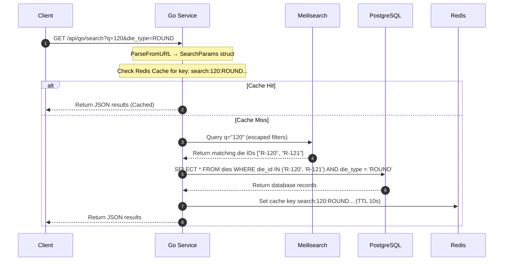

# Architecture, APIs, and Database Specifications

This document outlines the detailed system architecture, API specifications, and database performance configurations of the DMS application.

---

## 📖 Table of Contents
1. [Django REST API Schema](#1-django-rest-api-schema)
   - [Overview & Schema Formats](#overview--schema-formats)
   - [Authentication & JWT Handshake](#authentication--jwt-handshake)
   - [Django API Endpoints Matrix](#django-api-endpoints-matrix)
   - [API Request/Response Examples](#api-requestresponse-examples)
2. [Go Search API Contract & Logic](#2-go-search-api-contract--logic)
   - [Fuzzy Search Flow Control](#fuzzy-search-flow-control)
   - [Endpoints Specifications](#endpoints-specifications)
   - [Redis Caching Architecture](#redis-caching-architecture)
3. [Backend Service Layer Architecture](#3-backend-service-layer-architecture)
   - [Service Extraction Pattern](#service-extraction-pattern)
   - [Context Variables](#context-variables-async-safe-request-context)
   - [Middleware Stack](#middleware-stack)
4. [Database Connection Pooling & Performance](#4-database-connection-pooling--performance)
   - [Django PostgreSQL Pool Configuration](#django-postgresql-pool-configuration)
   - [Tuning Guidelines](#tuning-guidelines)
   - [Monitoring Queries](#monitoring-queries)
5. [Scheduled History Pruning & Cache Invalidation](#5-scheduled-history-pruning--cache-invalidation)
6. [Inventory Scaling Constraints & Limits](#6-inventory-scaling-constraints--limits)
7. [Security Hardening](#7-security-hardening)
   - [Startup Secret Validation](#startup-secret-validation)
   - [Meilisearch Filter Injection Prevention](#meilisearch-filter-injection-prevention)
   - [Internal API Secret](#internal-api-secret)
8. [See Also](#8-see-also)

---

## 1. Django REST API Schema

### Overview & Schema Formats

The DMS Django application automatically compiles and generates an OpenAPI 3.0.3 spec using **drf-spectacular**. 

> [!NOTE]
> All schema modifications in the Python backend models or ViewSets automatically propagate to the documentation routes upon restart.

*   **Interactive Swagger UI Portal**: [http://localhost:8000/api/docs/](http://localhost:8000/api/docs/)
    *   *Features*: Live "Try-it-out" request testing, validation error visualizers, and authentication controls.
*   **ReDoc Catalog**: [http://localhost:8000/api/redoc/](http://localhost:8000/api/redoc/)
    *   *Features*: Read-only sidebar catalog, optimized for offline reference or external API reviews.
*   **Raw OpenAPI Specification**: [http://localhost:8000/api/schema/](http://localhost:8000/api/schema/)
    *   *Format*: Raw OpenAPI JSON schema (machine-readable).

---

### Authentication & JWT Handshake

With the exception of static schema indices, all API calls must provide a JWT access token via the HTTP standard headers:
```http
Authorization: Bearer <your_jwt_access_token>
```

#### JWT Retrieval Flow
*   **Endpoint**: `POST /api/auth/login/`
*   **Request Payload**:
    ```json
    {
      "username": "root",
      "password": "your_password"
    }
    ```
*   **Response Payload (200 OK)**:
    ```json
    {
      "access": "eyJ0eXAiOiJKV1QiLCJhbGc...",
      "refresh": "eyJ0eXAiOiJKV1QiLCJhbGc..."
    }
    ```

---

### Django API Endpoints Matrix

| Domain | Method | Route | Access Level | Description |
| :--- | :--- | :--- | :--- | :--- |
| **Auth** | `POST` | `/api/auth/login/` | Public | Obtains JWT tokens |
| | `POST` | `/api/auth/keep-alive/` | Authenticated | Extends current login session |
| | `POST` | `/api/auth/sse-ticket/` | Authenticated | Exchanges a JWT for a short-lived SSE connection ticket |
| **Dies** | `GET` | `/api/dies/` | Public | Lists all dies with range filters |
| | `POST` | `/api/dies/` | Admin / Root | Registers a new die |
| | `GET` | `/api/dies/{id}/` | Public | Details a single die + change log |
| | `PATCH`| `/api/dies/{id}/` | Operator / Admin / Root | Partial updates (Operator: location/rack/shelf only; Admin/Root: full) |
| | `DELETE`| `/api/dies/{id}/` | Admin / Root | Deletes die from inventory |
| **Assets**| `GET` | `/api/categories/` | Public | Lists machine categories |
| | `POST` | `/api/categories/` | Admin / Root | Creates a new machine category |
| | `GET` | `/api/machines/` | Public | Lists machines |
| | `POST` | `/api/machines/` | Admin / Root | Creates a new machine |
| | `GET` | `/api/sets/` | Public | Lists tool sets |
| | `POST` | `/api/sets/` | Admin / Root | Creates a new tool set |
| **Racks** | `GET` | `/api/racks/` | Authenticated | Lists all physical racks |
| | `POST` | `/api/racks/` | Admin / Root | Creates a new physical rack storage |
| | `PATCH`| `/api/racks/{id}/` | Admin / Root | Updates rack name, row_count, column_count |
| | `DELETE`| `/api/racks/{id}/` | Admin / Root | Removes physical rack configuration |
| **Users** | `GET` | `/api/users/` | Root Only | Paginated list of administrators and operators |
| | `POST` | `/api/users/` | Root Only | Creates a new user account with specified role |
| | `DELETE`| `/api/users/{id}/` | Root Only | Deactivates/removes user account |
| **Backups**| `GET` | `/api/backups/` | Root Only | Lists night backup files |
| | `POST` | `/api/backups/` | Root Only | Triggers an instant DB dump |
| | `GET` | `/api/backups/download_backup/` | Root Only | Streams static backup dump file securely |
| **Import**| `POST` | `/api/import/` | Admin / Root | Spreadsheet CSV/XLSX bulk imports (dry-run supported via `?dry_run=true`) |
| | `GET` | `/api/import/template/` | Admin / Root | Downloads standard Excel import template spreadsheet |
| | `GET` | `/api/import/logs/` | Admin / Root | Retrieves paginated history logs of bulk spreadsheet imports |
| **History**| `GET` | `/api/history/` | Admin / Root | Audit Trail log history records (Restricted to Admin/Root roles) |
| | `GET` | `/api/history/machines/` | Admin / Root | Machine/Set Audit Trail history records |
| | `GET` | `/api/history/dashboard/` | Authenticated | Cached summary of non-sensitive history (strips IP, notes; cached 60s) |
| **Internal**| `POST` | `/internal/verify-token/` | Go Service Only | Internal-only token validation route mapping active user role and id |

---

### API Request/Response Examples

#### 1. Register a ROUND Die
*   **Request**:
    ```bash
    curl -X POST http://localhost:8000/api/dies/ \
      -H "Authorization: Bearer <access_token>" \
      -H "Content-Type: application/json" \
      -d '{
        "die_id": "R-101",
        "die_type": "ROUND",
        "casing": "Steel-25",
        "status": "AVAILABLE",
        "location": "Rack A - Row 1",
        "punched_size": 12.500,
        "current_size": 12.480,
        "current_set": 1,
        "remarks": "Polished during check-in"
      }'
    ```
*   **Response (201 Created)**:
    ```json
    {
      "id": 482,
      "die_id": "R-101",
      "die_type": "ROUND",
      "casing": "Steel-25",
      "status": "AVAILABLE",
      "location": "Rack A - Row 1",
      "punched_size": "12.500",
      "current_size": "12.480",
      "current_set": 1,
      "remarks": "Polished during check-in",
      "created_at": "2026-06-20T00:30:15Z",
      "updated_at": "2026-06-20T00:30:15Z"
    }
    ```

#### 2. Register a FLAT Die
*   **Request**:
    ```bash
    curl -X POST http://localhost:8000/api/dies/ \
      -H "Authorization: Bearer <access_token>" \
      -H "Content-Type: application/json" \
      -d '{
        "die_id": "F-205",
        "die_type": "FLAT",
        "casing": "Carbide-30",
        "status": "AVAILABLE",
        "location": "Rack B - Row 2",
        "punched_width": 30.000,
        "current_width": 29.950,
        "punched_thickness": 5.000,
        "current_thickness": 4.980,
        "radius": 1.500,
        "current_set": null
      }'
    ```

---

## 2. Go Search API Contract & Logic

### Fuzzy Search Flow Control

The Go Search Service (`go-api`) handles fuzzy, high-performance read-only searches. For complex queries containing decimal ranges, it dynamically joins Meilisearch matches with PostgreSQL index scans. All search parameters are parsed into a `SearchParams` struct via `ParseFromURL()`, and user-supplied filter values are sanitized through `escapeMeiliFilterValue()` before Meilisearch query construction.



---

### Endpoints Specifications

#### 1. Microservice Liveness Check
*   **Route**: `GET /api/go/health`
*   **Auth**: Public
*   **Response (200 OK)**:
    ```json
    {
      "status": "healthy"
    }
    ```

#### 2. Search & Filter Dies
*   **Route**: `GET /api/go/search`
*   **Auth**: Authenticated (JWT Access Token)
*   **Request Parsing**: All query parameters are parsed into a `SearchParams` struct via `ParseFromURL(r *http.Request)`. Filter values are sanitized through `escapeMeiliFilterValue()` before Meilisearch query construction.
*   **Query Parameters Matrix**:
    | Parameter | Type | Description | Example |
    | :--- | :--- | :--- | :--- |
    | `q` | string | Fuzzy keyword query (searches ids, locations, casing, sets) | `R-101` |
    | `die_type` | string | Match type exactly: `ROUND` or `FLAT` | `ROUND` |
    | `status` | string | Match status exactly: `AVAILABLE`, `RUNNING`, etc. | `RUNNING` |
    | `casing` | string | Filter casing substring (escaped for Meilisearch) | `Steel` |
    | `location` | string | Filter by location | `Rack A` |
    | `size_min` | decimal | Lower bound ROUND diameter | `5.25` |
    | `size_max` | decimal | Upper bound ROUND diameter | `10.5` |
    | `width_min` | decimal | Lower bound FLAT width | `25.0` |
    | `width_max` | decimal | Upper bound FLAT width | `35.0` |
    | `thick_min` | decimal | Lower bound FLAT thickness | `1.5` |
    | `thick_max` | decimal | Upper bound FLAT thickness | `3.0` |
    | `machine_id` | integer | Filter by machine ID | `42` |
    | `set_id` | integer | Filter by set ID | `7` |
    | `unassigned` | string | Filter unassigned dies | `true` |
    | `limit` | integer | Page size limit (default: 150) | `50` |
    | `offset` | integer | Offset/starting item index for pagination | `20` |

*   **Response (200 OK)**:
    ```json
    {
      "total": 450,
      "limit": 50,
      "offset": 0,
      "results": [
        {
          "die_id": "R-101",
          "die_type": "ROUND",
          "casing": "Steel-25",
          "status": "RUNNING",
          "location": "Rack A - Row 1",
          "set_name": "Set Alpha",
          "machine_name": "Machine 1",
          "current_set": 1,
          "current_size": "12.480"
        }
      ]
    }
    ```

#### 3. Search Index Rebuild Status
*   **Route**: `GET /api/go/index-status`
*   **Auth**: Authenticated (JWT Access Token)
*   **Response (200 OK - Rebuilding)**:
    ```json
    {
      "status": "rebuilding",
      "progress": 45,
      "total": 100
    }
    ```

#### 4. Real-Time Server-Sent Events (SSE)
*   **Route**: `GET /api/events/`
*   **Auth**: Authenticated (Via `?ticket=<ticket>` parameter)
*   **Description**: Establishes a real-time event stream. To avoid sending sensitive JWT keys in URL parameters, the client must first perform an HTTP `POST /api/auth/sse-ticket/` to receive a single-use random ticket token, which is then passed as `?ticket=<ticket>`.
*   **Stream Responses**:
    ```http
    event: connected
    data: {}

    data: {"type": "die_update", "data": {"id": "R-101", "action": "save"}}
    ```

#### 5. Go-to-Django Token Verification (Internal)
*   **Route**: `POST /internal/verify-token/`
*   **Auth**: Internal Network Only (accessible only within Docker network context by the Go service). The Go service authenticates using `INTERNAL_API_SECRET` in the `X-Internal-Key` header. Django verifies the secret using **timing-safe comparison** (`hmac.compare_digest`) to prevent timing attacks.
*   **Response (200 OK)**:
    ```json
    { "valid": true, "user_id": 4, "role": "ADMIN" }
    ```
*   **Rationale**: Isolates verification logic on the Django REST Auth app, preventing the Go search service from needing to duplicate user DB session tracking and eviction hooks directly.

---

### Redis Caching Architecture

*   **Authentication**: Redis is started with `--requirepass`. All clients (Go API, Django cache backend, Celery broker) authenticate using the password set in `REDIS_PASSWORD` / `docker-compose.yml`.
*   **Cache Lifetime**: Configurable via `SEARCH_CACHE_TTL_SECONDS` (default: 10 seconds).
*   **Key Composition**: A combined hash of all active search query parameters:
    `search:{q}:{die_type}:{status}:{location}:{casing}:{size_min}:{size_max}:{width_min}:{width_max}:{thick_min}:{thick_max}:{limit}:{offset}`
*   **Eviction Strategy**: Immediate validation invalidates cache values when data changes. When database insertions, deletions, or modifications occur, a Django PostgreSQL `LISTEN` / `NOTIFY` hook broadcasts an invalidation signal to the Go service.
*   **Cache Set-Tracker**: To avoid blocking Redis cursor-scanning operations, all cached search keys are registered under a Redis Set called `cached_searches` upon writing. During cache invalidation, the Go service pulls the keys from this Set, deletes them in a single batch operation, and clears the tracker Set.

---

## 3. Backend Service Layer Architecture

### Service Extraction Pattern

The Django backend follows a strict view → service → model layering pattern. Business logic is extracted into dedicated service classes to keep views as thin HTTP adapters:

| Service | Location | Responsibility |
| :--- | :--- | :--- |
| `SessionService` | `backend/users/services/session_service.py` | Session lookup, timeout validation, last-seen updates, eviction detection |
| `RecutService` | `backend/dies/services/recut_service.py` | Die recut business logic (size validation, audit logging) |
| `WearPredictionService` | `backend/dies/services/wear_prediction_service.py` | Wear prediction calculations and threshold evaluation |
| `ImportService` | `backend/dies/services/import_service.py` | Spreadsheet parsing, data resolution, bulk imports |
| `SearchService` | `backend/dies/services/search_service.py` | Meilisearch query construction and PostgreSQL fallback |
| `BackupService` | `backend/users/services/backup_service.py` | pg_dump/restore operations, backup file management |

### Context Variables (Async-Safe Request Context)

Request-scoped state (current user, IP, pending sync IDs) is managed via `contextvars.ContextVar` instances in `backend/users/context.py`, replacing the legacy `threading.local()` pattern. This makes the system safe for async/ASGI deployments.

```python
# backend/users/context.py
_current_user_var = contextvars.ContextVar('current_user', default=None)
_current_ip_var = contextvars.ContextVar('current_ip', default=None)

# Usage in views/services
from users.context import get_current_user
user = get_current_user()
```

The `_ThreadLocalsProxy` class provides backward compatibility for existing `from users.context import _thread_locals` imports.

### Middleware Stack

```python
MIDDLEWARE = [
    'django.middleware.security.SecurityMiddleware',
    'django.contrib.sessions.middleware.SessionMiddleware',
    'corsheaders.middleware.CorsMiddleware',
    'django.middleware.common.CommonMiddleware',
    'django.middleware.csrf.CsrfViewMiddleware',
    'django.contrib.auth.middleware.AuthenticationMiddleware',
    'users.middleware.CurrentUserMiddleware',      # Writes to contextvars
    'django.contrib.messages.middleware.MessageMiddleware',
    'django.middleware.clickjacking.XFrameOptionsMiddleware',
]
```

---

## 4. Database Connection Pooling & Performance

### Django PostgreSQL Pool Configuration

To prevent socket exhaustion and reduce overhead on high-frequency connection cycles, DMS implements connection reuse with statement timeouts:

```python
DATABASES = {
    'default': {
        'ENGINE': 'django.db.backends.postgresql',
        'CONN_MAX_AGE': 300,  # Connections persist for 5 minutes
        'OPTIONS': {
            'connect_timeout': 10,  # Max seconds to wait for connection
            'options': '-c statement_timeout=30000',  # Force timeout at 30 seconds
        },
        'ATOMIC_REQUESTS': True,  # Wrap HTTP requests in explicit SQL transactions
    }
}
```

---

### Tuning Guidelines

> [!WARNING]
> Enforcing statement timeouts prevents long-running queries from blocking database indexes, but requires proper query indexing to avoid false-positive timeouts.

*   **Idle Connection Bloat**: If connection counts regularly reach the host limit, reduce `CONN_MAX_AGE` to `120` or `180` to force earlier connection closures.
*   **Atomic Rollbacks**: Since `ATOMIC_REQUESTS` is active, any unhandled error inside a Django view will roll back all modifications within that request. Be cautious with third-party async calls inside views to avoid long-lived transaction locks.

---

### Monitoring Queries

Log in to the PostgreSQL container and run the following queries to monitor database load:

#### 1. Show Connection Count by Database
```sql
SELECT datname, count(*) 
FROM pg_stat_activity 
GROUP BY datname;
```

#### 2. Retrieve Currently Active Queries
```sql
SELECT pid, query_start, state, query 
FROM pg_stat_activity 
WHERE state = 'active' 
ORDER BY query_start ASC;
```

---

## 5. Scheduled History Pruning & Cache Invalidation

To prevent query degradation and database bloating as operational logs grow over time:
*   **Celery Beat Task**: A daily background task `auto_prune_history` is configured via `CELERY_BEAT_SCHEDULE` to run every 24 hours. It calls the Django management command `prune_history` to delete logs older than the retention threshold.
*   **Legacy Pruner**: A backup cron job scheduled nightly at **3:00 AM** in the `backup` container executes `scripts/prune_history.sh`.
*   **Logic**: Deletes all `history_diehistory` entries older than `HISTORY_RETENTION_DAYS` (default: 365 days).
*   **Cache Invalidation**: Whenever a new `DieHistory` row is saved or deleted, Django signals (`post_save`, `post_delete`) automatically clear the cached `/api/history/dashboard/` queries to keep the Operator dashboard accurate and real-time.

---

## 6. Inventory Scaling Constraints & Limits

To deliver high performance and low-latency rendering, the DMS React frontend uses a client-side grouping architecture for the Inventory Explorer sidebar tree and machine detail views:
- **Client-Side Grouping**: The frontend fetches active inventory records using a single paginated API request `/api/go/search` and then dynamically parses and groups them into their respective machines and sets in memory.
- **Maximum Page Size (`100,000`)**: To ensure all dies in the facility are represented in the explorer tree (rather than just the first few), the default `pageSize` state in [useInventoryState.ts](file:///home/sahil/Desktop/Projects/dms-o2/frontend/src/features/inventory/hooks/useInventoryState.ts#L20) is set to `100000`.
- **Scaling Recommendations**:
  - *Below 100,000 dies*: Performance remains sub-millisecond due to the virtualized grid renderer (`react-window`).
  - *Beyond 100,000 dies*: If the facility scales past this threshold, increase the `pageSize` default state value inside [useInventoryState.ts](file:///home/sahil/Desktop/Projects/dms-o2/frontend/src/features/inventory/hooks/useInventoryState.ts) accordingly, or refactor the sidebar tree to fetch counts dynamically from a dedicated backend metrics/grouping endpoint.

---

## 7. Security Hardening

### Startup Secret Validation

When `DJANGO_DEBUG=False`, the Django application validates all critical secrets at startup and raises `ImproperlyConfigured` if any match known weak defaults:

| Secret | Validation Rule |
| :--- | :--- |
| `DJANGO_SECRET_KEY` | Must not equal `django-insecure-development-secret-key-12345` |
| `MEILI_MASTER_KEY` | Must be ≥16 chars and not `meili_secret_key` or `change_me` |
| `INTERNAL_API_SECRET` | Must be ≥16 chars and not `dms_internal_secret_default_key_998` or `your-internal-secret` |
| `POSTGRES_PASSWORD` | Must be ≥16 chars and not `password`, `postgres`, or `dms_pass_password` |

### Meilisearch Filter Injection Prevention

All user-supplied filter values embedded in Meilisearch filter expressions pass through `escapeMeiliFilterValue()` which escapes:
- Backslashes: `\` → `\\`
- Single quotes: `'` → `\'`
- Control characters: `\x00`-`\x1f` → ` ` (space)

### Internal API Secret

The Go API authenticates to Django's `/internal/verify-token/` endpoint using the `X-Internal-Key` header with the shared `INTERNAL_API_SECRET`. Django validates using `hmac.compare_digest()` for timing-safe comparison.

---

## 8. See Also

*   [README.md](file:///home/sahil/Projects/dms-o2/README.md) - System Installation, configuration variables, and docker quick starts.
*   [PROJECT.md](file:///home/sahil/Projects/dms-o2/PROJECT.md) - Development roadmap, stack rules, and changelog lists.
*   [MASTER.md](file:///home/sahil/Projects/dms-o2/design-system/die-management-system/MASTER.md) - Styling rules, dark mode palettes, and typography specifications.

