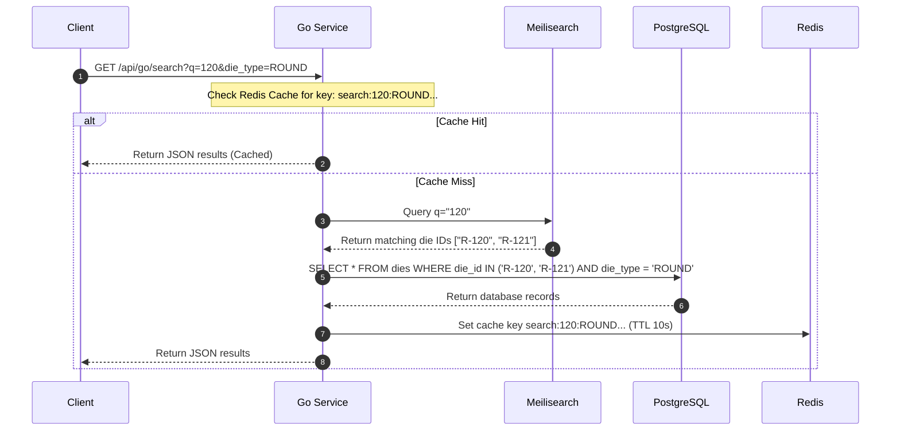

# Architecture, APIs, and Database Specifications

This document outlines the detailed system architecture, API specifications, and database performance configurations of the DMS application.

---

## 📖 Table of Contents
1. [Django REST API Schema](#1-django-rest-api-schema)
   - [Overview & Schema Formats](#overview--schema-formats)
   - [Authentication & JWT Handshake](#authentication--jwt-handshake)
   - [Django API Endpoints Matrix](#django-api-endpoints-matrix)
   - [API Request/Response Examples](#api-requestresponse-examples)
2. [Go Search API Contract & Logic](#2-go-search-api-contract--logic)
   - [Fuzzy Search Flow Control](#fuzzy-search-flow-control)
   - [Endpoints Specifications](#endpoints-specifications)
   - [Redis Caching Architecture](#redis-caching-architecture)
3. [Database Connection Pooling & Performance](#3-database-connection-pooling--performance)
   - [Django PostgreSQL Pool Configuration](#django-postgresql-pool-configuration)
   - [Tuning Guidelines](#tuning-guidelines)
   - [Monitoring Queries](#monitoring-queries)
4. [See Also](#see-also)

---

## 1. Django REST API Schema

### Overview & Schema Formats

The DMS Django application automatically compiles and generates an OpenAPI 3.0.3 spec using **drf-spectacular**. 

> [!NOTE]
> All schema modifications in the Python backend models or ViewSets automatically propagate to the documentation routes upon restart.

*   **Interactive Swagger UI Portal**: [http://localhost:8000/api/docs/](http://localhost:8000/api/docs/)
    *   *Features*: Live "Try-it-out" request testing, validation error visualizers, and authentication controls.
*   **ReDoc Catalog**: [http://localhost:8000/api/redoc/](http://localhost:8000/api/redoc/)
    *   *Features*: Read-only sidebar catalog, optimized for offline reference or external API reviews.
*   **Raw OpenAPI Specification**: [http://localhost:8000/api/schema/](http://localhost:8000/api/schema/)
    *   *Format*: Raw OpenAPI JSON schema (machine-readable).

---

### Authentication & JWT Handshake

With the exception of static schema indices, all API calls must provide a JWT access token via the HTTP standard headers:
```http
Authorization: Bearer <your_jwt_access_token>
```

#### JWT Retrieval Flow
*   **Endpoint**: `POST /api/auth/login/`
*   **Request Payload**:
    ```json
    {
      "username": "root",
      "password": "your_password"
    }
    ```
*   **Response Payload (200 OK)**:
    ```json
    {
      "access": "eyJ0eXAiOiJKV1QiLCJhbGc...",
      "refresh": "eyJ0eXAiOiJKV1QiLCJhbGc..."
    }
    ```

---

### Django API Endpoints Matrix

| Domain | Method | Route | Access Level | Description |
| :--- | :--- | :--- | :--- | :--- |
| **Auth** | `POST` | `/api/auth/login/` | Public | Obtains JWT tokens |
| | `POST` | `/api/auth/keep-alive/` | Authenticated | Extends current login session |
| | `POST` | `/api/auth/sse-ticket/` | Authenticated | Exchanges a JWT for a short-lived SSE connection ticket |
| **Dies** | `GET` | `/api/dies/` | Public | Lists all dies with range filters |
| | `POST` | `/api/dies/` | Admin / Root | Registers a new die |
| | `GET` | `/api/dies/{id}/` | Public | Details a single die + change log |
| | `PATCH`| `/api/dies/{id}/` | Operator / Admin / Root | Partial updates (Operator: location/rack/shelf only; Admin/Root: full) |
| | `DELETE`| `/api/dies/{id}/` | Admin / Root | Deletes die from inventory |
| **Assets**| `GET` | `/api/categories/` | Public | Lists machine categories |
| | `POST` | `/api/categories/` | Admin / Root | Creates a new machine category |
| | `GET` | `/api/machines/` | Public | Lists machines |
| | `POST` | `/api/machines/` | Admin / Root | Creates a new machine |
| | `GET` | `/api/sets/` | Public | Lists tool sets |
| | `POST` | `/api/sets/` | Admin / Root | Creates a new tool set |
| **Racks** | `GET` | `/api/racks/` | Authenticated | Lists all physical racks |
| | `POST` | `/api/racks/` | Admin / Root | Creates a new physical rack storage |
| | `PATCH`| `/api/racks/{id}/` | Admin / Root | Updates rack name, row_count, column_count |
| | `DELETE`| `/api/racks/{id}/` | Admin / Root | Removes physical rack configuration |
| **Users** | `GET` | `/api/users/` | Root Only | Paginated list of administrators and operators |
| | `POST` | `/api/users/` | Root Only | Creates a new user account with specified role |
| | `DELETE`| `/api/users/{id}/` | Root Only | Deactivates/removes user account |
| **Backups**| `GET` | `/api/backups/` | Root Only | Lists night backup files |
| | `POST` | `/api/backups/` | Root Only | Triggers an instant DB dump |
| | `GET` | `/api/backups/download_backup/` | Root Only | Streams static backup dump file securely |
| **Import**| `POST` | `/api/import/` | Admin / Root | Spreadsheet CSV/XLSX bulk imports (dry-run supported via `?dry_run=true`) |
| | `GET` | `/api/import/template/` | Admin / Root | Downloads standard Excel import template spreadsheet |
| | `GET` | `/api/import/logs/` | Admin / Root | Retrieves paginated history logs of bulk spreadsheet imports |
| **History**| `GET` | `/api/history/` | Authenticated | Audit Trail log history records (Regular users see own, Admin/Root see all) |
| **Internal**| `POST` | `/internal/verify-token/` | Go Service Only | Internal-only token validation route mapping active user role and id |

---

### API Request/Response Examples

#### 1. Register a ROUND Die
*   **Request**:
    ```bash
    curl -X POST http://localhost:8000/api/dies/ \
      -H "Authorization: Bearer <access_token>" \
      -H "Content-Type: application/json" \
      -d '{
        "die_id": "R-101",
        "die_type": "ROUND",
        "casing": "Steel-25",
        "status": "AVAILABLE",
        "location": "Rack A - Row 1",
        "punched_size": 12.500,
        "current_size": 12.480,
        "current_set": 1,
        "remarks": "Polished during check-in"
      }'
    ```
*   **Response (201 Created)**:
    ```json
    {
      "id": 482,
      "die_id": "R-101",
      "die_type": "ROUND",
      "casing": "Steel-25",
      "status": "AVAILABLE",
      "location": "Rack A - Row 1",
      "punched_size": "12.500",
      "current_size": "12.480",
      "current_set": 1,
      "remarks": "Polished during check-in",
      "created_at": "2026-06-20T00:30:15Z",
      "updated_at": "2026-06-20T00:30:15Z"
    }
    ```

#### 2. Register a FLAT Die
*   **Request**:
    ```bash
    curl -X POST http://localhost:8000/api/dies/ \
      -H "Authorization: Bearer <access_token>" \
      -H "Content-Type: application/json" \
      -d '{
        "die_id": "F-205",
        "die_type": "FLAT",
        "casing": "Carbide-30",
        "status": "AVAILABLE",
        "location": "Rack B - Row 2",
        "punched_width": 30.000,
        "current_width": 29.950,
        "punched_thickness": 5.000,
        "current_thickness": 4.980,
        "radius": 1.500,
        "current_set": null
      }'
    ```

---

## 2. Go Search API Contract & Logic

### Fuzzy Search Flow Control

The Go Search Service (`go-api`) handles fuzzy, high-performance read-only searches. For complex queries containing decimal ranges, it dynamically joins Meilisearch matches with PostgreSQL index scans.



---

### Endpoints Specifications

#### 1. Microservice Liveness Check
*   **Route**: `GET /api/go/health`
*   **Auth**: Public
*   **Response (200 OK)**:
    ```json
    {
      "status": "healthy"
    }
    ```

#### 2. Search & Filter Dies
*   **Route**: `GET /api/go/search`
*   **Auth**: Authenticated (JWT Access Token)
*   **Query Parameters Matrix**:
    | Parameter | Type | Description | Example |
    | :--- | :--- | :--- | :--- |
    | `q` | string | Fuzzy keyword query (searches ids, locations, casing, sets) | `R-101` |
    | `die_type` | string | Match type exactly: `ROUND` or `FLAT` | `ROUND` |
    | `status` | string | Match status exactly: `AVAILABLE`, `RUNNING`, etc. | `RUNNING` |
    | `casing` | string | Filter casing substring | `Steel` |
    | `size_min` | decimal | Lower bound ROUND diameter | `5.25` |
    | `size_max` | decimal | Upper bound ROUND diameter | `10.5` |
    | `width_min` | decimal | Lower bound FLAT width | `25.0` |
    | `thick_min` | decimal | Lower bound FLAT thickness | `1.5` |
    | `limit` | integer | Page size limit | `50` |
    | `offset` | integer | Offset/starting item index for pagination | `20` |

*   **Response (200 OK)**:
    ```json
    {
      "total": 450,
      "limit": 50,
      "offset": 0,
      "results": [
        {
          "die_id": "R-101",
          "die_type": "ROUND",
          "casing": "Steel-25",
          "status": "RUNNING",
          "location": "Rack A - Row 1",
          "set_name": "Set Alpha",
          "machine_name": "Machine 1",
          "current_set": 1,
          "current_size": "12.480"
        }
      ]
    }
    ```

#### 3. Search Index Rebuild Status
*   **Route**: `GET /api/go/index-status`
*   **Auth**: Authenticated (JWT Access Token)
*   **Response (200 OK - Rebuilding)**:
    ```json
    {
      "status": "rebuilding",
      "progress": 45,
      "total": 100
    }
    ```

#### 4. Real-Time Server-Sent Events (SSE)
*   **Route**: `GET /api/events/`
*   **Auth**: Authenticated (Via `?ticket=<ticket>` parameter)
*   **Description**: Establishes a real-time event stream. To avoid sending sensitive JWT keys in URL parameters, the client must first perform an HTTP `POST /api/auth/sse-ticket/` to receive a single-use random ticket token, which is then passed as `?ticket=<ticket>`.
*   **Stream Responses**:
    ```http
    event: connected
    data: {}

    data: {"type": "die_update", "data": {"id": "R-101", "action": "save"}}
    ```

#### 5. Go-to-Django Token Verification (Internal)
*   **Route**: `POST /internal/verify-token/`
*   **Auth**: Internal Network Only (accessible only within Docker network context by the Go service)
*   **Payload**:
    ```json
    { "token": "eyJhbG..." }
    ```
*   **Response (200 OK)**:
    ```json
    { "valid": true, "user_id": 4, "role": "ADMIN" }
    ```
*   **Rationale**: Isolates verification logic on the Django REST Auth app, preventing the Go search service from needing to duplicate user DB session tracking and eviction hooks directly.

---

### Redis Caching Architecture

*   **Cache Lifetime**: Configurable via `SEARCH_CACHE_TTL_SECONDS` (default: 10 seconds).
*   **Key Composition**: A combined hash of all active search query parameters:
    `search:{q}:{die_type}:{status}:{location}:{casing}:{size_min}:{size_max}:{width_min}:{width_max}:{thick_min}:{thick_max}:{limit}:{offset}`
*   **Eviction Strategy**: Immediate validation invalidates cache values when data changes. When database insertions, deletions, or modifications occur, a Django PostgreSQL `LISTEN` / `NOTIFY` hook broadcasts an invalidation signal to the Go service.
*   **Cache Set-Tracker**: To avoid blocking Redis cursor-scanning operations, all cached search keys are registered under a Redis Set called `cached_searches` upon writing. During cache invalidation, the Go service pulls the keys from this Set, deletes them in a single batch operation, and clears the tracker Set.

---

## 3. Database Connection Pooling & Performance

### Django PostgreSQL Pool Configuration

To prevent socket exhaustion and reduce overhead on high-frequency connection cycles, DMS implements connection reuse with statement timeouts:

```python
DATABASES = {
    'default': {
        'ENGINE': 'django.db.backends.postgresql',
        'CONN_MAX_AGE': 300,  # Connections persist for 5 minutes
        'OPTIONS': {
            'connect_timeout': 10,  # Max seconds to wait for connection
            'options': '-c statement_timeout=30000',  # Force timeout at 30 seconds
        },
        'ATOMIC_REQUESTS': True,  # Wrap HTTP requests in explicit SQL transactions
    }
}
```

---

### Tuning Guidelines

> [!WARNING]
> Enforcing statement timeouts prevents long-running queries from blocking database indexes, but requires proper query indexing to avoid false-positive timeouts.

*   **Idle Connection Bloat**: If connection counts regularly reach the host limit, reduce `CONN_MAX_AGE` to `120` or `180` to force earlier connection closures.
*   **Atomic Rollbacks**: Since `ATOMIC_REQUESTS` is active, any unhandled error inside a Django view will roll back all modifications within that request. Be cautious with third-party async calls inside views to avoid long-lived transaction locks.

---

### Monitoring Queries

Log in to the PostgreSQL container and run the following queries to monitor database load:

#### 1. Show Connection Count by Database
```sql
SELECT datname, count(*) 
FROM pg_stat_activity 
GROUP BY datname;
```

#### 2. Retrieve Currently Active Queries
```sql
SELECT pid, query_start, state, query 
FROM pg_stat_activity 
WHERE state = 'active' 
ORDER BY query_start ASC;
```

---

## 4. Scheduled History Pruning

To prevent query degradation and database bloating as operational logs grow over time:
*   **Pruning Job**: A cron job scheduled nightly at **3:00 AM** in the `backup` container executes `scripts/prune_history.sh`.
*   **Logic**: Connects directly to the PostgreSQL database via `psql` and deletes all `history_diehistory` entries older than `HISTORY_RETENTION_DAYS` (configured via environment variable, default: 365 days).
*   **Logs**: Outputs the count of deleted records to the container's stdout logs for administrative audit.

---

## 5. See Also

*   [README.md](file:///home/sahil/Projects/dms-o2/README.md) - System Installation, configuration variables, and docker quick starts.
*   [PROJECT.md](file:///home/sahil/Projects/dms-o2/PROJECT.md) - Development roadmap, stack rules, and changelog lists.
*   [MASTER.md](file:///home/sahil/Projects/dms-o2/design-system/die-management-system/MASTER.md) - Styling rules, dark mode palettes, and typography specifications.
