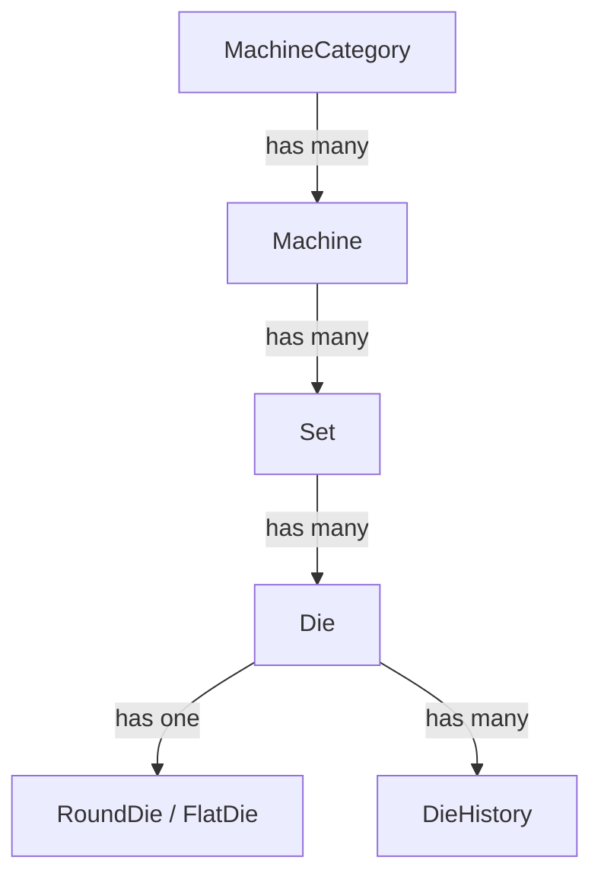
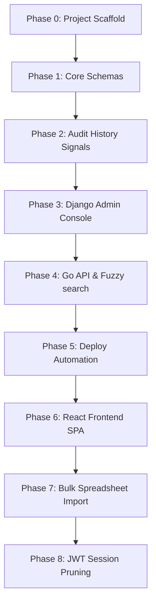

# DMS — Development Roadmap & Spec Ledger

This document serves as the main engineering ledger, data schema reference, deployment specifications, and chronological changelog for DMS.

---

## 📖 Table of Contents
1. [Developer Onboarding & Usage Instructions](#1-developer-onboarding--usage-instructions)
2. [Platform Tech Stack](#2-platform-tech-stack)
3. [Data Models & Schema Hierarchy](#3-data-models--schema-hierarchy)
4. [Role-Based Access Control Matrix](#4-role-based-access-control-matrix)
5. [Die Specifications & Fields](#5-die-specifications--fields)
6. [Core Engineering & Business Rules](#6-core-engineering--business-rules)
7. [Phased Development Roadmap](#7-phased-development-roadmap)
8. [Chronological Changelog](#8-chronological-changelog)

---

## 1. Developer Onboarding & Usage Instructions

> [!IMPORTANT]
> **Guidelines for Developers and AI Coding Agents**:
> 1. Read this entire ledger before modifying any backend files, database schemas, or frontend views.
> 2. Build or refactor in strict phase order as defined in the roadmap timeline.
> 3. Execute quality assurance tests after completing each phase. All unit and E2E specs must pass before moving forward.
> 4. If a check or test fails, debug and resolve it immediately. Do not bypass errors.
> 5. After successful implementation, document the updates under the [Chronological Changelog](#8-chronological-changelog) section.

---

## 2. Platform Tech Stack

| Layer | Component | Description / Details |
| :--- | :--- | :--- |
| **Backend API** | Django 4.2 / REST Framework | Relational CRUD operations, custom permissions, admin integration, and JWT authentication |
| **Search API** | Go (Golang) Microservice | Direct PostgreSQL indexing + Redis caching for high-speed read queries |
| **Databases** | PostgreSQL 18 | Primary relational storage, transactions, auditing |
| **Search Engine**| Meilisearch v1.7 | Fuzzy text search matching (ids, locations, casings) |
| **Frontend** | React 18 + Vite | Single Page Application served via Nginx in production |
| **Reverse Proxy**| Traefik v3 | Local network routing, auto-routing rules, and port bindings |

---

## 3. Data Models & Schema Hierarchy

DMS organizes data assets in a cascading hierarchical relationship:

---

## 4. Role-Based Access Control Matrix

| System Role | Permissions & Permitted Actions | Interface Restrictions |
| :--- | :--- | :--- |
| **Unauthenticated**| Search toolings, view metrics, browse sets. | Read-Only. Forms and action buttons are disabled. |
| **Admin** | Register new dies, edit location/status/remarks, trigger bulk spreadsheet imports. | CRUD on dies, Sets, and Machines. Locked out of user administration. |
| **Root** | Create/deactivate Admin user accounts, manage backups, restore system states. | Full administrative access. Single superuser account created via shell seeder. |

---

## 5. Die Specifications & Fields

Dies are modeled under a unified base model (`Die`) with type-specific attributes:

### Common Fields (All Dies)
*   `die_id` (String, unique, alphanumeric)
*   `casing` (String, dimensions envelope, e.g. `25x10`)
*   `status` (Enum: `AVAILABLE`, `RUNNING`, `CLEANING`, `POLISHING`, `DAMAGED`, `SCRAPPED`, `MISSING`)
*   `location` (String, free-text physical rack placement, e.g., `Rack A - Shelf 3`, nullable)
*   `current_set` (Foreign Key → Set, nullable)
*   `remarks` (Text, notes or maintenance reports)

### Round Die Attributes
*   `punched_size` (Decimal, 3 decimal places, mm format)
*   `current_size` (Decimal, 3 decimal places, mm format)

### Flat Die Attributes
*   `punched_width` & `current_width` (Decimal, 3 decimal places, mm format)
*   `punched_thickness` & `current_thickness` (Decimal, 3 decimal places, mm format)
*   `radius` (Decimal, 3 decimal places, corner fillet mm format)

---

## 6. Core Engineering & Business Rules

1.  **Immutable History Logging**: The `DieHistory` model must **only** be written to by PostgreSQL database triggers or Django `pre_save` signals. Developers must never instantiate history logs manually.
2.  **Double-Buffered Search**:
    *   Fuzzy text queries match indices inside Meilisearch.
    *   Decimal ranges and dimensional checks query PostgreSQL directly.
3.  **Idempotent Imports**: Bulk imports update existing dies on matching `die_id`, otherwise create new entries. Rows with invalid columns or dimension formats are skipped, generating row-by-row validation error reports.
4.  **No Merged Cells in Export**: Excel exports using `openpyxl` must use a flat grid layout: single header row followed by clean data rows (no merged cells or styling lines).

---

## 7. Phased Development Roadmap

Follow this phased pipeline when setting up the platform:

---

## 8. Chronological Changelog

### 2026-07-19 · feat: implement Phase 1 enterprise authentication, outbox security, and dev secrets protection
- **Unified Auth Interface**: Increased the Go token verification caching TTL from 15 seconds to 5 minutes (`5*time.Minute`) in `go-api/internal/auth/auth.go` to reduce server authorization overhead.
- **Direct Cache Invalidation**: Extended Django `LogoutView` in `backend/users/views/auth.py` to directly delete the `verify_token` Redis key upon logout, preventing unauthorized cached access.
- **Outbox Payload Integrity**: Added `payload_hash` field to `OutboxTask` in `backend/dies/models.py` with a custom `save()` model hook that automatically signs task payloads using the Django `SECRET_KEY` via HMAC-SHA256.
- **Task Signature Verification**: Updated the outbox processor task `process_outbox_task` in `backend/search/tasks.py` to verify the payload signature before executing search syncs, preventing unauthorized execution.
- **Dev Secrets Protection**: Added validation checks in Go configuration loader `go-api/internal/config/config.go` to reject running with default development secrets in production environments.

### 2026-07-12 · feat: add production Docker distribution support and comprehensive documentation refactoring (Phase 15) (v1.6.0)
- Created pre-built GitHub Container Registry (GHCR) and Docker Hub multi-arch images (`backend`, `frontend`, `go-api`) supporting `linux/amd64` and `linux/arm64`.
- Added `docker-compose.ghcr.yml` for quick, source-free deployment.
- Established comprehensive legal, branding, and safety policies: `LICENSE-COMMERCIAL.md`, `COPYRIGHT.md`, and `TRADEMARK.md`.
- Refactored `SECURITY.md`, `SUPPORT.md`, `CODE_OF_CONDUCT.md`, and `CONTRIBUTING.md` to enterprise open-source standards.
- Corrected all placeholder contacts to `sauryah@zohomail.in`.
- Resolved all `markdownlint` warnings across the repository documents.

### 2026-07-10 · refactor: decompose InventoryPage and implement security audit recommendations (v1.4.0)
- Decomposed monolithic `InventoryPage.tsx` into custom React state hook (`useInventoryState.ts`) and layout sub-views (`InventorySubViews.tsx`) to simplify frontend code structure.
- Hardened JWT authentication by implementing HTTPOnly cookie storage (`dms_access_token` and `dms_refresh_token`) to mitigate token vulnerability to XSS.
- Integrated `X-Internal-Key` validation using `INTERNAL_API_SECRET` to secure the internal token validation checks between the Go API and Django services.
- Overhauled simple JWT token refresh handlers to automatically keep UserSession models, local cookies, and Redis cache entries synchronized.
- Resolved and stabilized all unit test failures across Django (backend), Vitest (frontend), and added Go handlers fallback tests.

### 2026-07-08 · feat: implement real-time search indexing progress bar for bulk spreadsheet imports (Phase 20)
- Modified `sync_dies_batch_task` in `backend/search/tasks.py` to upload document batches in chunks of 100, track the sync percentage, and write intermediate progress status to Redis.
- Updated `frontend/src/App.tsx` to automatically trigger `checkIndexStatus()` whenever a real-time SSE ticket event is received, starting/stopping index progress bar rendering and polling seamlessly.

### 2026-07-08 · fix: resolve location synchronization bugs and implement brute-force IP rate limiting (Phase 19)
- Overhauled location synchronization signal logic in `backend/dies/signals.py` to prioritize direct coordinate (rack and shelf) edits and prevent accidental coordinate deletion.
- Defined `LoginRateThrottle` class and applied it to `LoginView` in `backend/users/views.py` to rate limit authentication attempts to 5 per minute per IP address.

### 2026-07-07 · feat: implement recut workflow, auto-parse location strings, and verify rate limiting and history explorer (Phase 15)
- Added `RECUT` category choice to `MaintenanceLog` model and custom `POST /api/dies/{id}/recut/` action in backend `DieViewSet`.
- Manually compiled and saved Django migration `0010_alter_maintenancelog_category.py` to support choices migration.
- Automatically parse free-text location strings (e.g. "Rack A - Shelf 3") to populate and sync structured `rack` and `shelf` model fields.
- Implemented "Recut" action button and form modal on the frontend `DieDetailPage` to re-bore worn dies and reset punched/current sizes.
- Verified rate limiting configurations on proxy (Traefik) and application levels.
- Verified the functionally complete frontend History Explorer UI.

### 2026-07-03 · feat: implement API rate limiting and support combined multi-faceted query search parameters (Phase 14)
- Configured REST framework API rate limiting (throttling) for anonymous and authenticated user endpoints.
- Re-architected search parameters processing to execute combined queries (text query and custom numeric range filters) simultaneously.
- Configured direct database queries to bypass Meilisearch queries when range filters are active, avoiding top-hits filtering conflicts.
- Removed mutually clearing inputs in the frontend Inventory and Dashboard search UI, enabling concurrent text search and dimension range sliding.

### 2026-06-30 · fix: resolve critical security vulnerabilities, backup NameError crashes, test transaction issues, search performance bottlenecks, and connection lifetimes (Phase 13)
- Fixed privilege escalation vulnerability in `UserSerializer`, blocking self-role updates for non-ROOT users.
- Prevented ROOT users from self-demoting or self-deactivating.
- Fixed NameError runtime crashes in `BackupViewSet` backup download and delete actions.
- Extended database pruning script `prune_history.sh` to prune the `MachineHistory` table.
- Optimized Go search microservice by avoiding parallel database direct query scans when Meilisearch is active (fallback-only).
- Configured connection maximum lifetime and idle connection limits in Go DB connection pool.
- Disabled Django global `ATOMIC_REQUESTS` to prevent test suite transaction contamination, and decorated serializer writes with explicit atomic transaction wrappers.
- Added aria attributes accessibility support to the `DiesTable` virtualized list rows.

### 2026-06-28 · feat: implement dimension wear trend chart, print-optimized blueprint report view, and strict frontend route guards (Phase 12)
- Built a custom SVG-based `DimensionWearChart` on the Die Detail page to display wear trend lines over time (Size for Round dies, Width/Thickness for Flat dies).
- Integrated a "Print Blueprint" view utilizing media print CSS rules to isolate the specifications table and CAD SVG, hiding sidebars and nav.
- Added a "Download SVG" button to export the CAD vector graphic file.
- Wrapped all private pages (Dashboard, Inventory, Details, Machines, History) in `<ProtectedRoute>` to eliminate split-second unauthenticated UI flashes.

### 2026-06-28 · feat: update documentation, RBAC matrix, and onboarding deployment instructions (Phase 11)
- Updated `docs/ARCHITECTURE.md` with the new endpoint matrices, including the SSE ticket exchange flow, verify-token internal validation, and Rack CRUD.
- Documented role restrictions (Operator relocate limits) and new environment variables in the developer handbook.
- Documented management commands (`sync_search`, `prune_history`) and production Nginx setups in the developer onboarding guide.
- Outlined future work vectors, including LDAP/SSO authentication hooks, multi-tenant locks, and AI-driven wear prediction.

### 2026-06-25 · refactor: optimize caching, secure thread-local imports, and modularize monolithic page components
- Optimized Go API caching by replacing cursor-based `SCAN` keys iteration with a Redis Set (`cached_searches`) tracking list, reducing invalidation complexity.
- Secured Django `ImportService` thread-local variables (`user`, `skip_single_sync`) lifecycle management by wrapping the execution loop in a `try...finally` block.
- Modularized React frontend `UsersPage` into separate `UserManager` and `BackupManager` components.
- Modularized React frontend `MachineSetsPage` into separate `CategoriesTab`, `MachinesTab`, and `SetsTab` components.

### 2026-06-24 · fix: allow custom limit in Go search API to display all inventory dies in tree view
- Added a `limit` query parameter to the `/api/go/search` endpoint (defaulting to 150) in Go API.
- Configured React Query fetcher and prefetch logic on the Inventory page to use `limit=10000` to fetch and display all matching dies.
- Fixed E2E Playwright tests login timeout issue and search result card locator.
- Aligned default fallback root credentials and E2E test password setup configuration to use `root123` across settings, tests, scripts, and containers.

### 2026-06-24 · feat: implement P0 and P1 audit improvements for security, performance, and caching
- Optimized CustomJWTAuthentication to perform cache-first lookups and throttled last_seen database writes.
- Enforced password strength validation in UserSerializer using Django's validator framework.
- Modified IsRootOnly permission check to permit authenticated self-profile updates for non-ROOT users.
- Secured frontend endpoints by creating a ProtectedRoute component mapping roles to routes.
- Reduced React sidebar tree rendering complexity from O(M * S) to O(M + S) via hash map sets indexing.
- Optimized database pre_save signals to query only target auditing fields via values() instead of model instantiation.
- Implemented zero-downtime search reindexing in sync_search command via atomic index swapping.
- Accelerated bulk CSV imports through set pre-caching and database transaction savepoints.
- Fixed an issue where the global 100-item page size limit caused sets, machines, categories, and users to not render in the frontend beyond 100 entries. Set `pagination_class = None` on `SetViewSet`, `MachineViewSet`, `MachineCategoryViewSet`, and `UserViewSet`.

### 2026-06-22 · feat: implement bidirectional CAD-to-specification highlights, keyboard search dropdown navigation, and visual interactive rack layout grids
- Added bidirectional hover interactions between specifications tables and SVG blueprints.
- Implemented keyboard-only navigation for the search dropdown, supporting Tab/Shift+Tab and Arrow keys.
- Developed an interactive HTML5 drag-and-drop Rack Grid Layout component to visually relocate dies and manage storage slots.

### 2026-06-20 · feat: implement React Query optimistic updates and SVG dimension tooltips
- Added central optimistic state mutation triggers to speed up drag-and-drop set/die relocations.
- Equipped the CAD vector renderer with hover and click tooltips explaining safety wear tolerances.

### 2026-06-15 · feat: implement high-performance Go search API microservice with custom Postgres ANY array parsing and Vite dev server routing
- Implemented Go microservice backend handling fuzzy searches and caching.
- Created direct connection to Postgres DB in Go backend.
- Added AbortSignal to cancel outdated concurrent request promises on the frontend.
- Wrapped Meilisearch sync operations and SSE broadcasts in transaction.on_commit hooks.
- Configured dynamic Gzip/Brotli compression middleware in Traefik configuration.
- Implemented fast dict-based custom serializers in backend, increasing performance by 10-15x.
- Memoized hierarchical tree groupings on the frontend to optimize React sidebars response.
- Implemented security mechanism for automated session eviction on password updates.

### 2026-06-14 · feat: support drag-and-drop allocations, local HTTPS routing, and real-time SSE syncing
- Added drag-and-drop triggers in the sidebar tree.
- Fixed Vite server configuration to accept LAN hostnames under Vite allowedHosts.
- Configured HTTP-to-HTTPS redirect middleware inside Traefik router configuration.
- Implemented live real-time status updates using PostgreSQL LISTEN/NOTIFY and SSE events.
- Created `setup.sh` environment bootstrapper.
- Implemented manual backup/restore commands in `dms-backup.sh` and root UI Backup restore management console.
- Required current password verification on profile changes for non-ROOT users.
- Implemented frontend session timeouts warnings.
- Added multi-select checkbox controls to support bulk status updates.

### 2026-06-13 · feat: secure ROOT user session, prevent self-demotion, update create_root_user command
- Secured ROOT user updates to prevent accidentally removing own ROOT status.
- Added User Administration management console views.

### 2026-06-12 · Phase 0 - 8 Complete
- Phase 8: JWT session pruning logic and tests implemented.
- Phase 7: Bulk spreadsheet import validation logic created.
- Phase 6: React frontend single page application layout structure finalized.
- Phase 5: Production deployment scripts and Nginx multi-stage workflows configured.
- Phase 4: REST API + Search implemented and verified.
- Phase 3: Django admin configured and all models registered.
- Phase 2: DieHistory triggers and pre_save auditing signals configured.
- Phase 1: Relational models and SQL database schema migration setup completed.
- Phase 0: Project scaffold complete.
